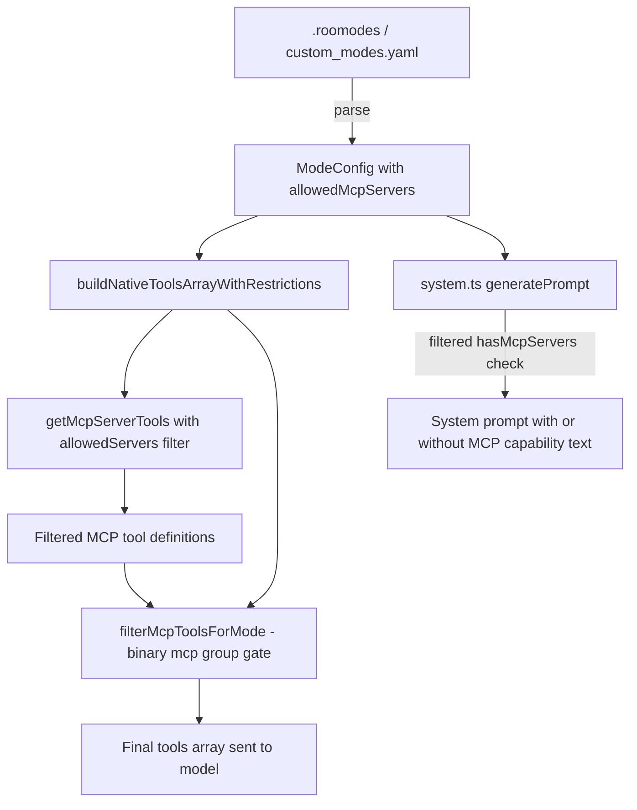

# Per-Mode MCP Server Settings — Design Document

## 1. Problem Statement

When a mode includes the `mcp` tool group, Roo Code injects **all** globally/project-enabled MCP server schemas into the system prompt and tool definitions. This causes three problems:

1. **Context bloat** — A mode like "Database Architect" that only needs `postgres-mcp` and `redis-mcp` receives tool schemas for every connected server (GitHub, Tavily, filesystem, etc.), wasting thousands of tokens per request.
2. **Hard tool limits exceeded** — Models like GPT-5.4 have a 128-tool limit. With many MCP servers, the combined native + MCP tool count exceeds this, causing API failures.
3. **No mode isolation** — Modes cannot be scoped to relevant servers, polluting the agent's context with unrelated capabilities.

### Example

```yaml
customModes:
  - slug: database-architect
    name: Database Architect
    groups: [read, edit, mcp]
    # Currently: ALL MCP servers injected (github, tavily, postgres, redis, filesystem...)
    # Desired: only postgres-mcp and redis-mcp
```

## 2. Current Architecture

### MCP Server Discovery

[`McpHub.getServers()`](src/services/mcp/McpHub.ts) returns all connected MCP servers (project servers take priority over global servers with the same name).

### Tool Definition Generation

[`getMcpServerTools()`](src/core/prompts/tools/native-tools/mcp_server.ts:14) iterates **all** servers from `mcpHub.getServers()` and generates `OpenAI.Chat.ChatCompletionTool` definitions for every enabled tool — no per-mode filtering.

### Tool Filtering

[`filterMcpToolsForMode()`](src/core/prompts/tools/filter-tools-for-mode.ts:437) is a binary gate: if the mode has `use_mcp_tool` permission (i.e., the `mcp` group), **all** MCP tools pass through. If not, **none** do.

### Build Pipeline

[`buildNativeToolsArrayWithRestrictions()`](src/core/task/build-tools.ts:82) orchestrates the flow:
1. Gets all MCP tools via `getMcpServerTools(mcpHub)` (line 128)
2. Filters via `filterMcpToolsForMode(mcpTools, mode, customModes, experiments)` (line 129) — binary on/off
3. Merges with native tools (line 145)

### System Prompt

[`generatePrompt()`](src/core/prompts/system.ts:68) checks `hasMcpGroup` and `hasMcpServers` to decide whether to include MCP capability text. No server-level filtering exists.

### Type System

[`ModeConfig`](packages/types/src/mode.ts:96) has no field for MCP server allowlisting. The `groups` array controls tool group access but not which servers within a group.

### Schema

[`roomodes.json`](schemas/roomodes.json) defines the `.roomodes` file schema with no `allowedMcpServers` property.

### UI

[`ModesView.tsx`](webview-ui/src/components/modes/ModesView.tsx:1535) renders tool group checkboxes (read, edit, command, mcp, modes) but has no UI for selecting specific MCP servers within the mcp group.

## 3. Proposed Solution

### 3.1 Type Changes

In [`packages/types/src/mode.ts`](packages/types/src/mode.ts:96):

```typescript
export const modeConfigSchema = z.object({
  slug: z.string().regex(/^[a-zA-Z0-9-]+$/, "Slug must contain only letters numbers and dashes"),
  name: z.string().min(1, "Name is required"),
  roleDefinition: z.string().min(1, "Role definition is required"),
  whenToUse: z.string().optional(),
  description: z.string().optional(),
  customInstructions: z.string().optional(),
  groups: groupEntryArraySchema,
  source: z.enum(["global", "project"]).optional(),
  // NEW: Optional allowlist of MCP server names
  allowedMcpServers: z.array(z.string()).optional(),
})
```

Semantics:
- **Omitted / undefined** → all servers included (backward compatible)
- **Empty array `[]`** → no MCP servers included (effectively disables MCP tools even if `mcp` group is enabled)
- **Populated array** → only listed servers are included

### 3.2 Schema Changes

In [`schemas/roomodes.json`](schemas/roomodes.json), add to the mode object `properties`:

```json
"allowedMcpServers": {
  "type": "array",
  "items": {
    "type": "string"
  },
  "description": "Optional list of MCP server names to include. When omitted, all servers are available. When set, only the listed servers are injected."
}
```

### 3.3 Filtering Logic

#### 3.3.1 `getMcpServerTools()` — Add `allowedServers` parameter

In [`src/core/prompts/tools/native-tools/mcp_server.ts`](src/core/prompts/tools/native-tools/mcp_server.ts:14):

```typescript
export function getMcpServerTools(
  mcpHub?: McpHub,
  allowedServers?: string[],  // NEW
): OpenAI.Chat.ChatCompletionTool[] {
  if (!mcpHub) return []

  let servers = mcpHub.getServers()

  // Filter servers by allowlist if provided
  if (allowedServers) {
    const allowSet = new Set(allowedServers)
    servers = servers.filter(s => allowSet.has(s.name))
  }

  // ... rest unchanged
}
```

#### 3.3.2 `filterMcpToolsForMode()` — Pass through allowlist

In [`src/core/prompts/tools/filter-tools-for-mode.ts`](src/core/prompts/tools/filter-tools-for-mode.ts:437):

```typescript
export function filterMcpToolsForMode(
  mcpTools: OpenAI.Chat.ChatCompletionTool[],
  mode: string | undefined,
  customModes: ModeConfig[] | undefined,
  experiments: Record<string, boolean> | undefined,
): OpenAI.Chat.ChatCompletionTool[] {
  // existing binary gate — unchanged
}
```

No changes needed here since the filtering happens upstream in `getMcpServerTools()`.

#### 3.3.3 `buildNativeToolsArrayWithRestrictions()` — Pass `allowedMcpServers`

In [`src/core/task/build-tools.ts`](src/core/task/build-tools.ts:82):

```typescript
// Resolve mode config to get allowedMcpServers
const modeConfig = getModeBySlug(mode ?? defaultModeSlug, customModes)
const allowedMcpServers = modeConfig?.allowedMcpServers

// Pass allowlist to getMcpServerTools
const mcpTools = getMcpServerTools(mcpHub, allowedMcpServers)
```

### 3.4 System Prompt Changes

In [`src/core/prompts/system.ts`](src/core/prompts/system.ts:68), the `hasMcpServers` check should respect the allowlist:

```typescript
const hasMcpGroup = modeConfig.groups.some(g => getGroupName(g) === "mcp")
const allowedMcpServers = modeConfig.allowedMcpServers

let hasMcpServers = false
if (mcpHub) {
  const servers = allowedMcpServers
    ? mcpHub.getServers().filter(s => new Set(allowedMcpServers).has(s.name))
    : mcpHub.getServers()
  hasMcpServers = servers.length > 0
}
const shouldIncludeMcp = hasMcpGroup && hasMcpServers
```

### 3.5 UI Changes

In [`ModesView.tsx`](webview-ui/src/components/modes/ModesView.tsx:1535), when the `mcp` group checkbox is enabled for a custom mode, show a sub-section:

1. A toggle: "Restrict to specific MCP servers" (unchecked = all servers, checked = show multi-select)
2. When checked, a checklist of all currently connected MCP server names (from `mcpServers` state)
3. Selected servers map to `allowedMcpServers` on the mode config

The same UI pattern should appear in both the mode detail view (edit mode) and the create-new-mode dialog.

## 4. Data Flow



## 5. Backward Compatibility

- **Omitted `allowedMcpServers`**: All servers included — identical to current behavior
- **Existing `.roomodes` files**: No `allowedMcpServers` field → schema validates fine (field is optional, `additionalProperties: false` requires adding the property to the schema)
- **Built-in modes**: `DEFAULT_MODES` in [`mode.ts`](packages/types/src/mode.ts:168) have no `allowedMcpServers` → all servers available
- **YAML custom modes**: Same behavior — optional field

## 6. Edge Cases

| Scenario | Behavior |
|---|---|
| `allowedMcpServers` omitted | All servers included (backward compatible) |
| `allowedMcpServers: []` | No MCP server tools injected; MCP capability text excluded from system prompt |
| Server name in list but not connected | Silently ignored — only connected+enabled servers are returned by `McpHub.getServers()` |
| Server name typo | No match, server excluded. Consider adding a warning in the UI when a listed server is not found among connected servers |
| `mcp` group not in `groups` but `allowedMcpServers` set | `allowedMcpServers` has no effect — MCP tools are gated by the `mcp` group first |
| Server added/removed while mode is active | Next request rebuilds the tools array dynamically — picks up changes automatically |
| Same server name in global and project config | `McpHub.getServers()` already deduplicates (project wins) — no special handling needed |

## 7. Testing Strategy

### Unit Tests

1. **`getMcpServerTools()` with `allowedServers`**
   - File: [`src/core/prompts/tools/native-tools/__tests__/mcp_server.spec.ts`](src/core/prompts/tools/native-tools/__tests__/mcp_server.spec.ts)
   - Test: returns only tools from allowed servers
   - Test: returns all tools when `allowedServers` is undefined
   - Test: returns empty when `allowedServers` is empty array
   - Test: ignores server names not found in hub

2. **`filterMcpToolsForMode()` unchanged behavior**
   - Existing tests in [`filter-tools-for-mode.ts`](src/core/prompts/tools/filter-tools-for-mode.ts) should continue passing

3. **`buildNativeToolsArrayWithRestrictions()` integration**
   - Test: mode with `allowedMcpServers` passes filter to `getMcpServerTools`
   - Test: mode without `allowedMcpServers` passes undefined (all servers)

4. **System prompt**
   - File: [`src/core/prompts/__tests__/system-prompt.spec.ts`](src/core/prompts/__tests__/system-prompt.spec.ts)
   - Test: MCP capability text excluded when `allowedMcpServers: []`
   - Test: MCP capability text included when `allowedMcpServers` matches connected servers

5. **Schema validation**
   - Test: `modeConfigSchema` accepts valid `allowedMcpServers`
   - Test: `modeConfigSchema` accepts missing `allowedMcpServers`
   - Test: `modeConfigSchema` rejects non-string array items

### UI Tests

6. **ModesView**
   - Test: MCP server checklist renders when mcp group enabled
   - Test: toggling server updates `allowedMcpServers` on mode config
   - Test: unchecking "Restrict" toggle removes `allowedMcpServers` field

## 8. Implementation Plan

### PR 1: Type + Schema + Core Filtering
1. Add `allowedMcpServers` to `modeConfigSchema` in `packages/types/src/mode.ts`
2. Add `allowedMcpServers` to `schemas/roomodes.json`
3. Add `allowedServers` parameter to `getMcpServerTools()` in `src/core/prompts/tools/native-tools/mcp_server.ts`
4. Update `buildNativeToolsArrayWithRestrictions()` in `src/core/task/build-tools.ts` to resolve and pass `allowedMcpServers`
5. Update `generatePrompt()` in `src/core/prompts/system.ts` to filter `hasMcpServers` check
6. Add unit tests for all above changes

### PR 2: UI — Mode Editor MCP Server Selection
1. Add MCP server multi-select UI to mode detail view in `ModesView.tsx`
2. Add same UI to create-new-mode dialog
3. Wire up `allowedMcpServers` to mode save/update flow
4. Add warning indicator for listed servers that aren't currently connected
5. Add UI tests
