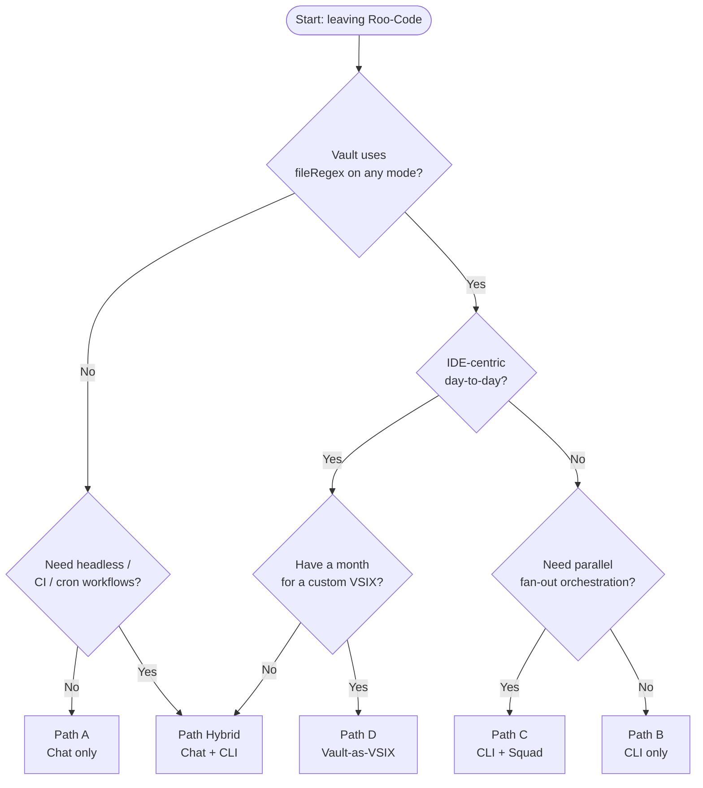

<!-- Phase 10b Path E + Hybrid+PAW added 2026-04-30 -->

# Phase 7 — Migration Path Options

> Parent plan: [`00-plan.md`](00-plan.md) · Index: [`README.md`](README.md) · Gap matrix: [`60-gap-analysis.md`](60-gap-analysis.md)

**What this file is for.** Score the candidate migration paths (A/B/C/D + Hybrid, plus **Path E (PAW)** and **Path Hybrid+PAW** added in Phase 10b) against a weighted decision-criteria framework derived from the user's actual context (Windows 11 + [`roo-vault`](../../../../roo-vault) with 17 modes / 7 MCP servers / multi-project symlink layout) and the unified Gap Catalog from Phase 6 (with PAW column added Phase 10b), then deliver an opinionated recommendation that hands off to [`80-migration-playbook.md`](80-migration-playbook.md).

**Path definitions** (used verbatim by downstream phases):

- **Path A — Copilot Chat only.** `.github/agents/*.agent.md` + `.github/copilot-instructions.md` + `.github/instructions/*.instructions.md` + `.vscode/mcp.json` + user-scope `*.toolsets.jsonc`. No CLI, no Squad, no VSIX.
- **Path B — Copilot CLI only.** `~/.copilot/agents/*.agent.md` + `~/.copilot/instructions/` + `~/.copilot/mcp-config.json` + hooks for `fileRegex` policy. CLI is the primary surface; Chat optional but unmanaged.
- **Path C — CLI + Squad overlay.** Path B plus Squad's parallel orchestration (`fleet-dispatch`, `wave-dispatch`, named-agent registry, Ralph daemon). Inherits Squad alpha-maturity risk (CG-12).
- **Path D — Vault-as-VSIX.** Custom VS Code extension shipping the vault via `@github/copilot-sdk` (Path-D embeddability = 🟡 per [50 § 7](50-copilot-cli-research.md#7-sdk-githubcopilot-sdk--full-export-catalogue-phase-5b-ii-b-1)) or via `vscode.chat.createChatParticipant` + Language Model Tools API. Maximum control; ~1 engineer-month + ongoing 0.x churn.
- **Path Hybrid — Chat (interactive) + CLI (automation).** Both surfaces, sharing `.agent.md` and `AGENTS.md` files; MCP duplicated per the [CG-3 schema fork](50-copilot-cli-research.md#13-limits--known-gaps-relative-to-roo-cli-gap-catalog--phase-5b-ii-b-2).
- **Path E — PAW (Phased Agent Workflow).** _(Added Phase 10b.)_ Adopt PAW from `c:/git/phased-agent-workflow` as the _workflow layer_ on top of any single host (Copilot CLI plugin, Copilot Chat extension, or Claude Code via NPM CLI). PAW is **not a host** — it is a Markdown-and-skill bundle (2 agents, ~30 skills, 23-field `WorkflowContext.md`) with **zero runtime deps** that imposes a serial Spec → Research → Plan → Implement → Review → PR state machine on top of whichever host is selected. Per [`35-paw-inventory.md`](35-paw-inventory.md) Path E is _complementary_, not standalone.
- **Path Hybrid+PAW** — Path Hybrid as the host substrate (Chat + CLI sharing one `.agent.md` set) + PAW installed as both Copilot CLI plugin (CLI side) and VS Code extension (Chat side), so the workflow agents (`PAW`, `PAW-Review`) are reachable from either surface and the artifact persistence at `.paw/work/<work-id>/` is shared via git. This is the canonical Phase-10b composition because Hybrid is the standing-recommendation host substrate.

---

## § 1 — Decision-Criteria Framework

Eight weighted criteria, each scored 1 (worst) – 5 (best) per path. Weights sum to 100%.

| #      | Criterion                      | Weight | What it measures                                                                                        | Rationale                                                                                                                                                                                                                                                                                                    |
| ------ | ------------------------------ | -----: | ------------------------------------------------------------------------------------------------------- | ------------------------------------------------------------------------------------------------------------------------------------------------------------------------------------------------------------------------------------------------------------------------------------------------------------ |
| **C1** | **Capability fidelity to Roo** |    30% | How many Phase-6 rows stay 🔴/🟠 after migration; how cleanly the vault's 17 modes survive              | Highest weight because the user's verbatim goal in [`00-plan.md`](00-plan.md) is _"replicate the Roo-Code experience — modes, orchestrator, MCP, custom prompts, rules, memory"_. Anything that drops below ~80% fidelity contradicts the brief.                                                             |
| **C2** | **Effort to migrate**          |    20% | Engineer-days for first project + steady-state per new project                                          | Single-developer migration ([`00-plan.md` § Non-goals](00-plan.md)); time spent here doesn't ship features. The vault's 17 modes scale this linearly.                                                                                                                                                        |
| **C3** | **Operational risk**           |    15% | Alpha/preview surface area, upstream-fix dependencies, breaking-change cadence                          | The user is the only operator. A 0.x dep that breaks weekly is materially worse than a stable surface with a known gap. Squad v0.9.1 (CG-12) and `@github/copilot-sdk` 0.3.0 (CG-8, 54 versions in 5 months) are the canonical examples.                                                                     |
| **C4** | **Day-to-day UX**              |    10% | One panel vs two; GUI vs slash commands; mode picker, MCP toggles, diff view                            | The vault user is an IDE-centric developer (VS Code Stable per [`00-plan.md` § Constraints](00-plan.md)). Pure-CLI workflows materially change the muscle memory; mixed-surface workflows split attention.                                                                                                   |
| **C5** | **Automation / CI fitness**    |    10% | Headless invocation, JSON event stream, OTel, exit codes                                                | The user has automation today (Ralph-style watch loops are documented in the vault; [`apps/cli/src/agent/json-event-emitter.ts`](../../../apps/cli/src/agent/json-event-emitter.ts) in Roo proves they consume NDJSON). Any path that loses headless capability cannot run pre-commit / CI / cron workflows. |
| **C6** | **Vault portability**          |     5% | Multi-machine, multi-profile, symlink-friendly                                                          | Lower weight because the user has one active dev box ([`00-plan.md` § Constraints](00-plan.md): single Windows 11 machine), but the vault is _designed_ for multi-machine (`setup-vault.ps1`, [`20 § Notable patterns`](20-roo-vault-inventory.md)). Future-proofing matters.                                |
| **C7** | **Lock-in / reversibility**    |     5% | Can the user back out and re-adopt Roo or pivot to another agent? Are config files cross-tool-readable? | `.agent.md` + `AGENTS.md` are cross-tool standards (Claude Code, Codex, Cursor, Gemini CLI all read at least one). A path that converges on those is reversible; a path that ships a bespoke VSIX is not.                                                                                                    |
| **C8** | **Cost**                       |     5% | Copilot subscription tier, GitHub Actions minutes for cloud agent, model BYOK savings                   | Low weight because the user already has Copilot ([`00-plan.md` § Constraints](00-plan.md): _"No paid tier assumptions beyond the user's existing subscription"_), but BYOK to local Ollama (CW-2) is a strict cost win for CLI-bearing paths.                                                                |

**Scoring conventions.**

- **C1 fidelity** maps roughly: 5 = ≤1 🟠 surviving, no 🔴; 4 = 2-3 🟠 / 0 🔴; 3 = 4-6 🟠 OR 1 🔴; 2 = 7+ 🟠 OR 2 🔴; 1 = ≥3 🔴.
- **C2 effort** is _inverse_ (lower effort → higher score): 5 = 1–3 days first-project + trivial steady-state; 4 = 3–7 days; 3 = 1–2 weeks; 2 = 2–4 weeks; 1 = 1+ engineer-month.
- **C3 risk** is _inverse_ (lower risk → higher score): 5 = stable GA APIs only; 1 = alpha + multiple upstream-blocked bugs.

---

## § 2 — Path-by-Path Scoring

### § 2.A — Path A: Copilot Chat only

**1. Summary.** Disable the Roo-Code extension. Convert each of the vault's 17 modes to `.github/agents/<slug>.agent.md` (project-scope) and `%APPDATA%\Code\User\prompts\*.agent.md` (user-scope). Move `~/.roo/rules/` → `%APPDATA%\Code\User\prompts\*.instructions.md`. Move `mcp_settings.json` → `%APPDATA%\Code\User\mcp.json` (rename `mcpServers` → `servers`, add `${input:…}` placeholders). Per-project: `.roo/mcp.json` → `.vscode/mcp.json`; `.roomodes` → `.github/agents/`. Keep working in the VS Code Chat panel only. **No CLI, no Squad, no custom extension.**

**2. What you keep from the vault.**

- ✅ All 17 mode definitions (slug/name/roleDefinition/customInstructions/description) port mechanically per the [60 § B.1](60-gap-analysis.md#b1-modes--agents-schema) row mappings.
- ✅ Layered composition (built-in → user → project) survives intact ([60 § B.1 row 7](60-gap-analysis.md#b1-modes--agents-schema)).
- ✅ All 7 MCP servers (`mcpServers` → `servers` rename, then `${input:…}` for secrets) — Chat's Credential Manager UX is _better_ than Roo's gitignored-JSON pattern ([60 § B.4 row 6](60-gap-analysis.md#b4-mcp-integration)).
- ✅ `AGENTS.md` reads natively (W-5).
- ✅ `~/.roo/rules/` → `%APPDATA%\Code\User\prompts\*.instructions.md` via symlink (vault `setup-vault.ps1` retargets cleanly).
- ⚠️ `.roomodes` `groups` array → `.agent.md` `tools:` (mechanical group→tool expansion, finer-grained — strict win for the _tool_ axis only).

**3. What you lose** (Phase-6 rows that survive as 🔴/🟠 on Chat):

- 🔴 **G-1 `groups[].fileRegex` per-mode edit restriction** ([60 § B.2 row 2](60-gap-analysis.md#b2-tool-restrictions-per-mode-toolmcpfile-gating)). Chat has **no hook surface**; the only enforcement is prose in `.agent.md` ("only edit `.md` files"). Affects ≥3 vault modes (architect, translate, docs-extractor — confirmed in [20 § Global Settings](20-roo-vault-inventory.md)). Per Q-047 this row alone is binding.
- 🔴 **G-2 per-mode `.roo/rules-<mode>/` folder** ([60 § B.3 row 3](60-gap-analysis.md#b3-custom-prompts--rules)). No `applyTo: agent:<slug>` glob exists; rules are file-glob-scoped, not agent-scoped. Workaround: inline rule bodies into each `.agent.md`, accepting duplication.
- 🟠 **G-13 BYOK / local-model providers** ([60 § B.10 row 1](60-gap-analysis.md#b10-model-selection)) — _only matters if vault uses Ollama/Anthropic-direct/Azure-OpenAI_; Q-030 unresolved for the user but the vault `setup_dev_box.ps1` does install LiteLLM/Qdrant infrastructure suggestive of local-model intent.
- 🟠 **G-9 chat-history portability** ([60 § B.11 row 1](60-gap-analysis.md#b11-sessions--state--history)) — sessions live in profile-scoped state DB; no portable JSON export (Q-029).
- 🟠 **B.8 row 1 — headless invocation is structurally absent.** Any pre-commit / CI / cron workflow the user has _or might want_ requires shelling out to a separate tool. This is not a "gap" per se; it's a categorical limitation of choosing a GUI as the only surface.
- 🟠 **G-5 / CG-1-equivalent — workspace-scoped `*.toolsets.jsonc`** is still on Backlog ([microsoft/vscode#251515](https://github.com/microsoft/vscode/issues/251515)); user-scope tool sets only.
- 🟡 **Q-049 — `update_todo_list` re-injection** has no Chat equivalent (no `userPromptSubmitted` hook).

**4. What you gain** (corresponding Wins):

- ➕ **W-4 first-class secret hygiene** via `${input:id}` + Windows Credential Manager — strictly better than the vault's "gitignored `mcp_settings.json` with live tokens" pattern.
- ➕ **W-2 Agent Plugins (Preview) marketplace** for community modes.
- ➕ **W-7 parallel sub-agent dispatch** (Roo's serial enforcement was a _limitation_, not a feature).
- ➕ **W-8 native checkpoints + Fork Conversation** — strictly better than Roo's per-task git-shadow rollback.
- ➕ **W-12 unified panel UX** — single chat surface for all agents; no extension overhead.
- ➕ **W-10 org-policy ceiling** — `chat.tools.terminal.autoApprove` regex map, `chat.permissions.default`, etc.

**5. Effort estimate.**

- **First project:** **3–7 days.** Mechanical conversion of 17 modes + 7 MCP servers + rule files + `setup-vault.ps1` retargeting + per-agent prose enforcement of `fileRegex` rules.
- **Steady-state per new project:** **<1 day** — copy `.github/agents/`, `.github/instructions/`, `.vscode/mcp.json` template; commit `AGENTS.md`.
- **Ongoing maintenance:** **~1 hour/month** — mostly tracking VS Code Insider/Stable changes to the agents/instructions schema (expect monthly small diffs while the surface is in Preview).

**6. Risks** (severity · ID · upstream link).

- 🔴 **G-1 unmitigated.** Cited multiple times above. No on-disk control; relies on the model honouring the prose. **Binding constraint.**
- 🟠 **G-2 inlining bloat.** Each agent body grows by the size of its rules folder; risk of hitting the documented "no longer than 2 pages" guidance for instructions (Q-017).
- 🟠 **Q-024 — `*.toolsets.jsonc` not synced** by Settings Sync; multi-machine vault loses tool-set definitions silently.
- 🟡 **G-11 multi-profile.** Phase 8 must script profile-aware `mcp.json` symlinks (Q-026).
- 🟡 **G-9 lock-in.** Chat sessions are not portable; if the user pivots later, history is lost.

**7. Prerequisites.**

- GitHub Copilot subscription (any tier — even Free works for Chat per [40 § Storage](40-copilot-chat-research.md)).
- VS Code Stable, recent enough that `.agent.md` (post-rename) is supported (Q-016 — exact version unverified; Insider 1.96+ confirmed in Phase 4d).
- Node 20+ if any MCP server is `npx`-launched.
- Windows Credential Manager (default on Windows 11).

**8. Open questions specific to Path A.**

- **Q-005** (lossy converter fields), **Q-015** (profile-scoped agents discovery), **Q-017** (instructions size cap), **Q-024** (`*.toolsets.jsonc` Settings Sync), **Q-026** (profile-id `mcp.json` symlink helper), **Q-027** (Agent Plugins outside Preview channel — only relevant if shipping community modes), **Q-029** (sessions JSON export), **Q-047** (vault's `fileRegex` blast radius), **Q-049** (todo re-injection).

**9. Score table.**

| Criterion                  |   Weight |                                                  Score (1–5) | Weighted |
| -------------------------- | -------: | -----------------------------------------------------------: | -------: |
| C1 Capability fidelity     |      30% |                               **2** (2 🔴 + ~6 🟠 surviving) |     0.60 |
| C2 Effort                  |      20% |         **4** (3–7 days first project; trivial steady-state) |     0.80 |
| C3 Operational risk        |      15% | **4** (Chat is GA in Stable; preview surfaces well-isolated) |     0.60 |
| C4 Day-to-day UX           |      10% |                    **5** (single panel, zero context switch) |     0.50 |
| C5 Automation / CI         |      10% |                              **1** (no headless mode at all) |     0.10 |
| C6 Vault portability       |       5% |    **3** (profile-scoped `mcp.json` needs PowerShell helper) |     0.15 |
| C7 Lock-in / reversibility |       5% |             **4** (`.agent.md` + `AGENTS.md` are cross-tool) |     0.20 |
| C8 Cost                    |       5% |            **3** (no BYOK; locked to GitHub-curated catalog) |     0.15 |
| **Total**                  | **100%** |                                                            — | **3.10** |

**10. Verdict.** Choose Path A only if (a) you do not depend on `fileRegex` for safety, (b) you never run agents from CI / pre-commit / cron, and (c) you primarily use the IDE for interactive coding. **Not recommended for the user's current vault** — G-1 alone disqualifies it for the architect/translate/docs-extractor modes.

---

### § 2.B — Path B: Copilot CLI only

**1. Summary.** Install `@github/copilot` (npm). Set `COPILOT_HOME=<vault>/global-settings/copilot` so the entire CLI config tree is vault-anchored. Convert vault modes to `~/.copilot/agents/*.agent.md` (same body schema as Path A — files port directly). Move rules to `~/.copilot/instructions/`. Move MCP to `~/.copilot/mcp-config.json` (top-level `mcpServers`, env-var substitution). Ship a `preToolUse` PowerShell hook (per [50 § 10.4](50-copilot-cli-research.md#104-pretooluse-deep-dive--the-fileregex-substitute)) implementing the `fileRegex` policy. Drive everything from a terminal. VS Code becomes a plain editor.

**2. What you keep.**

- ✅ All 17 modes — `.agent.md` body is identical to Path A; only the storage path changes.
- ✅ All rules — `~/.roo/rules/` → `~/.copilot/instructions/`; symlink retargets cleanly.
- ✅ All 7 MCP servers — `mcpServers` schema is preserved (no rename), env-var substitution honoured.
- ✅ `AGENTS.md` (CLI reads it natively per [50 § 4.1](50-copilot-cli-research.md)).
- ✅ Built-in starter agents (`code-review`, `general-purpose`, `explore`, `research`, `rubber-duck`, `task`, `configure-copilot`) — overridable by user files (CLI better-than-Roo: 7 starting points vs Roo's 5 built-ins).

**3. What you lose.**

- 🟠 **CG-1 webview UI loss** — `ModesView.tsx`, `McpServerRestriction.tsx`, `DeleteModeDialog.tsx`, mode-picker GUI, MCP toggle UI, diff preview. **The single biggest UX regression.** Mitigation: Command Palette `Chat: New Agent…` or hand-edit `.agent.md`.
- 🟠 **CG-7 no structured event stream** ([copilot-cli#52](https://github.com/github/copilot-cli/issues/52)) — Roo's NDJSON ([`apps/cli/src/agent/json-event-emitter.ts`](../../../apps/cli/src/agent/json-event-emitter.ts), 28+ event types) has no equivalent; plain text only. **Drop down to `@github/copilot-sdk` for code-driven consumers.**
- 🟠 **CG-11 sub-agent hook bypass** ([copilot-cli#2392](https://github.com/github/copilot-cli/issues/2392)) — `task`-dispatched sub-agents bypass `preToolUse`. **Demotes G-1 mitigation from "complete" to "complete for boot-agent only".** Requires restructuring orchestrator flows to use `--agent` boot mode instead of `task` dispatch for any regex-bound mode.
- 🟠 **CG-8 SDK 0.x churn** — only matters if user writes SDK consumers; CLI itself is more stable.
- 🟠 **CG-4 repo-settings 6-key allowlist** — per-project `allowedTools`/`deniedTools` silently dropped; needs a launcher wrapper.
- 🟠 **G-2 inherited** (per-mode rules folder still has no first-class equivalent).
- 🟡 **CG-2 secret model** (env-var only, no Credential Manager prompt) — vault must persist via `[Environment]::SetEnvironmentVariable("KEY","val","User")`.
- 🟡 **CG-3 MCP schema fork** — only matters if also using Chat (i.e., not on pure Path B).
- 🟡 **Q-049 todo re-injection** — approximated via `agentStop` or `userPromptSubmitted` hook; not a clean port.

**4. What you gain.**

- ➕ **CW-1 G-1 mitigation via `preToolUse` hook** — the headline CLI win. Reference impl in [50 § 10.4](50-copilot-cli-research.md#104-pretooluse-deep-dive--the-fileregex-substitute).
- ➕ **CW-2 BYOK** — `COPILOT_PROVIDER_BASE_URL` / `COPILOT_PROVIDER_TYPE` (openai/azure/anthropic) closes G-13 entirely. Ollama works.
- ➕ **CW-3 OpenTelemetry** export via standard OTLP env vars.
- ➕ **CW-4 SQLite FTS5** session search.
- ➕ **CW-6 single-env-var portability** (`COPILOT_HOME`) — closes G-11 entirely; massively simpler than Chat's per-profile-id symlinks.
- ➕ **CW-7 headless invocation** (`copilot -p "…" -s --no-ask-user --allow-tool=…`) — unlocks pre-commit / cron / CI workflows.
- ➕ **CW-12 `Kind(arg)` permission grammar** — `shell(git:*)` / `write(./src/**)` / `url(github.com)`; finer than Roo's per-server `alwaysAllow`.
- ➕ **Skills (Agent Skills standard)** — cross-tool with Claude Code, Cursor, Gemini CLI, Codex.
- ➕ **`/mcp` REPL family** — keyboard-driven MCP ops far better than Chat's UI toggles.

**5. Effort estimate.**

- **First project:** **1–2 weeks.** Mechanical mode conversion (~3 days) + `preToolUse` hook authoring + per-agent test (~2 days) + Windows-Bash-vs-PowerShell skill dual-shipping (~1 day) + muscle-memory retraining (~3 days).
- **Steady-state per new project:** **<1 day** — `.github/agents/` + `.github/mcp.json` + `.github/hooks/` per project; or rely on `COPILOT_HOME` user-scope.
- **Ongoing maintenance:** **~2–4 hours/month** — CLI ships weekly (54 versions in 5 months for the SDK; CLI itself similar cadence); track upstream issues #2392 / #52 / #2540 / #2013.

**6. Risks.**

- 🟠 **CG-11 `#2392` unfixed.** Until upstream ships, sub-agent dispatched modes leak past `preToolUse`. Hard cap on the G-1 mitigation.
- 🟠 **Q-039 — `pwsh` cold-start latency** on user's Windows 11 box. 150–400 ms typical, >1 s with module loads. Per-tool overhead on hook-heavy policies.
- 🟠 **CG-1 ergonomic shock.** Users coming from a webview UI will feel the loss day-1.
- 🟡 **Q-037 — active-agent name not in hook payload.** Workaround is sidecar state file from `subagentStart`.
- 🟡 **CG-13 / CG-14 / CG-15** — assorted hook bugs ([#2893](https://github.com/github/copilot-cli/issues/2893) parallel-call race, [#2540](https://github.com/github/copilot-cli/issues/2540) plugin hooks, [#2013](https://github.com/github/copilot-cli/issues/2013) `modifiedArgs` ignored).

**7. Prerequisites.**

- GitHub Copilot subscription (any tier).
- Node 20+ (CLI runtime).
- Windows 11 with PowerShell 7+ (`pwsh.exe`) for hook reference impl; built-in `powershell.exe` 5.1 works but is slower per Q-039.
- Optionally: Ollama / LM Studio if pursuing the BYOK win.
- A terminal-friendly mindset.

**8. Open questions specific to Path B.**

- **Q-035** (`preToolUse` Windows reference — partially resolved), **Q-036** (user-scope hook discovery), **Q-037** (active-agent in payload), **Q-038** (`http` hooks on CLI), **Q-039** (pwsh cold-start), **Q-040** (`${env:VAR}` in hook env), **Q-041** (`user-invocable` skill frontmatter), **Q-042** ([copilot-cli#52](https://github.com/github/copilot-cli/issues/52) tracking), **Q-043** (granular exit codes), **Q-047** (vault `fileRegex` × sub-agent intersection).

**9. Score table.**

| Criterion                  |   Weight |                                                       Score (1–5) | Weighted |
| -------------------------- | -------: | ----------------------------------------------------------------: | -------: |
| C1 Capability fidelity     |      30% |              **4** (0 🔴, ~7 🟠 with G-1 mitigated; CG-11 caveat) |     1.20 |
| C2 Effort                  |      20% |        **3** (1–2 weeks; hook authoring tax; skill dual-shipping) |     0.60 |
| C3 Operational risk        |      15% | **3** (4 active CLI bugs bound the headline win; weekly releases) |     0.45 |
| C4 Day-to-day UX           |      10% |                     **2** (CLI-only; no GUI; muscle-memory shift) |     0.20 |
| C5 Automation / CI         |      10% |                   **5** (purpose-built; OTel; FTS5; share/resume) |     0.50 |
| C6 Vault portability       |       5% |                 **5** (single env var `COPILOT_HOME` closes G-11) |     0.25 |
| C7 Lock-in / reversibility |       5% |             **5** (`.agent.md` + `AGENTS.md` cross-tool; SDK MIT) |     0.25 |
| C8 Cost                    |       5% |                                   **5** (BYOK to Ollama possible) |     0.25 |
| **Total**                  | **100%** |                                                                 — | **3.70** |

**10. Verdict.** Choose Path B if you live in the terminal already, want to script your agent workflows, and accept the loss of the visual mode CRUD. **Strong choice for headless-heavy users; compromised choice for IDE-centric users like the vault owner.**

---

### § 2.C — Path C: CLI + Squad overlay

**1. Summary.** Path B + install `@bradygaster/squad-cli` (alpha v0.9.1) and adopt Squad's parallel-orchestration patterns: `squad fan-out`, `squad wave-dispatch`, `squad fleet-dispatch`, the named-agent casting registry, and the Ralph watch daemon. Squad sits _in front of_ the CLI: invocations become `squad …` rather than `copilot …`. The CLI's `.agent.md` files survive untouched; Squad reads them.

**2. What you keep.**

- ✅ Everything Path B keeps.
- ✅ Plus Squad-specific affordances: persistent named agents (e.g., `squad cast architect-1 architect-2`), parallel `task` fan-out at concurrency caps, `.squad/log/` git-committed state, in-process `SessionHooks` via the SDK adapter.

**3. What you lose.**

- All Path-B losses, plus:
- 🟠 **CG-12 Squad alpha-stability tax.** v0.9.1; no SemVer commitment; runtime ESM patcher needed for SDK 0.1.32 (per [Phase 5b-ii-B-1 finding](90-decision-log.md#2026-04-26-1758--phase-5b-ii-b-1-githubcopilot-sdk-exports-catalogued-path-d-embeddability--with-shim)); pinned ~3 minor versions behind current SDK; doctor command exists _because_ upstream churn breaks it. **Q-011 still open** on Windows support state and breaking-change cadence.
- 🟠 **Indirection-debugging tax** — when something goes wrong, the failure can be in: the model, the CLI, the SDK adapter, Squad's orchestration layer, the casting registry, or the shipped skill. Triage surface is 2× Path B.
- 🟠 **Squad uses non-canonical config locations** (`.copilot/mcp-config.json` instead of `.github/mcp.json` per Q-031). Vault must dual-author or pick one canonical source.
- 🟠 **Ralph default invokes the wrong CLI** (`gh copilot` legacy extension, not `@github/copilot`) — vault adoption requires `--agent-cmd "copilot"` override. Easy to forget.

**4. What you gain.**

- ➕ **Parallel orchestration** is the headline. If your workflow benefits from N-way fan-out (e.g., "review this PR with architect + security + tester in parallel and merge results"), Squad is purpose-built; CLI's bare `task` tool is sequential-by-prose.
- ➕ **Casting registry** — persistent named agents with their own per-agent histories in `.squad/agents/<name>/`. Roo has no equivalent.
- ➕ **Ralph watch daemon** — file-watch-triggered agent invocation; replicates Roo's autonomous loops.
- ➕ **23 ready-made skills** in `c:/git/squad/.copilot/skills/` (some directly applicable: `secret-handling`, `protected-files`, `model-selection`).

**5. Effort estimate.**

- **First project:** **2–4 weeks.** Path-B effort (1–2 weeks) + Squad onboarding (3–5 days) + casting/fan-out workflow design (3–5 days) + alpha-bug triage (variable).
- **Steady-state per new project:** **1–3 days** — heavier than Path B because each project may want a `.squad/` state subtree.
- **Ongoing maintenance:** **~6–10 hours/month** — alpha-software tax; Squad's SDK pin lags upstream so doctor commands and runtime patches need re-running on each `npm update`.

**6. Risks.**

- 🟠 **CG-12 alpha maturity.** Single largest concern. Q-011 (Windows support, breaking-change cadence) unresolved.
- 🟠 **Two-stack debugging surface.**
- 🟠 **Squad cannot embed in VS Code** ([resolved Q-010](99-open-questions.md)) — Squad has zero `vscode.lm` deps, so any future Path-D pivot abandons Squad.
- 🟡 **Skills cross-tool surface fragments** — Squad's skills are Bash-first; Windows requires dual-shipping.

**7. Prerequisites.**

- All Path-B prereqs.
- Tolerance for v0.x alpha software in a daily driver.
- A workflow that genuinely needs parallel orchestration (otherwise Squad's value prop collapses to "an extra abstraction layer").

**8. Open questions specific to Path C.**

- **Q-011** (Squad alpha stability commitment), **Q-031** (`.copilot/mcp-config.json` non-canonical — already resolved as "non-canonical, use `.github/mcp.json`"), **Q-034** (sub-agent depth/concurrency caps under nested orchestrators), all Path-B Qs.

**9. Score table.**

| Criterion                  |   Weight |                                                           Score (1–5) | Weighted |
| -------------------------- | -------: | --------------------------------------------------------------------: | -------: |
| C1 Capability fidelity     |      30% |                   **4** (same as B; parallel-fan-out adds beyond Roo) |     1.20 |
| C2 Effort                  |      20% |                                                     **2** (2–4 weeks) |     0.40 |
| C3 Operational risk        |      15% |                            **2** (alpha + double stack + indirection) |     0.30 |
| C4 Day-to-day UX           |      10% |                            **2** (CLI-only, plus a second CLI on top) |     0.20 |
| C5 Automation / CI         |      10% |                             **5** (parallel + Ralph + portable state) |     0.50 |
| C6 Vault portability       |       5% | **4** (inherits CLI's `COPILOT_HOME`; Squad adds non-canonical paths) |     0.20 |
| C7 Lock-in / reversibility |       5% |                       **3** (Squad-specific concepts don't port back) |     0.15 |
| C8 Cost                    |       5% |                                             **5** (inherits CLI BYOK) |     0.25 |
| **Total**                  | **100%** |                                                                     — | **3.20** |

**10. Verdict.** Choose Path C only if you have a **demonstrated parallel-orchestration workload** (e.g., multi-agent code review, A/B model consensus) and tolerate alpha software. **Not recommended for the vault's current 17-mode/sequential-orchestrator pattern** — the marginal value over Path B is small and the maintenance cost is high.

---

### § 2.D — Path D: Vault-as-VSIX

**1. Summary.** Build a custom VS Code extension that ships the vault's modes/rules/MCP and consumes either `@github/copilot-sdk` (extension-host process — embeddability = 🟡 per [50 § 7](50-copilot-cli-research.md#7-sdk-githubcopilot-sdk--full-export-catalogue-phase-5b-ii-b-1)) or registers via the chat extension API (`vscode.chat.createChatParticipant` + Language Model Tools API + `contributes.languageModelTools`). Re-create Roo's `ModesView.tsx` / `McpServerRestriction.tsx` UX as either chat-participant UI or a webview ↔ extension-host postMessage bridge. **Maximum control; closes G-1 and G-2 cleanly because you're writing the enforcement code.**

**2. What you keep.**

- ✅ Everything from Roo, structurally — because you re-implement what you need on top of Copilot's stable surfaces.
- ✅ `fileRegex` enforcement (your own VSIX checks before forwarding the tool call).
- ✅ Per-mode rules folder (your own VSIX loads the right files per active agent).
- ✅ Visual mode CRUD (your own webview).

**3. What you lose.**

- 🔴 **~1 engineer-month** of _unproductive_ work (per [50 § 7](50-copilot-cli-research.md#7-sdk-githubcopilot-sdk--full-export-catalogue-phase-5b-ii-b-1) verdict). The user is a single developer; this is a non-trivial slice of capacity.
- 🟠 **Ongoing 0.x SDK churn maintenance.** SDK at 0.3.0, 54 versions in 5 months, breaking changes per minor. You become the Squad team for your own vault.
- 🟠 **CLI-bundling decision (Q-046).** Either user installs `@github/copilot` separately (degrades first-run UX) or VSIX bundles it (size + signing + auto-update conflicts).
- 🟠 **Q-027 — Agent Plugins channel is Preview.** The stable alternative (`vscode.chat.createChatParticipant` + Language Model Tools API) is more code.
- 🟡 **Q-044, Q-045** — SDK `acpServer` export presence and programmatic MCP-server registration not yet confirmed.
- 🟡 Inherits Path-B's CG-7 (no structured events from CLI; you'd need to write your own bridge using SDK streaming events).

**4. What you gain.**

- ➕ **G-1 and G-2 closed cleanly.** No upstream-fix dependency; you control the enforcement.
- ➕ **Visual mode CRUD restored.** Replicate Roo's UX exactly.
- ➕ **Per-mode rules folder restored** (your VSIX loads `.roo/rules-<mode>/` directly).
- ➕ **Future-proofing.** The VSIX is a stable abstraction layer between the vault and Copilot's evolving surfaces. When Copilot ships `fileRegex` natively, you remove your shim; when they break the schema, you absorb it.
- ➕ **Optional cloud-agent reuse** (`@github/copilot-sdk` exposes session APIs).

**5. Effort estimate.**

- **First project:** **3–6 weeks** (the brief's "~1 engineer-month" target). Includes: VSIX scaffold + extension-host SDK harness + chat-participant registration + tool-allowlist enforcement + webview re-implementation of mode CRUD + first-run CLI-detect-or-bundle UX + initial `fileRegex` enforcement + skills/instructions ingestion.
- **Steady-state per new project:** **<1 day** — the VSIX reads vault config from `roo-vault/projects/<name>/`.
- **Ongoing maintenance:** **~10–20 hours/month** — SDK churn + Marketplace version cycles + your own bug surface.

**6. Risks.**

- 🔴 **Sunk-cost risk.** Spend 4–6 weeks; Copilot ships `fileRegex` natively a month later; the VSIX becomes redundant.
- 🟠 **CG-8 SDK 0.x churn.**
- 🟠 **Marketplace gating** for personal use — Q-027 / Q-028 unresolved on whether you can ship this VSIX outside the Agent Plugins Preview channel.
- 🟠 **Q-046 — VSIX size** if bundling CLI binary (tens of MB).
- 🟡 **Single-developer maintenance burden** — if the user takes a month off, the VSIX rots.

**7. Prerequisites.**

- All Path-B prereqs.
- Solid VS Code extension-development experience (Yeoman generator, `npm i vscode`, debugging in the Extension Development Host).
- Willingness to commit ~1 month of focused engineering before seeing usable output.
- Optionally a publisher account on the VS Code Marketplace.

**8. Open questions specific to Path D.**

- **Q-027** (extension manifest path outside Agent Plugins Preview), **Q-028** (org-management for plugins), **Q-044** (`acpServer` export), **Q-045** (programmatic MCP registration), **Q-046** (CLI bundling).

**9. Score table.**

| Criterion                  |   Weight |                                              Score (1–5) | Weighted |
| -------------------------- | -------: | -------------------------------------------------------: | -------: |
| C1 Capability fidelity     |      30% |          **5** (you control enforcement; G-1/G-2 closed) |     1.50 |
| C2 Effort                  |      20% |                          **1** (3–6 weeks first project) |     0.20 |
| C3 Operational risk        |      15% |         **2** (SDK 0.x + sunk-cost + Marketplace gating) |     0.30 |
| C4 Day-to-day UX           |      10% |                         **5** (rebuild Roo's UX exactly) |     0.50 |
| C5 Automation / CI         |      10% | **3** (extension-host doesn't help CI; CLI still needed) |     0.30 |
| C6 Vault portability       |       5% |   **4** (VSIX installs anywhere; vault config decoupled) |     0.20 |
| C7 Lock-in / reversibility |       5% |                           **2** (you now own a codebase) |     0.10 |
| C8 Cost                    |       5% |  **3** (no BYOK natively; engineering time is real cost) |     0.15 |
| **Total**                  | **100%** |                                                        — | **3.25** |

**10. Verdict.** Choose Path D only if (a) you have a month of focused capacity, (b) the vault's `fileRegex` enforcement is genuinely safety-critical (e.g., production secrets, regulatory edits), and (c) you're prepared to maintain a personal extension long-term. **Not recommended as a Phase-1 migration step** — but viable as a Phase-3 escalation if Path A/B/Hybrid hit unacceptable gaps.

---

### § 2.E — Path Hybrid: Chat (interactive) + CLI (automation)

**1. Summary.** Use Path A's Chat surface for interactive coding (the IDE you already live in) and Path B's CLI for any automation, headless invocation, hook-based policy enforcement, or BYOK workflow. **Both surfaces share the same `.agent.md` files** by symlinking `.github/agents/` (project) and `~/.copilot/agents/` ↔ `%APPDATA%\Code\User\prompts\` (user); **`AGENTS.md` is read by both natively**. The MCP layer is the only piece that genuinely duplicates per the [CG-3 schema fork](50-copilot-cli-research.md#13-limits--known-gaps-relative-to-roo-cli-gap-catalog--phase-5b-ii-b-2): one `.vscode/mcp.json` (`servers:` shape) for Chat, one `.github/mcp.json` (`mcpServers:` shape) for CLI, generated from a single canonical YAML by a Phase-8 converter (`jq '{mcpServers: .servers}'` is the one-liner).

**2. What you keep.**

- ✅ Everything Path A keeps for the IDE workflow.
- ✅ Everything Path B keeps for automation — including the `preToolUse` hook for `fileRegex` enforcement.
- ✅ **The vault's symlink-and-commit pattern survives almost intact** — `.agent.md` and `AGENTS.md` are shared by both surfaces; only the MCP file is duplicated.

**3. What you lose.**

- 🔴 **G-1 in Chat-only sessions.** When working interactively in the IDE, the `preToolUse` hook does not fire (Chat has no hook surface). Mitigation: prose enforcement + reserve the Chat surface for read-mostly modes (architect, ask, code-review); use the CLI for any mode that genuinely needs the regex barrier.
- 🟠 **G-2 inherited** (per-mode rules folder).
- 🟠 **CG-3 MCP duplication** — adds a converter step; secrets must be authored in env vars (Path-B canonical) and then surfaced as `${input:…}` in the Chat-side file (a Phase-8 helper writes both).
- 🟠 **Q-049 todo re-injection** unsolved on both sides.
- 🟡 **Cognitive load — two panels.** Mitigated by clear "Chat for interactive, terminal for cron" mental model.

**4. What you gain.**

- ➕ All Chat ➕ wins (W-2/4/7/8/10/12).
- ➕ All CLI ➕ wins (CW-1/2/3/4/6/7/12 + skills + `/mcp` REPL).
- ➕ **G-1 mitigated where it matters.** Vault's regex-bound modes (architect, translate, docs-extractor) get hook enforcement when invoked from the CLI; the IDE-bound modes (code, ask) where regex is less critical use Chat.
- ➕ **G-13 mitigated where it matters.** BYOK on the CLI side; Chat falls back to Copilot's catalog.
- ➕ **G-9 mitigated where it matters.** Chat sessions live in the profile DB (opaque); CLI sessions live as JSONL on disk (portable). Use the CLI for any session you want to keep.
- ➕ **Reversibility maximised** — the shared `.agent.md` + `AGENTS.md` files port to any other agent (Claude Code, Cursor, Codex, Gemini CLI) and back to Roo.

**5. Effort estimate.**

- **First project:** **1–2 weeks.** Path-A conversion (3–7 days) + CLI bootstrap (2–3 days) + MCP dual-format converter script (1–2 days) + hook authoring for the regex-bound modes only (1–2 days).
- **Steady-state per new project:** **<1 day** — same templates as Path A and Path B applied together.
- **Ongoing maintenance:** **~3–5 hours/month** — sum of Path A (~1 hr) + Path B (~2–4 hr) less overlap.

**6. Risks.**

- 🔴 **G-1 on Chat side.** Acknowledged trade-off; binding only if you forget which surface enforces what.
- 🟠 **MCP drift.** If Chat and CLI MCP files diverge, two configs must be reconciled. Phase-8 owns the canonical-source decision and the generator script.
- 🟠 **Skill / hook surface only on CLI side.** Skills don't fire in Chat; agentic loops with skill dependencies only work in the terminal.
- 🟡 **Onboarding new contributors** to two-surface workflows.

**7. Prerequisites.**

- All Path-A prereqs **and** all Path-B prereqs (subscription works once for both; install both binaries; set both config trees).

**8. Open questions specific to Hybrid.**

- All Path A and Path B Qs.
- **Q-050 [NEW] — canonical-source decision for MCP config.** YAML with two generators? `.vscode/mcp.json` as truth and CLI generated? `.github/mcp.json` as truth and Chat generated? Filed below.
- **Q-051 [NEW] — `AGENTS.md` ↔ `AGENTS.local.md` interaction with both surfaces.** Q-048 covers the file existence; Q-051 covers the dual-surface read order.

**9. Score table.**

| Criterion                  |   Weight |                                                                                Score (1–5) | Weighted |
| -------------------------- | -------: | -----------------------------------------------------------------------------------------: | -------: |
| C1 Capability fidelity     |      30% | **4** (G-1 mitigated where it matters; G-2 still 🟠; ~5 surviving 🟠 across both surfaces) |     1.20 |
| C2 Effort                  |      20% |                                         **3** (1–2 weeks first project; sum of A + lean B) |     0.60 |
| C3 Operational risk        |      15% |                              **3** (CLI bugs apply to automation surface only; Chat is GA) |     0.45 |
| C4 Day-to-day UX           |      10% |                        **4** (IDE for daily work; terminal for automation; familiar split) |     0.40 |
| C5 Automation / CI         |      10% |                                                         **5** (full CLI surface available) |     0.50 |
| C6 Vault portability       |       5% |                           **5** (`COPILOT_HOME` for CLI; Chat profile helper for the rest) |     0.25 |
| C7 Lock-in / reversibility |       5% |                              **5** (`.agent.md` + `AGENTS.md` shared; cross-tool readable) |     0.25 |
| C8 Cost                    |       5% |                                                                   **5** (BYOK on CLI side) |     0.25 |
| **Total**                  | **100%** |                                                                                          — | **3.90** |

**10. Verdict.** Choose Hybrid as the **default** for an IDE-centric developer who also needs automation and policy enforcement. Pays the duplication cost only on MCP (one schema-fork converter); everything else (modes, rules, AGENTS.md) is genuinely shared.

---

### § 2.F — Path E: PAW (Phased Agent Workflow) — _added Phase 10b_

**1. Summary.** Adopt **PAW** ([`35-paw-inventory.md`](35-paw-inventory.md)) as the primary workflow surface on top of a single host. PAW ships into one of three hosts via three install paths ([`35 § 10.1`](35-paw-inventory.md#101-installation)): (a) **Copilot CLI plugin** `copilot plugin install lossyrob/phased-agent-workflow`, (b) **NPM CLI installer** `npx @paw-workflow/cli install copilot|claude`, (c) **VS Code .vsix** for Copilot Chat. The user works through PAW's two long-lived agents (`PAW` for Spec→PR implementation flow, `PAW-Review` for PR review) which delegate to ~30 SKILL.md skills (`paw-init`, `paw-spec`, `paw-implement`, `paw-impl-review`, `paw-pr`, `paw-final-review`, etc.). Per-work-item state lives at `.paw/work/<work-id>/{Spec,CodeResearch,ImplementationPlan,WorkflowContext,Docs}.md` — committed Markdown, diff-able in PRs, machine-portable via the `Repository Identity` proof string. The vault's 17 modes are **not converted**; they are _replaced by_ PAW's 2 agents + skills + WorkflowContext-driven configuration.

> **Important nuance** (per the [Phase 10b open scope](README.md#phase-10--paw-evaluation-re-opened-2026-04-30)): PAW is **complementary** to a host. Path E "alone" still requires picking _one_ host (CLI, Chat, or Claude Code). For the canonical evaluation that pairs PAW with the standing-recommendation Hybrid substrate, see [§ 2.G — Path Hybrid+PAW](#-2g--path-hybridpaw--added-phase-10b).

**2. What you keep from the vault.**

- ✅ **`AGENTS.md`** is read first-class by `paw-init` parameter resolution ([`35 § 6.3`](35-paw-inventory.md#63-agentsmd-awareness)) — vault-level always-on rules survive.
- ✅ **MCP configuration** is host-managed (PAW does not host MCP per [`35 § 5`](35-paw-inventory.md#5-mcp-integration)) — your `.vscode/mcp.json` or `.github/mcp.json` continues to work unchanged.
- ✅ **Host built-ins** (Chat: `#edit` / `#search`; CLI: `view`/`grep`/`glob`/`bash`/`apply_patch`) — PAW ships _zero_ tools and inherits the host's full registry.
- ✅ **Multi-model routing / BYOK** if hosted on CLI (PAW carries model-name string preferences in `WorkflowContext.md` but doesn't gate provider routing per [`35 § 9 / P-7`](35-paw-inventory.md#9-model--provider-support)).
- ✅ **All 7 vault MCP servers** (PAW has no opinion on MCP).
- ⚠️ **Vault's 17 modes**: _not_ preserved. PAW's only agents are `PAW` and `PAW-Review` ([`35 § 3 / P-4`](35-paw-inventory.md#3-mode--agent--phase-system-)). Mode-specific personas like Roo's `architect`, `translate`, `docs-extractor` either (a) become _skill conventions_ invoked from inside the PAW workflow, (b) remain as separate `.agent.md` files installed alongside PAW (but not orchestrated by PAW), or (c) are dropped. This is the headline trade-off of Path E.

**3. What you lose** (Phase-6 rows that survive as 🔴/🟠 with PAW _itself_ not contributing a fix; see [`60 § G`](60-gap-analysis.md#g-paw-surface-summary-added-phase-10b--2026-04-30)):

- 🟠 **G-1 `fileRegex`** — unchanged; PAW has no per-skill file-edit restriction (P-1, [`35 § 4.2`](35-paw-inventory.md#42-per-phase--per-skill-tool-restrictions)). On Copilot CLI host, the host's `preToolUse` hook still works → 🟠; on Chat host the gap is 🔴.
- 🟠 **G-2 per-mode rules folder** — _worse_ under PAW than under Path A/B because PAW deprecated `.paw/instructions/` ([P-9](35-paw-inventory.md#12-paw-gap-catalog-preliminary), [`extension.ts:274-309`](../../../../phased-agent-workflow/src/extension.ts:274-309)); only `WorkflowContext.md` per-work-item config remains as a project-scope knob.
- 🟠 **17 vault modes collapse to 2 PAW agents.** Roo's mode taxonomy is replaced by PAW's workflow-stage taxonomy. Modes like `code-reviewer`, `pr-fixer`, `merge-resolver`, `issue-fixer`, `tester` map plausibly onto PAW skills (`paw-impl-review`, `paw-pr`, `paw-final-review`); narrower modes like `translate`, `docs-extractor`, `security` do not have first-class PAW analogues. **Net: substantial vault rewrite required**, not a mechanical port.
- 🟠 **No webview / mode CRUD UI** (P-6, [`35 § 8`](35-paw-inventory.md#8-ui--surface)) — same UX cost as Path B/C; PAW ships only 3 Command Palette entries + 1 LM tool (`paw_new_session`).
- 🟡 **No project-scope agent extension** (P-9, P-4) — adding a fourth or fifth agent (e.g., a vault-specific `PAW-Lint`) is not in PAW's documented pattern (Q-061); the answer is "fork PAW or layer your own `.agent.md` files outside PAW".
- 🟡 **No per-skill MCP allowlist** (P-2, Q-060) — host-level filtering only.
- 🟡 **`paw_new_session` is fire-and-forget** (PW-5) — VS Code stage-boundary chained workflows depend on the user (or the priming `Work ID` prompt) to resume the next stage.
- 🟡 **`update_todo_list` re-injection** (Q-049) — PAW _partially_ mitigates via `ImplementationPlan.md` Phase Status checklist, but does not re-inject per turn.

**4. What you gain** (PAW-specific additive wins, from [`60 § G.3`](60-gap-analysis.md#g3--three-headline-strengths-of-paw-vs-the-existing-4-paths)):

- ➕ **Strict serial workflow state machine** ([`35 § 3.5`](35-paw-inventory.md#35-how-phases-are-sequenced--declarative-pipeline--interactive-orchestrator)) — Mandatory Transitions table + Stage Boundary Rule + `paw-transition` gate + structured-return convention. **Closes G-4 cleanly** at the orchestrator-prompt layer; no other Phase-1–9 path ships this off-the-shelf.
- ➕ **Artifact-based persistence is strictly better than every other path's session model** — `.paw/work/<work-id>/{Spec,CodeResearch,ImplementationPlan,WorkflowContext,Docs}.md` is committed Markdown. Diff-able in PRs, code-reviewable, machine-portable, resumable from any worktree via `Repository Identity`. Roo's per-task globalState, Chat's profile-DB sessions, CLI's session-state JSONL, and Squad's `.squad/log/` all lose on at least one of {portability, code-review fitness, machine-independence}.
- ➕ **Multi-model planning + Society-of-Thought review** ([`35 § 9`](35-paw-inventory.md#9-model--provider-support), [`§ 7.2`](35-paw-inventory.md#72-parallel-vs-serial)) as first-class workflow primitives — `plan_generation_models` defaults to `latest GPT, latest Gemini, latest Claude Opus` parallel-and-synthesise; SoT supports specialist→model assignments across 9 specialist personas (architecture, security, testing, …).
- ➕ **Mandatory automated quality gates** ([`35 § 4.3`](35-paw-inventory.md#43-approval--human-in-the-loop-model)) — `paw-spec-review`, `paw-plan-review`, `paw-impl-review` are unconditional regardless of `Review Policy`; pending GitHub reviews never auto-submit.
- ➕ **Worktree-based execution binding** (`Execution Binding: worktree:<work_id>:<target_branch>`) for native multi-checkout development across machines.
- ➕ **23-field `WorkflowContext.md`** lets per-work-item config be exhaustively explicit (review_policy, review_strategy, session_policy, artifact_lifecycle, final_review_mode, planning_review_mode, multi-model lists, society-of-thought knobs).

**5. Effort estimate.**

- **First project:** **2–4 weeks.** ~1 week to install PAW + bootstrap a first work item + pick a host + author project-level `AGENTS.md` overrides + populate `WorkflowContext.md` defaults. ~1–2 weeks to either (a) rewrite vault's 17 modes as PAW skill-flavoured personas or (b) decide which vault modes survive as host-side `.agent.md` files alongside PAW. ~3–5 days of dogfooding to internalise the Spec→Research→Plan→Implement→Review→PR cadence and resist the "just code it" reflex.
- **Steady-state per new project:** **<1 day per project plus per-work-item overhead.** Per-project: drop in `AGENTS.md`, choose preset (`quick` / `standard` / `thorough` / `team` / `auto`). **Per work-item: 30–90 minutes** before any code is written, because PAW mandates Spec → Research → Plan → Plan-Review before Implement begins. This is the **point** of PAW (context-driven development) but it is real overhead that should not be hidden in the estimate.
- **Ongoing maintenance:** **~3–5 hours/month** — track PAW releases (currently `0.0.1`/`0.0.2-dev`/`0.3.0` per [`35 § 1`](35-paw-inventory.md#1-identity--provenance), so cadence is high); resolve `WorkflowContext.md` schema migrations between releases.

**6. Risks.**

- 🟠 **Workflow-fit risk.** PAW prescribes a phased Spec→…→PR pipeline. For workflows that don't fit that shape (pure ad-hoc exploration, micro-edits, REPL coding, debugging-first triage), PAW is friction, not value. The Roo-vault's existing modes are heterogeneous (some explore, some edit, some review) — not all of them benefit equally from PAW's pipeline.
- 🟠 **Vault rewrite cost.** Path E is the only path investigated that doesn't _port_ the 17 modes; it _replaces_ them. If the vault's mode taxonomy is load-bearing for the user's day-to-day, this is a non-trivial transition.
- 🟠 **Maturity** ([`35 § 11`](35-paw-inventory.md#11-maturity-signals)) — components at 0.0.1 (NPM CLI) / 0.0.2-dev (extension) / 0.3.0 (CLI plugin). Active dogfooding (25+ in-flight `.paw/work/`) and a 1113-line normative spec mitigate this somewhat (PAW reads more mature than version numbers suggest), but breaking changes are likely between minor versions.
- 🟠 **Single-maintainer project.** Maintainer is `@lossyrob` (Rob Emanuele) per [`plugin.json:5-8`](../../../../phased-agent-workflow/plugin.json:5-8). If maintenance pauses, the user inherits a fork.
- 🟡 **Plugin-vs-extension precedence ambiguity** (Q-064, PW-3) — README warns about duplicate agents when both Copilot CLI plugin and NPM CLI install are present.
- 🟡 **`{{#vscode}}` / `{{#cli}}` Mustache renderer** (PW-4) — agent/skill template expansion is custom; raw-edit failures produce host-mismatched output.

**7. Prerequisites.**

- A host: **Copilot CLI** (preferred, since PAW's CLI plugin is the most-versioned distribution at 0.3.0), Copilot Chat (VS Code .vsix), or Claude Code.
- Node 20+ if using the NPM CLI installer.
- Tolerance for workflow-as-spec (you must follow Spec→Research→Plan→… or you're not really using PAW).
- Willingness to commit `.paw/work/` to git.
- For PAW developers (not consumers): WSL or Git-Bash on Windows for [`scripts/build-vsix.sh`](../../../../phased-agent-workflow/scripts/build-vsix.sh) etc. (PW-1).

**8. Open questions specific to Path E.**

- **Q-059** (skill `allowed-tools` frontmatter intent — affects P-1 severity), **Q-060** (per-skill MCP filtering plans — affects P-2), **Q-061** (project-level agent customisation story — affects whether new vault-specific personas can join), **Q-062** (`paw-lite` skill scope — alternative compact orchestrator?), **Q-063** (Society-of-Thought specialist isolation — counts toward parallel-orchestration win?), **Q-064** (plugin-vs-extension precedence — affects PW-3).

**9. Score table.**

> Scoring uses **the same 8 weighted criteria** as Paths A–D / Hybrid (see [`§ 1`](#-1--decision-criteria-framework)) with the same 1–5 scale and the same weights. Numbers below are directly comparable to Path A's 3.10 / B's 3.70 / C's 3.20 / D's 3.25 / Hybrid's 3.90.

| Criterion                  |   Weight | Score (1–5) | Weighted | Reasoning                                                                                                                                                                                                                                                                                                                                                                                                 |
| -------------------------- | -------: | ----------: | -------: | --------------------------------------------------------------------------------------------------------------------------------------------------------------------------------------------------------------------------------------------------------------------------------------------------------------------------------------------------------------------------------------------------------- |
| C1 Capability fidelity     |      30% |       **2** |     0.60 | 17-mode → 2-agent collapse is a major fidelity loss. G-1 unchanged (host-dependent), G-2 _worse_ (P-9 deprecation). PAW's `+ workflow state machine` is a real win but doesn't restore the lost mode taxonomy. Net: 2 ≈ Path A's score, since both lose a lot of vault structure even though for different reasons.                                                                                       |
| C2 Effort                  |      20% |       **2** |     0.40 | 2–4 weeks first project (vault rewrite + workflow internalisation) > Path B's 1–2 weeks. Per-work-item overhead (30–90 min Spec/Research/Plan before any code) is real and persistent.                                                                                                                                                                                                                    |
| C3 Operational risk        |      15% |       **3** |     0.45 | Components at 0.0.1/0.0.2-dev/0.3.0 + single maintainer + breaking-changes-likely cadence balanced by zero runtime deps (no SDK churn, no upstream API surface to break) and a 1113-line normative spec. Net: comparable to CLI's 3, slightly worse than Hybrid's 3 because the workflow-spec churn is in addition to the host's churn.                                                                   |
| C4 Day-to-day UX           |      10% |       **3** |     0.30 | Inherits host UX (CLI → 2; Chat → 5; estimate 3 as host-mix average). PAW adds the strict workflow cadence which is _better_ for some users (clear stages, defensible decisions) and _worse_ for others (no ad-hoc / triage path). Plus loss of mode picker per P-6.                                                                                                                                      |
| C5 Automation / CI         |      10% |       **3** |     0.30 | Inherits host (CLI → 5; Chat → 1). PAW does not contribute structured event streams or headless invocation; `paw_new_session` is fire-and-forget. Estimate 3 for host-mix average plus PAW's git-committed artifact persistence which _is_ genuinely usable from CI.                                                                                                                                      |
| C6 Vault portability       |       5% |       **4** |     0.20 | `WorkflowContext.md` is exhaustively explicit and machine-independent (`Repository Identity` + `Execution Binding`); `.paw/work/` is committed; install paths are OS-aware ([`platformDetection.ts`](../../../../phased-agent-workflow/src/agents/platformDetection.ts)). One step below Hybrid's 5 because the vault's 17-mode multi-project layout doesn't survive without rewriting.                   |
| C7 Lock-in / reversibility |       5% |       **3** |     0.15 | `.agent.md` and `SKILL.md` are cross-tool standards (Claude Code, Copilot CLI, future hosts). `.paw/work/` is plain Markdown that any reviewer can read without PAW installed. **But** the workflow taxonomy itself (Mandatory Transitions table, paw-transition, paw-rewind) is PAW-specific and doesn't port to a Roo / Squad / vanilla setup without rewriting. Net: 3, between Squad's 3 and CLI's 5. |
| C8 Cost                    |       5% |       **4** |     0.20 | Inherits host's cost story; PAW's multi-model planning (`latest GPT, latest Gemini, latest Claude Opus` per work item) **costs more per work item** than single-model coding. BYOK to local Ollama is host-side only. Estimate 4 (slightly worse than Hybrid's 5) because the multi-model defaults aren't free.                                                                                           |
| **Total**                  | **100%** |           — | **2.60** | —                                                                                                                                                                                                                                                                                                                                                                                                         |

**10. Verdict.** **Path E alone is not competitive** with Path Hybrid (2.60 vs 3.90). PAW's three structural wins (serial state machine, artifact persistence, multi-model SoT) are genuinely valuable, but they are wiped out by the cost of replacing the vault's 17 modes with 2 PAW agents (C1 = 2) and by the workflow-fit overhead (C2 = 2, C5 = 3). The right way to use PAW is **on top of** an existing host substrate, not as the substrate itself — see [§ 2.G — Path Hybrid+PAW](#-2g--path-hybridpaw--added-phase-10b).

> **When Path E _would_ win:** if a user is starting fresh (no vault to preserve), if their workflow is primarily greenfield feature-development PRs (where Spec→Research→Plan→Implement→Review→PR is exactly the right shape), and if they value the multi-model SoT review pattern enough to tolerate the per-work-item overhead. None of those describe the current Roo-vault user.

---

### § 2.G — Path Hybrid+PAW — _added Phase 10b_

**1. Summary.** Path Hybrid (the current 3.90 winner) **plus** PAW installed as both Copilot CLI plugin (CLI side) and VS Code extension (Chat side). The host substrate is unchanged: 17 vault modes still live as `.agent.md` files at `.github/agents/` (project) and `~/.copilot/agents/` (user); MCP duplicated per CG-3; `preToolUse` hook for `fileRegex` enforcement on the CLI side. **PAW adds two more agents** (`PAW`, `PAW-Review`) and ~30 skills _alongside_ the vault's 17, plus the `.paw/work/<work-id>/` artifact subtree per work item. The user picks per task: "this is a small ad-hoc edit → use vault's `code` agent in Chat" vs "this is a feature with a spec → use `PAW` agent on CLI and walk the workflow".

**2. What you keep.**

- ✅ Everything Hybrid keeps — all 17 vault modes, all rules, all MCP, all approval semantics, all hook-based `fileRegex` enforcement.
- ✅ Plus everything PAW adds: serial state machine for spec-driven feature work, artifact-based per-work-item persistence at `.paw/work/`, multi-model SoT review for high-stakes changes, mandatory automated quality gates.
- ✅ The vault's 17 modes and PAW's 2 agents **coexist in the same `~/.copilot/agents/` directory** (per [`35 § 3.4`](35-paw-inventory.md#34-where-agentsskills-live-per-host)) — no conflict; the user picks the agent per session via Chat's agent picker or CLI's `--agent` flag.

**3. What you lose** (relative to plain Hybrid).

- 🟡 **Two install vectors instead of one.** Hybrid users now manage the Copilot CLI plugin install (`copilot plugin install lossyrob/phased-agent-workflow`) **and** the VS Code .vsix install in addition to the bare Hybrid setup. Per [README:117-119](../../../../phased-agent-workflow/README.md:117-119), the two installers can produce duplicate agents; Q-064 captures the precedence ambiguity.
- 🟡 **Cognitive overhead of "when do I use PAW vs the vault agent?"** — adds a third axis (Chat vs CLI vs PAW-vs-vault-agent) to daily decisions.
- 🟡 **Mustache template churn** (PW-4) — agent/skill files are renderer-expanded; consumers who edit installed copies risk host-mismatched output.
- 🟡 **`paw_new_session` fire-and-forget** (PW-5) — VS Code stage-boundary handoffs depend on the user.
- 🟠 **G-1 still survives on PAW agent dispatch from sub-agents.** PAW agents (`PAW`, `PAW-Review`) themselves dispatch sub-agent skills via the host's `task` tool, which means CG-11 (sub-agent hook bypass) applies to _PAW-driven_ file edits exactly as it applies to vault-driven file edits. PAW does not introduce a new mitigation here. Same severity as Hybrid: 🟠 with CG-11 caveat.

**4. What you gain** (additive over plain Hybrid).

- ➕ **Roo's serial-orchestrator pattern (G-4) gets a documented, off-the-shelf implementation** that the vault couldn't otherwise have — the PAW agent's Mandatory Transitions table is a drop-in spec for "do these stages in this order, gate on these reviews".
- ➕ **Artifact persistence for PAW-managed work items is _strictly better_ than the bare Hybrid session story.** `.paw/work/<work-id>/` is committed Markdown, code-reviewable, machine-portable, and resumable. Hybrid's CLI-side JSONL is portable but not code-reviewable; Hybrid's Chat-side profile DB is opaque. PAW's artifacts close both gaps for any work item that goes through PAW.
- ➕ **Multi-model planning and Society-of-Thought review** become available on a per-work-item basis (set `final_review_mode: society-of-thought` in `WorkflowContext.md` for high-stakes changes; leave `single-model` for routine work).
- ➕ **Cross-tool portability of the workflow.** PAW agents/skills also run on Claude Code (per [`35 § 2.2`](35-paw-inventory.md#22-entry-points)), so the vault's PAW-managed work items become reusable by any future Claude-Code-driven contributor without re-authoring.
- ➕ **Mandatory automated quality gates** apply to PAW-managed work even if `Review Policy = final-pr-only` is set for the human gates.

**5. Effort estimate** (over and above Hybrid's 1–2 weeks).

- **Add to first project:** **+3–5 days.** PAW install + first work item bootstrap + `WorkflowContext.md` template + pick-per-task convention written into project `AGENTS.md`.
- **Steady-state per new project:** **+0 days** (PAW is global; only the convention "use PAW agent for spec-driven work" needs to be in `AGENTS.md`).
- **Per work-item overhead** (only for PAW-managed work items): 30–90 minutes for Spec → Research → Plan → Plan-Review before implementation. Routine vault-mode work has no PAW overhead.
- **Ongoing maintenance:** **+1–2 hours/month** (PAW release tracking + WorkflowContext schema migrations).

**6. Risks** (over and above Hybrid).

- 🟡 **Two-install drift** (Q-064 / PW-3) — vault setup script must install PAW via _one_ canonical channel (preferred: Copilot CLI plugin) and the VS Code extension; document the precedence rule for users.
- 🟡 **Agent picker clutter** — chat's agent picker now shows 17 vault agents + 2 PAW agents + PAW-Review = ~19+ entries. Mitigate via `description:` text discipline and possibly user-scope filtering.
- 🟡 **Workflow-mismatch temptation.** When PAW is installed, there is a temptation to use it for everything; PAW is wrong for ad-hoc / debug / triage workflows. The vault's `AGENTS.md` should explicitly call out "PAW for spec-driven feature work; vault agents for everything else."
- 🟡 **PAW maturity (0.x cadence)** — same as Path E.

**7. Prerequisites.**

- All Hybrid prereqs.
- Decision on PAW install channel (recommend **Copilot CLI plugin** as canonical — most-versioned at 0.3.0; install VS Code extension as _secondary_).
- Project-level `AGENTS.md` updated with the PAW-vs-vault-agent decision rule.
- `WorkflowContext.md` defaults baked into the vault as a per-work-item template.

**8. Open questions specific to Hybrid+PAW.**

- All Hybrid Qs **plus** all Path-E Qs (Q-059..Q-064).
- **Q-065 [NEW]** — How does PAW's `~/.copilot/agents/` install interact with the vault's symlinked `~/.copilot/agents/` per Hybrid's setup script? (See § F.4 below.)
- **Q-066 [NEW]** — Does PAW's `paw-init` skill respect a vault-supplied `WorkflowContext.md` template (e.g., the vault committing a default `multi-model planning + every-stage review` preset) or does it always interactive-prompt? (See § F.4 below.)

**9. Score table.**

> Scoring uses **the same 8 weighted criteria** as the other paths.

| Criterion                  |   Weight | Score (1–5) | Weighted | Reasoning (Hybrid baseline → +PAW delta)                                                                                                                                                                                                                                                                                                                                            |
| -------------------------- | -------: | ----------: | -------: | ----------------------------------------------------------------------------------------------------------------------------------------------------------------------------------------------------------------------------------------------------------------------------------------------------------------------------------------------------------------------------------- |
| C1 Capability fidelity     |      30% |       **4** |     1.20 | Hybrid baseline (4) preserved — vault's 17 modes still ported. PAW _adds_ a serial state machine + artifact persistence + multi-model review for spec-driven work but **does not change** the residual G-1/G-2/Q-049 picture. Net delta: ≈0 on C1's metric (which counts surviving 🔴/🟠 rows) — PAW's wins are additive, not gap-closing. Score stays at 4.                        |
| C2 Effort                  |      20% |       **3** |     0.60 | Hybrid (3) + 3–5 days install/bootstrap + per-project `AGENTS.md` convention + per-work-item Spec/Research/Plan overhead for the subset of work that goes through PAW. Net: still 3 — the overhead is bounded to PAW-managed work items, not all work. (If PAW were used for _everything_, this would drop to 2.)                                                                   |
| C3 Operational risk        |      15% |       **3** |     0.45 | Hybrid (3) + PAW's 0.x cadence. Mitigated by PAW's zero-runtime-deps property — no SDK churn surface like Squad has — and by the fact that vault-mode work continues to function if PAW breaks. Net: 3.                                                                                                                                                                             |
| C4 Day-to-day UX           |      10% |       **4** |     0.40 | Hybrid (4) + PAW agent picker entries. Slight increase in cognitive load offset by PAW's clear stage cadence for the work that goes through it. Net: 4.                                                                                                                                                                                                                             |
| C5 Automation / CI         |      10% |       **5** |     0.50 | Hybrid (5) — all CLI affordances preserved (NDJSON via SDK, OTel, FTS5, headless invocation). PAW's `.paw/work/` Markdown is _additionally_ CI-consumable (parse `ImplementationPlan.md` for phase-status checkbox progress). Net: 5.                                                                                                                                               |
| C6 Vault portability       |       5% |       **5** |     0.25 | Hybrid (5) — `COPILOT_HOME` for CLI; profile helper for Chat. PAW installs to OS-aware paths and stores per-work-item state in git via `.paw/work/`. Net: 5.                                                                                                                                                                                                                        |
| C7 Lock-in / reversibility |       5% |       **4** |     0.20 | Hybrid (5) → 4. `.agent.md` and `AGENTS.md` shared; `.paw/work/` is plain Markdown readable without PAW. **But** the PAW workflow taxonomy itself is PAW-specific — work items started under PAW need PAW (or a manual rewrite) to continue. One step down from Hybrid's 5 because the vault now has a PAW-shaped subtree that doesn't trivially port.                              |
| C8 Cost                    |       5% |       **5** |     0.25 | Hybrid (5) — BYOK on CLI side. PAW's multi-model planning (3-model fan-out by default) costs more per PAW-managed work item but is opt-out per work item via `WorkflowContext.md`. If user sets `single-model` defaults → C8 stays 5; if user accepts 3-model defaults → drops to 4. Conservative estimate: **5** (assuming the user opts out of 3-model defaults in steady state). |
| **Total**                  | **100%** |           — | **3.85** | —                                                                                                                                                                                                                                                                                                                                                                                   |

**10. Verdict.** **Hybrid+PAW scores 3.85, narrowly losing to plain Hybrid (3.90).** The loss comes entirely from C7 (5 → 4) — adding a PAW-shaped subtree to the vault makes future migration slightly less trivial. Every other criterion is unchanged: C1 stays 4 (PAW's wins are additive, not gap-closing on the criteria the rubric measures), C2 stays 3 (overhead is bounded to PAW-managed work), C3 stays 3 (PAW's zero-runtime-deps shields it from SDK churn), C4–C6 stay at their Hybrid values, C5/C8 stay at 5.

**Important caveat to the score:** the rubric was designed in Phase 7 to measure how cleanly the vault's _existing_ 17-mode pattern survives migration. PAW's three structural wins (serial state machine, artifact persistence, SoT review) are not directly captured by any of C1–C8 — they are _additive workflow capabilities_ the rubric was not designed to score. If you weight workflow discipline / artifact code-reviewability / multi-model review highly, Hybrid+PAW becomes more attractive than the 3.85 number suggests. The rubric-as-defined cannot capture this without a new criterion (which would require re-scoring all 5 prior paths and is out of scope for Phase 10b).

> **Practical reading:** Hybrid+PAW is a **lateral move** from plain Hybrid — it pays a small lock-in cost (C7 −1) and the recurring per-work-item overhead, in exchange for additive workflow-discipline wins that the rubric doesn't score. Whether to adopt it is a _workflow preference_ call, not a rubric-driven call. The rubric says: stay on Hybrid (3.90 > 3.85). The architect's note: if the user's working pattern is dominated by spec-driven feature PRs (the workflow PAW is purpose-built for), Hybrid+PAW is the better practical choice; if the user's working pattern is dominated by ad-hoc / debug / triage / micro-edits, plain Hybrid wins.

---

## § 3 — Side-by-Side Comparison

| Criterion              |       Wt | A (Chat) |  B (CLI) | C (CLI+Squad) | D (VSIX) | **Hybrid** |  E (PAW) | **Hybrid+PAW** |
| ---------------------- | -------: | -------: | -------: | ------------: | -------: | ---------: | -------: | -------------: |
| C1 Capability fidelity |      30% |        2 |        4 |             4 |        5 |      **4** |        2 |          **4** |
| C2 Effort              |      20% |        4 |        3 |             2 |        1 |      **3** |        2 |          **3** |
| C3 Operational risk    |      15% |        4 |        3 |             2 |        2 |      **3** |        3 |          **3** |
| C4 Day-to-day UX       |      10% |        5 |        2 |             2 |        5 |      **4** |        3 |          **4** |
| C5 Automation / CI     |      10% |        1 |        5 |             5 |        3 |      **5** |        3 |          **5** |
| C6 Vault portability   |       5% |        3 |        5 |             4 |        4 |      **5** |        4 |          **5** |
| C7 Reversibility       |       5% |        4 |        5 |             3 |        2 |      **5** |        3 |          **4** |
| C8 Cost                |       5% |        3 |        5 |             5 |        3 |      **5** |        4 |          **5** |
| **Weighted Total**     | **100%** | **3.10** | **3.70** |      **3.20** | **3.25** |   **3.90** | **2.60** |       **3.85** |
| **Rank**               |        — |      6th |      3rd |           5th |      4th | **🥇 1st** |      7th |     **🥈 2nd** |

---

## § 4 — Recommendation

### § 4.1 — Primary recommendation _(updated Phase 10b — 2026-04-30)_

**Path Hybrid (3.90) remains the primary recommendation.** Adopt: Copilot Chat for interactive IDE work + Copilot CLI for automation, hook-based policy enforcement, and BYOK. Share `.agent.md` files via symlink between `.github/agents/` and `~/.copilot/agents/`; commit a single `AGENTS.md` per project read by both surfaces; generate the two MCP file shapes from one canonical YAML via a Phase-8 converter.

**Phase 10b finding: PAW does not move the needle on the rubric-driven scoring.** Path E (PAW alone) scored **2.60** — the worst of any path investigated, because PAW _replaces_ (rather than ports) the vault's 17-mode taxonomy and adds workflow overhead the vault doesn't currently demand. Path Hybrid+PAW scored **3.85** — narrowly losing to plain Hybrid (3.90 vs 3.85) entirely on the C7 lock-in criterion (PAW-shaped subtree adds ~1 point of future-migration friction). **Standing recommendation unchanged.**

**Why PAW didn't move the needle, in detail:**

1. **PAW's three structural wins (serial state machine, artifact persistence, multi-model SoT review) are not what the rubric measures.** The Phase-7 rubric was designed to score _how cleanly the vault's existing 17-mode pattern survives migration_, not "does this path add new workflow capabilities the vault doesn't currently have". PAW's wins land in a column the rubric doesn't have.
2. **C1 (Capability fidelity) is unmoved on Hybrid+PAW** because PAW doesn't close G-1 (P-1 = no per-skill `fileRegex`), doesn't close G-2 (P-9 = `.paw/instructions/` deprecated, _worse_ than Roo for project-scope), and doesn't restore any vault feature currently lost on plain Hybrid. PAW _adds_ new capabilities (serial state machine, artifact persistence) that aren't represented in C1's metric (which counts surviving 🔴/🟠 rows).
3. **C7 (Reversibility) drops from 5 → 4** because adopting PAW creates a vault subtree (`.paw/work/` + `WorkflowContext.md` per work item + PAW's two extra agents) that doesn't trivially port to Roo / Squad / vanilla Copilot. Plain `.agent.md` and `AGENTS.md` files still port cross-tool, so the loss is bounded — but it's real.

**Practical reading.** If your work pattern is dominated by **spec-driven feature PRs** (the workflow PAW is purpose-built for — Spec → Research → Plan → Implement → Review → PR), Hybrid+PAW is the better practical choice despite its 3.85 number, because the workflow-discipline wins genuinely change how you work for the better. If your work pattern is dominated by **ad-hoc / debug / triage / micro-edits**, plain Hybrid wins because PAW's overhead is friction, not value. The rubric, as designed, measures the second pattern, which is why it picks plain Hybrid.

Justification for the _unchanged_ primary recommendation (referencing § 3 scores):

- **Highest weighted total (3.90).** Beats Path B (3.70), Hybrid+PAW (3.85), Path D (3.25), Path C (3.20), Path A (3.10), and Path E (2.60) on the criteria that the vault actually weights — Hybrid scores ≥4 on every criterion except C2/C3 where it's a reasonable 3.
- **Closes G-1 where it matters** without the binary "live in the terminal" cost of Path B. The vault's regex-bound modes (architect, translate, docs-extractor — confirmed in [20 § Global Settings](20-roo-vault-inventory.md)) gain `preToolUse` enforcement when invoked from the CLI; the IDE-bound modes (code, ask) keep their visual UX.
- **Preserves the vault's investment.** The 17 modes port mechanically (one `.agent.md` body schema satisfies both surfaces); the symlink-and-commit pattern in [`setup-vault.ps1`](../../../../roo-vault/setup-vault.ps1) extends naturally to the CLI's `COPILOT_HOME` env var (CW-6); only MCP needs a generator.
- **Effort is bounded** at 1–2 weeks for the first project and <1 day per new project — comparable to Path A alone, materially less than Path C or D, and dramatically less than building a custom VSIX.
- **Maximum reversibility.** `.agent.md` and `AGENTS.md` are cross-tool standards (Claude Code, Cursor, Gemini CLI, Codex CLI all read at least one); if Copilot disappoints, every other agent is one config-rename away.

### § 4.1.1 — When to layer PAW on top _(added Phase 10b)_

Adopt **Hybrid+PAW** as a Stage-3 escalation (analogous to Squad on Path C) **only if** at least two of the following hold:

- The user's daily workflow is dominated by spec-driven feature PRs and would benefit from Spec→Research→Plan→Implement→Review→PR cadence as a default.
- The user wants per-work-item artifact persistence that survives across machines via git (and across host migrations to Claude Code or future tools).
- The user values multi-model planning / Society-of-Thought review enough to accept the 3-model fan-out cost for high-stakes work.
- The user is actively dogfooding and contributing to PAW, or otherwise has tolerance for a 0.x dependency in their daily driver.

If none of these hold, **stay on plain Hybrid (3.90)**. PAW is not a wrong choice for the vault — it is an additional choice whose value is workflow-pattern-dependent in a way the rubric cannot capture. Ship the same Phase-8 playbook unchanged; revisit Hybrid+PAW after first-project rollout if the workflow-fit becomes obvious.

### § 4.2 — Conditions that would flip the recommendation

- **If the vault uses zero `fileRegex` rules** (Q-047 audit returns 0): drop the CLI side; **Path A becomes viable** and effort drops to 3–7 days. The only reason to keep the CLI is automation (C5).
- **If the user has zero automation / CI / cron workflows planned**: drop the CLI side; **Path A** (3.10) becomes acceptable because C5's weight is wasted in Hybrid.
- **If the user has a demonstrated parallel-orchestration workload** (multi-agent code review, A/B model consensus, fleet-of-architects): **escalate to Path C** (Hybrid + Squad on the CLI side). The C5 score moves from 5 to ~5+ and parallel fan-out becomes a strict win.
- **If `fileRegex` is safety-critical** (production secrets, regulatory edits) **AND** the user has a month of capacity: **escalate to Path D** for the regex-bound modes only (i.e., a _thin_ VSIX that wraps just the policy enforcement, leaving the rest on Path A/Hybrid). C1 moves from 4 to 5; C2 collapses to 1.
- **If the user's Copilot subscription is Free tier** and the agent-mode features are gated (verify against current GitHub pricing pages — outside this synthesis): **fall back to Path B-only** and use BYOK to a local Ollama. CLI agent mode is Free-tier-eligible per [50 § 1](50-copilot-cli-research.md).
- **If [`copilot-cli#2392`](https://github.com/github/copilot-cli/issues/2392) is fixed upstream**: Hybrid's score moves from 3.90 → ~4.05 (CG-11 caveat removed; G-1 mitigation becomes complete on CLI side). Phase 8 should track this issue.
- **If the user's working pattern is dominated by spec-driven feature PRs and they value workflow discipline highly** _(Phase 10b)_: **escalate to Path Hybrid+PAW** (3.85). Net rubric score is slightly worse but the workflow-discipline wins (serial state machine, `.paw/work/` artifact persistence, multi-model SoT review) are not captured by the rubric and may dominate in practice.

### § 4.3 — Suggested hybrid blend (concrete file-level division of labour)

Single canonical author point per artifact; two surfaces consume:

| Artifact           | Canonical source                                                                                              | Chat consumption                                                                                             | CLI consumption                                               |
| ------------------ | ------------------------------------------------------------------------------------------------------------- | ------------------------------------------------------------------------------------------------------------ | ------------------------------------------------------------- |
| Mode definitions   | `.github/agents/<slug>.agent.md` (project) and `~/.copilot/agents/<slug>.agent.md` (user)                     | Direct read (`.github/agents/` is the Chat default; user-scope via symlink → `%APPDATA%\Code\User\prompts\`) | Direct read (`~/.copilot/agents/` via `COPILOT_HOME` symlink) |
| Always-on rules    | `AGENTS.md` (project)                                                                                         | Native (`chat.useAgentsMdFile` = on)                                                                         | Native ([50 § 4.1](50-copilot-cli-research.md))               |
| Per-file rules     | `.github/instructions/*.instructions.md`                                                                      | Native                                                                                                       | Native (same path)                                            |
| Per-mode rules     | Inline in the agent body (G-2 acceptance)                                                                     | Native                                                                                                       | Native                                                        |
| MCP servers        | **`mcp.canonical.yaml`** (Phase-8 invents) → generates `.vscode/mcp.json` (Chat) AND `.github/mcp.json` (CLI) | Generated `.vscode/mcp.json` with `${input:…}` placeholders                                                  | Generated `.github/mcp.json` with `${ENV_VAR}` substitution   |
| Secrets            | User-environment variables set via `[Environment]::SetEnvironmentVariable("KEY","val","User")`                | First-run prompt → Credential Manager (W-4); cached value bridged to env via Phase-8 helper                  | Native env-var substitution                                   |
| `fileRegex` policy | `.github/hooks/preToolUse-fileregex.ps1` + a JSON policy table                                                | **Not enforced** (G-1 acceptance for Chat); prose-only in agent body                                         | Enforced via `preToolUse` hook                                |
| Sessions / history | n/a                                                                                                           | Profile DB (opaque)                                                                                          | `~/.copilot/session-state/<id>/` JSONL (portable)             |
| Skills             | `.github/skills/<name>/SKILL.md`                                                                              | Not loaded (Chat doesn't fire skills)                                                                        | Loaded; explicit `/skill` invocation                          |

### § 4.4 — Phasing suggestion

A **3-stage rollout** that minimises risk and lets each stage validate the next:

1. **Stage 1 (week 1) — Path A scaffold.** Convert all 17 modes + rules + MCP for Chat-only. Disable Roo. Live in the IDE. This validates that Chat alone handles ≥80% of daily work and surfaces which gaps actually bite.
2. **Stage 2 (week 2) — Add CLI for the gaps.** Install `@github/copilot`, set `COPILOT_HOME`, symlink `.agent.md` files, ship the `preToolUse` hook for the 3 regex-bound modes only. Drive automation tasks (commit hooks, PR reviews from CLI, batch refactors) from the terminal.
3. **Stage 3 (later, conditional) — escalate only if needed.**
    - If parallel orchestration becomes a real workload → add Squad (Path C).
    - If `fileRegex` enforcement gaps become genuinely painful → build a thin Path-D VSIX for just that.

Do **not** try to do Stage 2 and Stage 3 simultaneously; the Stage 1+2 surface alone is enough to learn from.

### § 4.5 — Explicitly NOT recommended

- **Path C (CLI + Squad) as a starting point.** Squad's parallel-orchestration value is real but narrow; layering an alpha tool over an already-evolving CLI surface multiplies the debugging surface for marginal vault benefit. The vault's current 17-mode pattern is sequential, not fan-out. Revisit only if your workflow explicitly evolves toward parallel agent dispatch.
- **Path D (Vault-as-VSIX) as a starting point.** ~1 engineer-month of unproductive work for a single-developer migration is poor ROI when Hybrid closes 90%+ of the same gaps in 1–2 weeks. Path D is a _Stage 3_ escalation, not a starting point.
- **Path A on its own for a vault with `fileRegex` modes** — G-1 is unmitigated; the architect/translate/docs-extractor restrictions become prose-only and the model can violate them silently.
- **Path E (PAW alone) for the current Roo-vault user** _(Phase 10b)_ — scored 2.60 (worst of any path). PAW _replaces_ the 17-mode taxonomy with 2 PAW agents + skills + WorkflowContext-driven configuration; this is a substantial rewrite of vault content for a workflow that may not even fit the user's daily working pattern. If you're sure PAW's workflow fits your day-to-day, layer it onto Hybrid (Hybrid+PAW = 3.85) rather than adopting it standalone.

---

## § 5 — Decision Tree

Reading the tree: the user's documented context (Windows 11 + IDE-centric + vault uses `fileRegex` per [20 § Global Settings](20-roo-vault-inventory.md) + has demonstrated automation interest via `apps/cli` + no parallel-fan-out workflow today + no month of free engineering capacity) traces **Q1 → Yes → Q3 → Yes → Q4 → No → Path Hybrid**.

---

## § 6 — Sensitivity Analysis

How would the recommendation change if a single input flips?

| Trigger                                                                                                                               | Affected criterion                                                                                                           | Score delta                                                                                             | Resulting rank shift                                                                                                                                                                                                                            |
| ------------------------------------------------------------------------------------------------------------------------------------- | ---------------------------------------------------------------------------------------------------------------------------- | ------------------------------------------------------------------------------------------------------- | ----------------------------------------------------------------------------------------------------------------------------------------------------------------------------------------------------------------------------------------------- |
| **`fileRegex` not used in vault** (Q-047 audit returns zero)                                                                          | Path A's C1 score: 2 → 4 (no surviving 🔴)                                                                                   | A's total: 3.10 → 3.70                                                                                  | **Path A ties Path B**; Hybrid still wins (3.90) but Path A becomes acceptable for IDE-only users. Drop the CLI side if also no automation.                                                                                                     |
| **[`copilot-cli#2392`](https://github.com/github/copilot-cli/issues/2392) fixed upstream** (CG-11 sub-agent hook bypass closed)       | Path B's C1: 4 → 5 (G-1 fully mitigated incl. sub-agents); Hybrid C1: 4 → 5                                                  | B: 3.70 → 4.00; Hybrid: 3.90 → 4.20; Hybrid+PAW: 3.85 → 4.15                                            | **Hybrid widens its lead.** Path B becomes a closer second; Path D's already-marginal lead on C1 evaporates. Hybrid+PAW also climbs but stays second to plain Hybrid.                                                                           |
| **User adds a second laptop** (e.g., personal + work machine)                                                                         | C6 weight effectively doubles in importance subjectively                                                                     | A: 3.10 → ~3.05 (profile-id helper drag); B: 3.70 → ~3.75; Hybrid: 3.90 → ~3.95                         | **Hybrid still wins** because it inherits CW-6 (`COPILOT_HOME`) on the CLI side. Path A degrades because per-profile `mcp.json` symlinks must be recreated per machine (Q-026 helper script needed). Path D unchanged (VSIX installs anywhere). |
| **A new C9 criterion "workflow discipline / artifact code-reviewability" added at 10% weight** _(Phase 10b — hypothetical re-rubric)_ | Hybrid+PAW's C9 score: 5 (PAW's `.paw/work/` is purpose-built); plain Hybrid C9: 2 (no equivalent); Path E C9: 5; others 1–2 | All paths re-normalised to 100% weight: Hybrid: 3.90 → ~3.71; Hybrid+PAW: 3.85 → ~3.97; E: 2.60 → ~2.94 | **Hybrid+PAW would overtake plain Hybrid** in this hypothetical re-rubric. _Phase 10c may consider whether to formally introduce C9 in the executive summary update._                                                                           |
| **PAW reaches 1.0 stable** (component versions stop the 0.x cadence)                                                                  | Path E's C3: 3 → 4; Hybrid+PAW's C3: 3 → 4                                                                                   | E: 2.60 → 2.75; Hybrid+PAW: 3.85 → 4.00                                                                 | **Hybrid+PAW would tie plain Hybrid** (4.00 vs 3.90). Worth re-evaluating after PAW's 1.0 release.                                                                                                                                              |

---

## § 7 — Hand-off to Phase 8

- **Primary path for Phase 8's playbook:** **Path Hybrid.** The playbook should treat Chat (`.github/agents/` + `.vscode/mcp.json` + `AGENTS.md`) and CLI (`~/.copilot/agents/` + `.github/mcp.json` + `preToolUse` hook + `COPILOT_HOME`) as twin first-class surfaces sharing one canonical `.agent.md` per mode and one `AGENTS.md` per project. Section ordering inside the playbook should follow the migration phasing in § 4.4 (Stage 1 = Chat scaffold, Stage 2 = add CLI for the gaps).

- **Appendix path for contingency:** **Path B (CLI-only).** The playbook's Appendix should provide a `fileRegex`-heavy mapping (mode-by-mode `preToolUse` policy table) for the user who decides — after Stage 1 validation — that they prefer terminal-first workflows or that Chat's G-1 prose enforcement is unacceptable across the board. The Appendix should _not_ duplicate the canonical mode-conversion content; it should reference the Hybrid sections and only document the deltas (skip Chat MCP file, skip Credential Manager input prompts, ship hook policies for _all_ regex-bound modes not just the IDE-bypass ones).

- **Open questions to resolve before / during Phase 8 execution:**
    - **Before:** Q-047 (vault `fileRegex` audit — owns the regex-bound mode list the playbook will enforce), Q-030 (does the vault actually use a non-Copilot model? — informs whether BYOK is decisive on CLI side), Q-024 (`*.toolsets.jsonc` Settings Sync state — affects multi-machine portability of Chat side).
    - **During:** Q-026 (multi-profile `mcp.json` PowerShell helper), Q-029 (Chat sessions export script), Q-035/Q-037/Q-039 (refining the `preToolUse` reference impl with active-agent identity + measured pwsh latency on user's box), Q-048 (`AGENTS.local.md` per-tool support test), Q-049 (`update_todo_list` re-injection approximation via `userPromptSubmitted` hook).
    - **New from Phase 7:** Q-050 (canonical-source decision for MCP dual-format), Q-051 (`AGENTS.md` ↔ `AGENTS.local.md` dual-surface read order).
    - **New from Phase 10b _(only relevant if escalating to Hybrid+PAW)_:** Q-059..Q-064 (PAW preliminary catalog questions surfaced in Phase 10a), **Q-065** (PAW install vs vault `~/.copilot/agents/` symlink interaction), **Q-066** (`paw-init` template-honour vs interactive-prompt). Phase 10c may surface further questions during the executive-summary update.

---

## Cross-links

- [`60-gap-analysis.md`](60-gap-analysis.md) · [`80-migration-playbook.md`](80-migration-playbook.md) · [`90-decision-log.md`](90-decision-log.md) · [`99-open-questions.md`](99-open-questions.md)
