<!-- Phase 8 complete 2026-04-26 (8a + 8b-i + 8b-ii); Phase 9 (executive summary) pending -->

# Phase 8 — Concrete Migration Playbook (Path Hybrid)

> Parent plan: [`00-plan.md`](00-plan.md) · Index: [`README.md`](README.md) · Recommendation: [`70-migration-paths.md` § 4](70-migration-paths.md#-4--recommendation) · Decision log: [`90-decision-log.md`](90-decision-log.md)

## § 0 — Overview & scope

**Recommended path:** **Path Hybrid (Copilot Chat + Copilot CLI), weighted score 3.90** — see [`70-migration-paths.md` § 4](70-migration-paths.md#-4--recommendation). Hybrid uses **Chat as the IDE-centric interactive surface** and **CLI as the automation / hook-based-policy / BYOK surface**, sharing one canonical [`.agent.md`](#-22--agentmd-schema-and-conversion) per mode and one [`AGENTS.md`](#-21--agentsmd-project-root) per project. Only the MCP layer genuinely duplicates because of the [CG-3 schema fork](50-copilot-cli-research.md#13-limits--known-gaps-relative-to-roo-cli-gap-catalog--phase-5b-ii-b-2) (Chat uses `servers:`, CLI uses `mcpServers:`).

**Architecture sketch:**

```mermaid
flowchart LR
    subgraph SHARED [Shared assets - both surfaces]
        A1[.github/agents/*.agent.md]
        A2[AGENTS.md + AGENTS.local.md]
        A3[.github/instructions/*.instructions.md]
    end
    subgraph CHAT [Chat - 8a]
        C1[.vscode/mcp.json - servers]
        C2[%APPDATA%/Code/User/mcp.json]
        C3[user *.toolsets.jsonc]
        C4[.github/copilot-instructions.md]
    end
    subgraph CLI [CLI - 8b]
        D1[.github/mcp.json - mcpServers]
        D2[~/.copilot/agents symlink]
        D3[preToolUse hook - fileRegex]
        D4[COPILOT_HOME env]
    end
    SHARED --> CHAT
    SHARED --> CLI
    CHAT -. duplicate via jq generator .-> CLI
```



**Map of this document:**

| § | Section | Phase | Status |
|---|---|---|---|
| § 0 | Overview & scope | 8a | ✅ |
| § 1 | Pre-migration checklist | 8a | ✅ |
| § 2 | Shared assets (work in both surfaces) | 8a | ✅ |
| § 3 | Chat-side configuration | 8a | ✅ |
| § 4 | 17-mode mapping table | 8a | ✅ skeleton (audit command provided) |
| § 5 | Step-by-step Phase 8a execution | 8a | ✅ |
| § 6 | Hand-off to Phase 8b | 8a | ✅ |
| § 7 | CLI-side configuration (`~/.copilot/`, `mcpServers` schema) | 8b | ⏭ deferred |
| § 8 | `preToolUse` hook for `fileRegex` enforcement | 8b | ⏭ deferred |
| § 9 | MCP canonical-source generator (Q-050) | 8b | ⏭ deferred |
| § 10 | Setup automation (vault + project + pre-commit) | 8b-ii | ✅ |
| § 11 | Validation matrix | 8b-ii | ✅ |
| § 12 | Rollback plan | 8b-ii | ✅ |
| Appendix B | Path B (CLI-only) fallback playbook | 8b-ii | ✅ |

**Status badge convention** used throughout: ✅ done · ⏭ deferred to Phase 8b · ❌ not applicable / dropped on purpose · ⚠ requires user input or audit before proceeding.

---

## § 1 — Pre-migration checklist

Run these **before touching any config**. They establish the inputs that downstream sections depend on.

1. **⚠ Vault `fileRegex` audit (Q-047).** Enumerate every mode in the global vault file and per-project `.roomodes` files that uses a `fileRegex` restriction. The output drives § 4's `Has fileRegex?` column and § 8's hook coverage list.

   PowerShell command (run from anywhere):

   ```powershell
   # Audit global vault modes
   Select-String -Path "$HOME\..\..\git\roo-vault\global-settings\custom_modes.yaml" `
                 -Pattern "fileRegex" -Context 2,1
   # Audit per-project overrides
   Get-ChildItem "$HOME\..\..\git\roo-vault\projects" -Recurse -Filter ".roomodes" |
       ForEach-Object {
           Write-Host "=== $($_.FullName) ===" -ForegroundColor Cyan
           Select-String -Path $_.FullName -Pattern "fileRegex" -Context 2,1
       }
   ```

   Expected from [20 § Global Settings](20-roo-vault-inventory.md): at least `architect` (`\.md$`), `translate` ((md|ts|tsx|js|jsx|json)), `docs-writer` (`\.(md|txt|rst|adoc)$`), `docs-extractor` (`\.roo/extraction/.*\.(yaml|json|md)$`). User confirms the final count and records it in § 4.

2. **⚠ Canonical MCP source decision (Q-050).** Hybrid duplicates MCP config across Chat (`.vscode/mcp.json` with `servers:`) and CLI (`.github/mcp.json` or `~/.copilot/mcp-config.json` with `mcpServers:`). Pick **one** of:

   | Option | Trade-off |
   |---|---|
   | (a) **Chat-as-truth + `jq` generator → CLI** | Best for IDE-first users; `.vscode/mcp.json` is what VS Code's "MCP: Open Workspace Configuration" command edits, so day-to-day edits land in the canonical file. Generator runs on commit. **Recommended default.** |
   | (b) **CLI-as-truth + `jq` generator → Chat** | Best for terminal-first users / CI-heavy workflows. Loses VS Code's first-run `${input:…}` Credential Manager hand-off (must re-author). |
   | (c) **Third file `mcp.canonical.yaml` + two generators** | Cleanest separation; adds an extra file no tool reads natively. Worthwhile only if you also generate `.envrc` / dev-container MCP configs from the same source. |

   **Recommendation:** option (a) for this vault (IDE-centric per [`70 § 4`](70-migration-paths.md#-4--recommendation)). Phase 8b will ship the actual `jq`/PowerShell generator script.

3. **Subscription tier verification.** Confirm which Copilot tier is active at <https://github.com/settings/copilot> (or `gh api user/copilot_status`). Tier-gated features that matter to this migration:

   | Feature | Minimum tier | Source |
   |---|---|---|
   | Chat custom agents (`.agent.md`) | **Free** | [40 § Storage](40-copilot-chat-research.md) |
   | Copilot CLI (`@github/copilot`) agent mode | **Free** | [50 § 1](50-copilot-cli-research.md) |
   | Cloud agent (PR creation from issue) | **Pro** | [40 § Cloud agent](40-copilot-chat-research.md) |
   | BYOK (`COPILOT_PROVIDER_BASE_URL` to Ollama / Anthropic / Azure OpenAI) on CLI | **Pro+** | [50 § CW-2](50-copilot-cli-research.md) |
   | Org-managed policies (`chat.tools.eligibleForAutoApproval`, `chat.agent.networkFilter`) | **Business / Enterprise** | [40 § Permission levels](40-copilot-chat-research.md) |
   | Agent Plugins (Preview) gallery | **Pro+** with `chat.plugins.enabled` | [40 § Agent plugins](40-copilot-chat-research.md) |

4. **Node 22.5+ on PATH.** Required by Squad's SDK pin and recent `@github/copilot-sdk` releases (per [50 § 7](50-copilot-cli-research.md#7-sdk-githubcopilot-sdk--full-export-catalogue-phase-5b-ii-b-1)). Verify:

   ```powershell
   node -v   # expect v22.5.0 or higher
   npm -v
   ```

   If older, install via `winget install OpenJS.NodeJS.LTS` or `choco install nodejs-lts`.

5. **Backup `.roomodes`, `~/.roo/rules/`, vault snapshot.** Create a dated rollback folder so Stage-1 can be reversed in <5 minutes:

   ```powershell
   $stamp = Get-Date -Format "yyyyMMdd-HHmm"
   $bak = "$HOME\roo-migration-backup-$stamp"
   New-Item -ItemType Directory -Path $bak | Out-Null
   Copy-Item -Recurse "$HOME\..\..\git\roo-vault" "$bak\roo-vault"
   Copy-Item -Recurse "$env:APPDATA\Code\User\globalStorage\rooveterinaryinc.roo-cline" `
             "$bak\roo-cline-globalStorage"
   if (Test-Path .roomodes)        { Copy-Item .roomodes "$bak\" }
   if (Test-Path .roo)             { Copy-Item -Recurse .roo "$bak\" }
   Write-Host "Backup at $bak"
   ```

6. **Disable Roo extension (don't uninstall yet).** Keep as 30-day fallback per § 12 (Phase 8b rollback). In VS Code: `Extensions` view → search `Roo Code` → gear icon → **Disable (Workspace)** for the pilot project, **Disable** globally once Stage-2 validates. Do **not** click *Uninstall* until §11 validation has passed for ≥30 days.

7. **Pin upstream issues to watch.** Subscribe (GitHub bell icon) to the bugs that bound Hybrid's score:
    - [`copilot-cli#52`](https://github.com/github/copilot-cli/issues/52) — structured `--output-format json` event stream (CG-7). When shipped, Phase 8b automation can drop its NDJSON shim.
    - [`copilot-cli#2392`](https://github.com/github/copilot-cli/issues/2392) — `task`-dispatched sub-agents bypass `preToolUse` (CG-11). Binding constraint on G-1 mitigation; when fixed, the architect/translate/docs-extractor modes get full hook enforcement even when sub-dispatched.
    - [`microsoft/vscode#251515`](https://github.com/microsoft/vscode/issues/251515) — workspace-scoped `*.toolsets.jsonc` (G-3). When shipped, the inline-`tools:` workaround in § 3.3 collapses.
    - [`microsoft/vscode#251603`](https://github.com/microsoft/vscode/issues/251603) — `*.toolsets.jsonc` Settings Sync (Q-024).

---

## § 2 — Shared assets (work in BOTH Chat and CLI)

These three artifact types are the **portability core** of the migration. A single file edit propagates to both surfaces.

### § 2.1 — `AGENTS.md` (project root)

**Who reads it (cross-tool standard):**

| Tool | Reads `AGENTS.md`? | Toggle / setting |
|---|---|---|
| Copilot Chat (VS Code) | ✅ | `chat.useAgentsMdFile` (default **on** per [40 § Custom Instructions (4)](40-copilot-chat-research.md#custom-instructions-githubcopilot-instructionsmd)) |
| Copilot CLI | ✅ native | [50 § 4.1](50-copilot-cli-research.md) |
| Claude Code | ✅ native | upstream cross-tool standard |
| Codex / Cursor / Gemini CLI | ✅ at least one of `AGENTS.md` / `CLAUDE.md` / `GEMINI.md` | per [40 § 4](40-copilot-chat-research.md#custom-instructions-githubcopilot-instructionsmd) |

**What goes in:** project-wide always-on instructions — coding standards, commands list, repo conventions, "how to run tests", "where the database connection lives". Anything you'd want every agent to read on every turn.

**Migration steps:**

1. The Roo-Code repo already has [`AGENTS.md`](../../../AGENTS.md). **Copy it verbatim to the migration target project's root.** No frontmatter changes needed for Copilot — both surfaces ingest plain Markdown.
2. For projects without an `AGENTS.md`, create one:

   ```markdown
   # AGENTS.md

   Project: <name>
   Stack: <e.g., TypeScript / pnpm / Vitest>

   ## Commands
   - Install: `pnpm install`
   - Test: `pnpm test`
   - Build: `pnpm build`

   ## Conventions
   - <coding standards>
   - <PR / commit rules>
   ```

3. Nested per-folder `AGENTS.md` (e.g., `apps/web/AGENTS.md`) is supported in Chat behind the `chat.useNestedAgentsMdFiles` setting; CLI honours it natively. Per [40 § Custom Instructions (4)](40-copilot-chat-research.md#custom-instructions-githubcopilot-instructionsmd): *"the nearest `AGENTS.md` file in the directory tree will take precedence."*

**`AGENTS.local.md` — gitignored personal overrides (Q-051):**

The cross-tool community convention is to place a sibling `AGENTS.local.md` next to `AGENTS.md` and gitignore the `.local.md` suffix; both files concatenate when the agent loads context.

> ⚠ **Both Chat and CLI support for `AGENTS.local.md` is unverified** (Q-048 / Q-051). Until verified, the safe pattern is:
>
> 1. Add `AGENTS.local.md` to `.gitignore`.
> 2. Author a small `AGENTS.local.md` containing one identifying token (e.g., `LOCAL-OVERRIDE-12345`).
> 3. Ask each agent in chat to "quote any line containing `LOCAL-OVERRIDE`" — if the agent quotes the token, the file is being read.
> 4. If neither surface reads it, the fallback is to put personal overrides in user-scope `%APPDATA%\Code\User\prompts\personal.instructions.md` with `applyTo: "**"` (Chat) and `~/.copilot/instructions/personal.instructions.md` (CLI).

### § 2.2 — `.agent.md` schema and conversion

#### Canonical frontmatter (per [40 § Custom Chat Modes (1)](40-copilot-chat-research.md#custom-chat-modes-chatmodemd))

```yaml
---
name: Architect                          # display name (defaults to filename)
description: Plan, design, strategize    # placeholder text in chat input + auto-pick hint
argument-hint: e.g., "design auth flow"  # optional hint
tools:                                   # allowlist; tool sets, individual tools, MCP wildcards
  - "#search"
  - "#edit"
  - "github/*"
  - "context7/*"
agents: ["Implementer", "Reviewer"]      # subagent allowlist; * = all, [] = none
model: ["claude-opus-4.7", "gpt-5"]      # priority order; first available wins
user-invocable: true                     # if false, only callable as a subagent
disable-model-invocation: false          # if true, can't be called as a subagent
target: vscode                           # vscode | github-copilot
mcp-servers: { ... }                     # inline MCP JSON (only when target: github-copilot)
handoffs:                                # post-response next-step buttons
  - label: "Implement this plan"
    agent: Implementer
    prompt: "Implement the plan above."
    send: false
hooks: { ... }                           # Preview; per-agent PreToolUse / PostToolUse (CLI only enforces; see § 8 [Phase 8b])
---

You are Roo, an experienced technical leader who is inquisitive and an excellent planner.
…body Markdown is prepended to every user prompt under this agent…
```

#### Worked example: vault `architect` mode → `.github/agents/architect.agent.md`

**Source (Roo)** — extracted from [`../../../../roo-vault/global-settings/custom_modes.yaml`](../../../../roo-vault/global-settings/custom_modes.yaml) (line numbers per [20 § Global Settings](20-roo-vault-inventory.md), entry #18):

```yaml
- slug: architect
  name: 🏗️ Architect
  roleDefinition: |
    You are Roo, an experienced technical leader who is inquisitive and an excellent planner.
    Your goal is to gather information and get context to create a detailed plan for accomplishing
    the user's task, which the user will review and approve before they switch into another mode
    to implement the solution.
  whenToUse: |
    Use this mode when you need to plan, design, or strategize before implementation.
  customInstructions: |
    Load and follow the shared architect instructions from .roo/shared-modes/architect.md.
  groups:
    - read
    - - edit
      - fileRegex: \.md$
        description: Markdown files only
    - mcp
  allowedMcpServers:
    - git
    - context7
    - tavily
    - ado
```

**Target (Copilot Chat)** — `.github/agents/architect.agent.md`:

```markdown
---
name: 🏗️ Architect
description: Plan, design, or strategize before implementation. Gathers context and produces a detailed plan for review.
tools:
  - "#search"           # group "read" expands to #search + read/problems + search/usages
  - "search/codebase"
  - "search/usages"
  - "read/problems"
  - "#edit"             # ⚠ G-1: fileRegex \.md$ NOT enforceable in Chat — see body + § 8 [Phase 8b]
  - "git/*"             # from allowedMcpServers: [git]
  - "context7/*"
  - "tavily/*"
  - "ado/*"
agents: ["💻 Code", "🔧 Issue Fixer", "🪲 Debug"]   # typical handoff targets
model: ["claude-opus-4.7", "gpt-5"]
user-invocable: true
---

You are Roo, an experienced technical leader who is inquisitive and an excellent planner.
Your goal is to gather information and get context to create a detailed plan for accomplishing
the user's task, which the user will review and approve before they switch into another mode
to implement the solution.

## File-edit policy (G-1 prose enforcement — Chat surface)

You may **only edit Markdown files** (matching glob `**/*.md`). Refuse to edit any other
file type and instead propose the change as a code block in chat.

> The CLI surface enforces this same policy structurally via a `preToolUse` hook
> (see § 8 of the migration playbook). On the Chat surface this prose is the only guard.

## Shared instructions

See [`.github/instructions/architect-shared.instructions.md`](../instructions/architect-shared.instructions.md)
for the canonical body migrated from `roo-vault/shared-modes/architect.md`.

## Handoffs

When a plan is approved, hand off to the **💻 Code** agent for implementation.
```

#### Where `.agent.md` lives — workspace vs user

| Scope | Chat reads | CLI reads | Strategy |
|---|---|---|---|
| Workspace | `.github/agents/*.agent.md` | `.github/agents/*.agent.md` (via `--workspace-agents` discovery) | ✅ **shared file** — commit it; both surfaces read the same path |
| User | `%APPDATA%\Code\User\prompts\*.agent.md` (per [Q-015](99-open-questions.md), the global `prompts/` folder, NOT profile-scoped) | `~/.copilot/agents/*.agent.md` (i.e., `%USERPROFILE%\.copilot\agents\`) | **different folders** — see helper below |

**User-scope sharing pattern** (PowerShell helper to avoid double-authoring):

```powershell
# Author once in the vault, symlink both consumer locations.
$src  = "C:\git\roo-vault\global-settings\agents"           # vault canonical user-scope
$chat = "$env:APPDATA\Code\User\prompts"                    # Chat reads here
$cli  = "$env:USERPROFILE\.copilot\agents"                  # CLI reads here

# Chat: symlink each .agent.md from $src into $chat (prompts/ holds many file types,
# so symlink files individually rather than the whole folder)
Get-ChildItem $src -Filter "*.agent.md" | ForEach-Object {
    New-Item -ItemType SymbolicLink -Path "$chat\$($_.Name)" -Target $_.FullName -Force
}

# CLI: symlink the whole agents folder
if (-not (Test-Path $cli)) {
    New-Item -ItemType SymbolicLink -Path $cli -Target $src
}
```

> The asymmetry exists because Chat's `prompts/` folder is shared with `.prompt.md`, `.instructions.md`, and `*.toolsets.jsonc` files (per [40 § Storage](40-copilot-chat-research.md)), so a folder-level symlink would shadow other content.

#### Roo → `.agent.md` field-mapping rules

| Roo field | `.agent.md` target | Notes |
|---|---|---|
| `slug` | filename (kebab-case) → `<slug>.agent.md` | `slug: architect` → `architect.agent.md`. Do not preserve emoji from `name` in filename. |
| `name` | frontmatter `name:` | Keep the emoji + display name (`🏗️ Architect`). |
| `roleDefinition` | `.agent.md` body, opening paragraph | Verbatim — no transformation. |
| `whenToUse` | frontmatter `description:` (loose / heuristic) | Chat uses this as auto-pick hint and chat-input placeholder; not a hard gate. |
| `customInstructions` | body main section + Markdown link to `.instructions.md` | For long content (>50 lines), put the body in `.github/instructions/<slug>-shared.instructions.md` with `applyTo: "**"` and link from the agent body — keeps the agent file scannable. |
| `groups: [read, edit, command, mcp, browser]` | `tools: [...]` array | Group-to-tool expansion: `read` → `["#search", "search/codebase", "search/usages", "read/problems"]`; `edit` → `["#edit"]`; `command` → `["runInTerminal"]`; `mcp` → enumerate per `allowedMcpServers`; `browser` → `["openSimpleBrowser"]`. Cross-ref [40 § Tool Sets (6)](40-copilot-chat-research.md#tool-sets). |
| `groups: [["edit", { fileRegex: "\\.md$" }]]` | ⏭ **deferred to Phase 8b CLI hook** | **Chat cannot enforce** (G-1, [40 § Limits](40-copilot-chat-research.md#limits--known-gaps)). Add prose paragraph to `.agent.md` body as a soft guard; the CLI's `preToolUse` hook is the structural safety net. |
| `allowedMcpServers: ["github"]` | `tools: ["github/*"]` | Direct equivalent per [40 § MCP (4)](40-copilot-chat-research.md#mcp-support). Wildcard `serverName/*` admits all tools from one server. |
| `allowedMcpServers: []` (empty array) | `tools: [...]` with **no** `<server>/…` entries | Roo's empty-array sentinel ("no MCP at all", per [Q-009](99-open-questions.md)) maps to omitting all MCP wildcards from `tools:`. |
| Source (built-in / global / project) | file location only (no field) | Built-in modes: provided by VS Code; do not author. Global vault modes → `%APPDATA%\Code\User\prompts\` (or `.github/agents/` shared via vault symlink). Project overrides → `.github/agents/`. |
| `description` (in `.roomodes` UI) | frontmatter `description:` | Same as `whenToUse` mapping. |

### § 2.3 — `.github/instructions/*.instructions.md` with `applyTo` glob

**Maps Roo's `.roo/rules/` (project) and `~/.roo/rules/` (global) → path-scoped instruction files** read by both Chat ([40 § Custom Instructions (2)](40-copilot-chat-research.md#custom-instructions-githubcopilot-instructionsmd)) and CLI (`~/.copilot/instructions/`).

**Frontmatter schema** (per [40 § 2](40-copilot-chat-research.md#custom-instructions-githubcopilot-instructionsmd)):

```yaml
---
name: Test conventions               # optional, defaults to filename
description: How tests are written   # shown in tooltip
applyTo: "**/*.test.ts, **/*.spec.ts" # comma-separated globs; "**" = always
---

# Body — Markdown
- Use Vitest's `describe` / `test` / `it` from globals…
```

If `applyTo` is omitted, the file is **not auto-applied** — only attachable manually via the chat `#`-mention picker.

**Migration steps:**

1. For each `.md` file in the vault's `~/.roo/rules/` (global) and the project's `.roo/rules/` (project):
    - Move to `.github/instructions/<original-name>.instructions.md` (project) or `%APPDATA%\Code\User\prompts\<original-name>.instructions.md` (user).
    - Add frontmatter `applyTo: "**"` for blanket rules; or a path-specific glob (e.g., `applyTo: "src/**/*.ts"`) for code-only rules.
2. For `.roo/rules-<mode>/` (per-mode rule packs — Roo G-2 with no first-class equivalent in Copilot, per [40 § Limits G-2](40-copilot-chat-research.md#limits--known-gaps)):
    - ⏭ **Deferred to Phase 8b.** The Phase-8a interim is to **link from the agent body**: in `.github/agents/<mode>.agent.md`, add a Markdown link `See [.github/instructions/rules-<mode>.instructions.md](...)` and put the rule content in that file with `applyTo: "**"`. The instructions file will then load on every turn (including non-`<mode>` turns), which is broader than Roo's mode-scoping but acceptable as a Stage-1 compromise.
    - Phase 8b will document any naming convention or `excludeAgent`-style filter that lets us recover per-mode scoping.

**Rules-folder migration command:**

```powershell
# Project-scope: .roo/rules/*.md → .github/instructions/*.instructions.md
$src = ".roo\rules"
$dst = ".github\instructions"
New-Item -ItemType Directory -Path $dst -Force | Out-Null
Get-ChildItem $src -Filter "*.md" | ForEach-Object {
    $newName = "$($_.BaseName).instructions.md"
    $content = "---`napplyTo: `"**`"`n---`n`n" + (Get-Content $_.FullName -Raw)
    Set-Content -Path "$dst\$newName" -Value $content -Encoding UTF8
    Write-Host "  $($_.Name) → $newName"
}
```

---

## § 3 — Chat-side configuration

### § 3.1 — `.vscode/mcp.json` (workspace)

**Schema** (per [40 § MCP (1)](40-copilot-chat-research.md#mcp-support)): two top-level keys, `servers` (object: name → config) and `inputs` (array of typed-prompt definitions for secrets).

**Side-by-side conversion** — vault's [`../../../../roo-vault/projects/Roo-Code/.roo/mcp.json`](../../../../roo-vault/projects/Roo-Code/.roo/mcp.json) → `.vscode/mcp.json`:

| Roo (`.roo/mcp.json`) | Copilot Chat (`.vscode/mcp.json`) |
|---|---|
| Top-level key `mcpServers` | Top-level key `servers` (rename) |
| Inline `env: { GITHUB_PERSONAL_ACCESS_TOKEN: "ghp_xxx…" }` | `env: { GITHUB_PERSONAL_ACCESS_TOKEN: "${input:githubToken}" }` + `inputs` entry |
| `disabled: true` per server | enable/disable state moved to workspace state (Extensions view), not in `mcp.json` |
| File **gitignored** because it contains tokens | File **committable** because secrets are placeholders |

**Worked target** — `.vscode/mcp.json` for the Roo-Code project (mirrors [20 § MCP Server Inventory](20-roo-vault-inventory.md) for `ado` + `git`):

```jsonc
{
  "inputs": [
    { "type": "promptString", "id": "adoPat", "description": "Azure DevOps PAT (msdata)", "password": true }
  ],
  "servers": {
    "ado": {
      "command": "npx",
      "args": ["-y", "@azure-devops/mcp", "msdata"],
      "env": { "ADO_PAT": "${input:adoPat}" }
    },
    "git": {
      "command": "docker",
      "args": [
        "run", "--rm", "-i",
        "--mount", "type=bind,src=${workspaceFolder},dst=/workspace",
        "mcp/git", "--repository", "/workspace"
      ]
    }
  }
}
```

**`${input:id}` semantics** (per [40 § MCP (3)](40-copilot-chat-research.md#mcp-support)): on first server start, VS Code shows a Quick Pick prompt for each referenced input ID; the supplied value is stored in **Windows Credential Manager** via `vscode.SecretStorage` and reused silently on subsequent runs. To force a re-prompt, run **MCP: Reset Trust** or delete the saved input via the Chat Customizations editor.

**Commit safety:** the file with `${input:…}` placeholders is **safe to commit**. Tokens never touch disk in plaintext outside the OS keychain. This collapses Roo's gitignored-`mcp_settings.json` + committed-`.roo/mcp.json` two-file split into one committable file.

### § 3.2 — `%APPDATA%\Code\User\mcp.json` (user / profile)

**Maps the vault's [`../../../../roo-vault/global-settings/mcp_settings.json`](../../../../roo-vault/global-settings/mcp_settings.json) → user-scope Chat config.** Per [20 § MCP Server Inventory](20-roo-vault-inventory.md): 4 enabled (`github`, `context7`, `tavily`, `microsoft-learn`) + 3 disabled (`memory`, `filesystem`, `brave-search`).

**Path on Windows:**

- **Default profile:** `%APPDATA%\Code\User\mcp.json` → `C:\Users\<you>\AppData\Roaming\Code\User\mcp.json`
- **Named profile:** `%APPDATA%\Code\User\profiles\<profile-id>\mcp.json` (per [40 § MCP (2)](40-copilot-chat-research.md#mcp-support)). The `<profile-id>` is a generated short ID, not the human name; the cleanest discovery is to invoke **MCP: Open User Configuration** in the desired profile.

**Worked target** — `%APPDATA%\Code\User\mcp.json` covering the 4 enabled vault servers:

```jsonc
{
  "inputs": [
    { "type": "promptString", "id": "githubToken",  "description": "GitHub PAT for github MCP",     "password": true },
    { "type": "promptString", "id": "tavilyKey",    "description": "Tavily API key",                "password": true },
    { "type": "promptString", "id": "context7Key",  "description": "Context7 API key",              "password": true }
  ],
  "servers": {
    "github": {
      "command": "docker",
      "args": ["run", "-i", "--rm", "-e", "GITHUB_PERSONAL_ACCESS_TOKEN", "ghcr.io/github/github-mcp-server"],
      "env": { "GITHUB_PERSONAL_ACCESS_TOKEN": "${input:githubToken}" }
    },
    "tavily": {
      "command": "docker",
      "args": ["run", "-i", "--rm", "-e", "TAVILY_API_KEY", "mcp/tavily"],
      "env": { "TAVILY_API_KEY": "${input:tavilyKey}" }
    },
    "context7": {
      "type": "http",
      "url": "https://mcp.context7.com/mcp",
      "headers": { "CONTEXT7_API_KEY": "${input:context7Key}" }
    },
    "microsoft-learn": {
      "type": "http",
      "url": "https://learn.microsoft.com/api/mcp"
    }
  }
}
```

**Disabled-in-Roo servers** (`memory`, `filesystem`, `brave-search`): leave them out of `servers:` entirely, OR include them and use the Extensions view (`@mcp` filter) to toggle their enable/disable state — that toggle is workspace/profile state, not in `mcp.json`.

### § 3.3 — `*.toolsets.jsonc` (user-scope only — G-3 workaround)

**Status:** workspace-scope `*.toolsets.jsonc` is **not yet supported** ([G-3](40-copilot-chat-research.md#limits--known-gaps), [`microsoft/vscode#251515`](https://github.com/microsoft/vscode/issues/251515)). The current shipping recommendation:

- **Default for Phase 8a:** **inline `tools:` arrays per agent** in `.github/agents/<slug>.agent.md`. This is workspace-scoped (commits with the repo) and Hybrid-friendly (CLI also reads `.github/agents/`). § 2.2's worked architect example demonstrates this pattern.
- **Optional:** for users who want reusable bundles across many agents, author a user-scope `*.toolsets.jsonc` in `%APPDATA%\Code\User\prompts\` (per [40 § Tool Sets (2)](40-copilot-chat-research.md#tool-sets)).

**Example user-scope toolset** — bundle "edit + GitHub MCP" into one referenceable name:

```jsonc
// %APPDATA%\Code\User\prompts\writer-with-github.toolsets.jsonc
{
  "writer-with-github": {
    "tools": [
      "#edit",
      "github/get_issue",
      "github/create_issue",
      "github/list_issues",
      "github/get_pull_request",
      "github/create_pull_request"
    ],
    "description": "Markdown editing + GitHub Issues / PR CRUD",
    "icon": "edit"
  }
}
```

Reference from any `.agent.md`'s `tools: ["writer-with-github"]` or from a chat input via `#writer-with-github`.

**Sync caveat (Q-024):** `*.toolsets.jsonc` is reportedly **not** synced via Settings Sync's "Prompts and Instructions" category ([`microsoft/vscode#251603`](https://github.com/microsoft/vscode/issues/251603)). Multi-machine users should symlink the file from the vault rather than relying on cloud sync.

### § 3.4 — `.github/copilot-instructions.md` (repo-wide)

**Single-file repo-wide always-on instructions** — per [40 § Custom Instructions (1)](40-copilot-chat-research.md#custom-instructions-githubcopilot-instructionsmd), VS Code auto-attaches this file to every Chat / agent-mode request in the workspace.

**Decision: when to use which file:**

| Content | Target | Why |
|---|---|---|
| Short (<100 lines), single concern | `.github/copilot-instructions.md` | Simplest; no glob; no frontmatter required |
| Long (>100 lines), multiple concerns | Multiple `.github/instructions/*.instructions.md` with `applyTo: "**"` | Composable; attach selectively; better diffability |
| Path-scoped (e.g., `src/**/*.ts` only) | `.github/instructions/*.instructions.md` with the path glob | `copilot-instructions.md` does not support globbing |
| Always-on cross-tool (read by Claude / Codex / Gemini too) | `AGENTS.md` (§ 2.1) | Cross-tool standard; `copilot-instructions.md` is Copilot-specific |

**Recommendation for the vault:** put **command lists, repo conventions, test-running instructions** in `AGENTS.md` (cross-tool); put **Copilot-specific tweaks** (e.g., model preferences, `chat.*` setting reminders) in `.github/copilot-instructions.md`. Avoid duplication — `AGENTS.md` and `.github/copilot-instructions.md` both load on every turn, so content in both doubles the prompt cost.

---

## § 4 — 17-mode mapping table

The master checklist for Phase 8a → 8b. Each row represents one vault mode that needs a `.agent.md` in `.github/agents/`. The `Has fileRegex?` column is the **Phase 8b hook coverage list**.

> ⚠ **Source-of-truth note.** The vault has 17 user-authored modes per the original task brief, though [20 § Global Settings](20-roo-vault-inventory.md) counts 21 entries (the file has grown). The table below uses the 17 most-cited slugs from [`../../../../roo-vault/global-settings/custom_modes.yaml`](../../../../roo-vault/global-settings/custom_modes.yaml). Re-run § 1 step 1 (audit command) to confirm the final list and the `Has fileRegex?` column for your snapshot.

**Tools-allowlist column is best-effort from [20 § Global Settings](20-roo-vault-inventory.md)**; values marked ⚠ Q-047 require the audit to confirm.

| # | Mode slug | Tools allowlist (target `.agent.md` `tools:`) | Has `fileRegex`? | `.agent.md` filename | Notes / Phase 8b action |
|---|---|---|---|---|---|
| 1 | `docs-writer` | `[#search, #edit, "*/*"]` (all MCP) | ✅ Yes (`\.(md\|txt\|rst\|adoc)$`) | `docs-writer.agent.md` | Phase 8b hook required |
| 2 | `security` | `[#search, "*/*"]` (read-only; drop `#edit`) | ❌ No (no `edit` group) | `security.agent.md` | Read-only enforced by tool omission |
| 3 | `design-reviewer` | `[#search, "*/*"]` (read-only) | ❌ No | `design-reviewer.agent.md` | Body must say "never implements" |
| 4 | `review-addresser` | `[#search, #edit, runInTerminal, "*/*"]` | ❌ No | `review-addresser.agent.md` | Standard edit agent |
| 5 | `code-reviewer` | `[#search, runInTerminal]` (READ-ONLY, no edit, no MCP) | ❌ No | `code-reviewer.agent.md` | Strict read-only — `#edit` deliberately omitted |
| 6 | `task-filer` | `[#search, runInTerminal, "*/*"]` | ❌ No | `task-filer.agent.md` | No edit group |
| 7 | `builder` | `[#search, #edit, runInTerminal, "*/*"]` | ❌ No | `builder.agent.md` | — |
| 8 | `tester` | `[#search, #edit, runInTerminal, "*/*"]` | ❌ No | `tester.agent.md` | — |
| 9 | `translate` | `[#search, runInTerminal, #edit (regex)]` | ✅ Yes (`(.*\.(md\|ts\|tsx\|js\|jsx)$\|.*\.json$)`) | `translate.agent.md` | **Phase 8b hook required** |
| 10 | `issue-fixer` | `[#search, #edit, runInTerminal]` | ❌ No | `issue-fixer.agent.md` | — |
| 11 | `merge-resolver` | `[#search, #edit, runInTerminal, "*/*"]` | ❌ No | `merge-resolver.agent.md` | — |
| 12 | `docs-extractor` | `[#search, #edit (regex), runInTerminal, "*/*"]` | ✅ Yes (`\.roo/extraction/.*\.(yaml\|json\|md)$`) | `docs-extractor.agent.md` | **Phase 8b hook required** |
| 13 | `issue-investigator` | `[#search, runInTerminal, "*/*"]` (read-only) | ❌ No | `issue-investigator.agent.md` | — |
| 14 | `issue-writer` | `[#search, runInTerminal, "*/*"]` (read-only) | ❌ No | `issue-writer.agent.md` | — |
| 15 | `architect` | `[#search, #edit (regex), git/*, context7/*, tavily/*, ado/*]` | ✅ Yes (`\.md$`) | `architect.agent.md` | **Phase 8b hook required** — worked example in § 2.2 |
| 16 | `pull-requestor` | `[#search, #edit, runInTerminal, ado/*, git/*]` | ❌ No | `pull-requestor.agent.md` | — |
| 17 | `orchestrator` | `[#search, agent]` (read + subagent dispatch) | ❌ No | `orchestrator.agent.md` | Set `agents: ["*"]`; per [70 § 4.4](70-migration-paths.md#-44--phasing-suggestion), use parallel sub-agent dispatch where appropriate |

> Additional vault entries not in the canonical 17 (`code`, `ask`, `debug`, `devops`, `pr-fixer`) are built-in Copilot agents (`code` ≈ default Agent; `ask` ≈ Ask; `debug` ≈ Plan + Agent) **plus** project-level overrides. Author them only if the vault's overrides materially diverge from the built-ins; otherwise omit and let Copilot's defaults serve.

**Phase 8b hook coverage list (rows where `Has fileRegex? = ✅ Yes`):**

1. `docs-writer` — `\.(md|txt|rst|adoc)$`
2. `translate` — `(.*\.(md|ts|tsx|js|jsx)$|.*\.json$)`
3. `docs-extractor` — `\.roo/extraction/.*\.(yaml|json|md)$`
4. `architect` — `\.md$`

Phase 8b will ship one `preToolUse` hook with a JSON policy table mapping `agentName → allowedRegex` for these four modes.

---

## § 5 — Step-by-step Phase 8a execution

Run from the active project's root in PowerShell. Assumes § 1 checklist completed.

1. **Create the Copilot directory layout.**

   ```powershell
   New-Item -ItemType Directory -Path .github\agents       -Force | Out-Null
   New-Item -ItemType Directory -Path .github\instructions -Force | Out-Null
   New-Item -ItemType Directory -Path .github\prompts      -Force | Out-Null
   New-Item -ItemType Directory -Path .vscode              -Force | Out-Null
   ```

2. **Author one `.agent.md` per vault mode.** Sketch (PowerShell loop pattern — adapt the field-mapping logic from § 2.2):

   ```powershell
   # Pseudocode — concrete YAML→Markdown converter is a Phase 8b deliverable
   $vaultModes = "C:\git\roo-vault\global-settings\custom_modes.yaml"
   $modes = ConvertFrom-Yaml (Get-Content $vaultModes -Raw)   # requires powershell-yaml module
   foreach ($m in $modes.customModes) {
       $target = ".github\agents\$($m.slug).agent.md"
       # Build frontmatter from $m.name / description / groups / allowedMcpServers (see § 2.2 mapping)
       # Append $m.roleDefinition + $m.customInstructions to body
       # If groups contains a fileRegex tuple, add the prose-enforcement paragraph
       Set-Content -Path $target -Value $frontmatter + "`n" + $body -Encoding UTF8
   }
   ```

   **Manual fallback** (no YAML module): copy § 2.2's worked architect example, edit per row in § 4, save to `.github/agents/<slug>.agent.md`.

3. **Copy or create `AGENTS.md`.**

   ```powershell
   if (Test-Path "C:\git\Roo-Code\AGENTS.md") {
       Copy-Item "C:\git\Roo-Code\AGENTS.md" .\AGENTS.md
   } else {
       Set-Content .\AGENTS.md @"
   # AGENTS.md
   Project: $((Get-Item .).Name)
   ## Commands
   - Test: <fill in>
   ## Conventions
   - <fill in>
   "@
   }
   ```

4. **Convert `.roo/rules/*.md` → `.github/instructions/*.instructions.md`** (script in § 2.3).

5. **Convert `.roo/mcp.json` → `.vscode/mcp.json`.** Manual edit using the side-by-side mapping in § 3.1: rename top-level key `mcpServers` → `servers`; replace each inline secret value with `${input:<id>}` and add a corresponding `inputs:` entry. Commit.

6. **Convert global `mcp_settings.json` → `%APPDATA%\Code\User\mcp.json`** (or per-profile path). Use the worked target in § 3.2 verbatim, plug in the four enabled vault servers. Run **MCP: Open User Configuration** in VS Code first to confirm the actual path for your active profile.

7. **Reload VS Code.** `Ctrl+Shift+P` → **Developer: Reload Window**. Verify:
    - `.agent.md` files appear in the agents dropdown next to the chat input.
    - `Chat: Configure Custom Agents` (`/agents`) lists every vault mode.
    - `MCP: List Servers` shows all 4 enabled servers.

8. **Trigger first MCP run.** In Chat, ask the architect agent to "list the open issues in this repo using the github MCP server". Verify:
    - VS Code shows a `${input:githubToken}` Quick Pick on first run.
    - The supplied value persists across reloads (stored in Windows Credential Manager).
    - Run **MCP: Reset Trust** to confirm the prompt re-fires when secrets are cleared.

---

## § 6 — Hand-off to Phase 8b

Phase 8b inherits the following inputs from 8a:

- **§ 4 hook coverage list** (4 modes with `fileRegex`: `docs-writer`, `translate`, `docs-extractor`, `architect`) — owns the `preToolUse` hook policy table.
- **Q-050 canonical-source decision** — recommendation in § 1 step 2 is *Chat-as-truth + `jq` generator → CLI*; Phase 8b documents the converter script and commit-time invocation.
- **Q-047 audit results** (pending user execution of § 1 step 1) — finalises the `Has fileRegex?` column in § 4.
- **Q-051 `AGENTS.local.md` dual-surface verification** (pending user execution of the test in § 2.1).

Phase 8b deliverables (sections § 7–§ 12 + Appendix B):

- § 7: CLI-side configuration (`~/.copilot/agents/`, `~/.copilot/instructions/`, `mcp-config.json` with `mcpServers:` schema, `COPILOT_HOME` env var).
- § 8: `preToolUse` hook reference implementation (PowerShell + JSON policy table) covering the four hook-required modes.
- § 9: MCP canonical-source generator script (per Q-050 decision).
- § 10: Automation recipes (pre-commit hooks, GitHub Actions, cron / Windows Task Scheduler).
- § 11: Validation matrix — one row per vault capability, expected behaviour on Chat / CLI / both.
- § 12: Rollback plan — revert to Roo within 5 minutes; preserve state for 30-day fallback.
- Appendix B: Path B (CLI-only) deltas for users who later prefer terminal-first workflows.

---

## § 7 — CLI-side Configuration (Phase 8b-i)

Mirrors § 3 (Chat) for the Copilot CLI surface. All paths assume Windows 11 + `COPILOT_HOME` redirected to the vault (see § 7.4). Source of record for every claim: [`50-copilot-cli-research.md`](50-copilot-cli-research.md) §§ 2, 4, 5, 9 (Q-008 / Q-031 / Q-033 resolved).

### § 7.1 — Directory layout under `~/.copilot/` (or `$COPILOT_HOME`)

```text
%USERPROFILE%\.copilot\           ← or $env:COPILOT_HOME if set
├── settings.json                 ← user-global settings (cascades over .github/copilot/settings.json)
├── copilot-instructions.md       ← always-on global instructions (analogue of ~/.roo/rules/global.md)
├── instructions\                 ← *.instructions.md modular instructions, applyTo: glob honoured
│   └── *.instructions.md
├── agents\                       ← user-scope custom agents (CLI flavour .agent.md)
│   └── <slug>.agent.md
├── mcp-config.json               ← user-scope MCP servers (mcpServers: schema, ${VAR} env vars)
├── hooks.json                    ← user-scope hooks (see § 8.5)
├── state\                        ← vault-authored sidecar state (active-agent.txt — see § 8.3)
├── skills\                       ← (out of scope for 8b-i — defer per Phase 8b-ii)
└── session-state\                ← per-session events; auto-managed
```

Discovery & precedence (per [50 § 5.1](50-copilot-cli-research.md#5-custom-agents---agent-agentmd) and [50 § 4.1](50-copilot-cli-research.md#4-custom-instructions)): **project (`.github/agents/`, `.github/instructions/`, `.github/mcp.json`) > user (`~/.copilot/…`) > plugins**. The Phase-8a shared assets in [§ 2](#-2--shared-assets-work-in-both-chat-and-cli) live in `.github/` and are read by both surfaces; § 7 only covers the **user-scope CLI-only** layer.

### § 7.2 — `.agent.md` schema diff: CLI vs Chat

The CLI's `.agent.md` schema is a **strict subset** of the VS Code Chat schema documented in [§ 2.2](#-22--agentmd-schema-and-conversion). A Chat-valid `.agent.md` is also CLI-valid; extra Chat-only fields are silently ignored on the CLI side.

| Field | Chat (§ 2.2) | CLI | Notes |
|---|---|---|---|
| `name` | ✅ | ✅ | Same. |
| `description` | ✅ optional | ✅ **required** | CLI requires it; Chat infers from filename if missing. |
| `model` | ✅ array (priority order) | ✅ scalar | CLI accepts a single model string; arrays are not honoured. Pick the first Chat preference. |
| `tools` | ✅ | ✅ | Same allowlist syntax including `<server>/*` wildcards. |
| `mcp-servers` | ✅ object (inline MCP defs) | ✅ array (allowlist) **or** object (inline) | CLI extension over Chat: can inline a `mcpServers:` map scoped to the agent only ([50 § 9.4](50-copilot-cli-research.md#94-per-agent-mcp-filtering)). |
| `agents` | ✅ subagent allowlist | ❌ ignored | CLI has no subagent allowlist field; sub-agent dispatch goes through the `task` tool subject to `tools:` permission. |
| `handoffs` | ✅ post-response buttons | ❌ ignored | Chat-only UI affordance. |
| `target` | ✅ `vscode \| github-copilot` | ❌ ignored | Chat-only. |
| `argument-hint` | ✅ | ❌ ignored | Chat-only. |
| `user-invocable` / `disable-model-invocation` | ✅ | ❌ ignored | Chat-only. |
| `hooks` | ✅ (Preview) | ❌ ignored | CLI hooks live in `~/.copilot/hooks.json` or `.github/hooks/*.json`, NOT in agent frontmatter (§ 8). |
| `infer` | — | ✅ optional | CLI legacy field, replaced by `user-invocable` semantics in Chat. |

**Practical consequence:** **author one `.agent.md` per mode, commit it to `.github/agents/`, and let both surfaces consume it.** Only the user-scope agents (vault `global-settings/agents/`) need symlinking into `~/.copilot/agents/` (CLI) and `%APPDATA%\Code\User\prompts\` (Chat) — see § 2.2's user-scope sharing pattern.

### § 7.3 — `~/.copilot/instructions/` and AGENTS.md inheritance

Per [50 § 4.1](50-copilot-cli-research.md#4-custom-instructions) the CLI loads instructions from **all** of these locations and **concatenates** them (no priority fallback — every match is included):

| Layer | Path | Always-on? |
|---|---|---|
| User-global, primary | `~/.copilot/copilot-instructions.md` | ✅ every session |
| User-global, modular | `~/.copilot/instructions/*.instructions.md` | Filtered by `applyTo:` glob in frontmatter; `applyTo: "**"` = always |
| Repository, primary | `.github/copilot-instructions.md` | ✅ every session in repo |
| Repository, modular | `.github/instructions/**/*.instructions.md` | Same `applyTo:` semantics |
| Cross-tool (workspace root) | `AGENTS.md` (+ `Copilot.md`, `GEMINI.md`, `CODEX.md`, `CLAUDE.md` if present) | ✅ every session |

**AGENTS.md inheritance semantics (CLI):** the CLI honours the same nested-`AGENTS.md` cascade as Chat — the **nearest `AGENTS.md` walking up from `cwd`** wins for that subtree, but ancestors also concatenate (per [40 § 4](40-copilot-chat-research.md#custom-instructions-githubcopilot-instructionsmd) for Chat; CLI matches per [50 § 4.1](50-copilot-cli-research.md#4-custom-instructions)). Net behaviour identical between surfaces — author once, both surfaces read it.

**Vault migration:** symlink `~/.copilot/copilot-instructions.md` → `<vault>/global-settings/copilot-instructions.md`, and symlink `~/.copilot/instructions/` → `<vault>/global-settings/instructions/`. The actual symlink scripts ship in Phase 8b-ii (out of scope here); for Phase 8b-i users can run the helper inline:

```powershell
$vault = "C:\git\roo-vault\global-settings"
$cli   = Join-Path $env:USERPROFILE ".copilot"
New-Item -ItemType Directory -Path $cli -Force | Out-Null
New-Item -ItemType SymbolicLink -Path "$cli\copilot-instructions.md" `
         -Target "$vault\copilot-instructions.md" -Force
New-Item -ItemType SymbolicLink -Path "$cli\instructions" `
         -Target "$vault\instructions" -Force
```

### § 7.4 — `COPILOT_HOME` env var for vault portability (resolves Q-008)

`COPILOT_HOME` redirects **every** CLI config sub-path (settings, agents, skills, instructions, hooks, MCP, sessions) to a single root — see [50 § 2.1](50-copilot-cli-research.md#21-path-layout). This is the cleanest vault-portability hook; it eliminates the per-profile-id symlink dance that the Chat side requires (Q-026).

**Recommended Windows 11 setup** (set once, persists across reboots and shells):

```powershell
# Point CLI at the vault's copilot-home directory.
$copilotHome = "C:\git\roo-vault\copilot-home"
New-Item -ItemType Directory -Path $copilotHome -Force | Out-Null

# Persist as a User-scope env var (no reboot needed; new shells inherit it).
[Environment]::SetEnvironmentVariable("COPILOT_HOME", $copilotHome, "User")

# For the current shell session:
$env:COPILOT_HOME = $copilotHome

# Verify:
copilot --help | Select-String -Pattern "config" -Context 0,2
```

Vault layout to match:

```text
C:\git\roo-vault\copilot-home\
├── settings.json
├── copilot-instructions.md
├── instructions\
├── agents\
├── mcp-config.json          ← generated by § 9 script (NOT hand-edited)
├── hooks.json               ← § 8.5 reference impl
└── state\
    └── active-agent.txt     ← § 8.3 sidecar (written by subagentStart hook)
```

**Per-invocation override** (useful in CI / multi-vault scenarios):

```powershell
copilot --config-dir "C:\git\roo-vault-experimental\copilot-home" --agent architect "review this PR"
```

### § 7.5 — BYOK via `COPILOT_PROVIDER_*` env vars (resolves G-13 on CLI)

Per [50 § 7.2 / G-13 resolution](50-copilot-cli-research.md#13-limits--known-gaps-relative-to-roo-cli-gap-catalog--phase-5b-ii-b-2) the CLI honours four env vars for bring-your-own-key:

| Env var | Purpose | Example |
|---|---|---|
| `COPILOT_PROVIDER_TYPE` | `openai` (default) \| `azure` \| `anthropic` | `openai` |
| `COPILOT_PROVIDER_BASE_URL` | OpenAI-compatible endpoint URL | `http://localhost:11434/v1` (Ollama) |
| `COPILOT_PROVIDER_API_KEY` | Provider API key (sent as `Authorization: Bearer …`) | `sk-…` or `ollama` (any non-empty) |
| `COPILOT_MODEL` | Model name (must be set explicitly when BYOK is in use) | `llama3.1:70b` |

**Tier requirement:** Pro+ or higher (per § 1 step 3). Free / Pro tiers ignore these env vars and fall back to GitHub-hosted models.

**Worked example — Ollama on localhost:**

```powershell
[Environment]::SetEnvironmentVariable("COPILOT_PROVIDER_TYPE",     "openai", "User")
[Environment]::SetEnvironmentVariable("COPILOT_PROVIDER_BASE_URL", "http://localhost:11434/v1", "User")
[Environment]::SetEnvironmentVariable("COPILOT_PROVIDER_API_KEY",  "ollama", "User")
[Environment]::SetEnvironmentVariable("COPILOT_MODEL",             "llama3.1:70b", "User")
# Restart shell, then:
copilot -p "summarise CHANGELOG.md" -s --no-ask-user
```

To **revert to GitHub-hosted models for one invocation**, unset for the call:

```powershell
$env:COPILOT_PROVIDER_BASE_URL = $null
copilot --model gpt-5 -p "…"
```

> ⚠️ **Chat surface still 🟠** — BYOK does NOT carry over to VS Code Copilot Chat (G-13 stays open there). Hybrid users who depend on local models must accept that interactive IDE work uses GitHub-hosted models while CLI/automation work can use BYOK.

### § 7.6 — `~/.copilot/mcp-config.json` (`mcpServers:` schema)

Schema fork from Chat's `.vscode/mcp.json` (see [50 § 9.2 side-by-side](50-copilot-cli-research.md#92-schema-vs-copilot-chats-vscodemcpjson--side-by-side); CG-3):

| Axis | CLI `mcp-config.json` | Chat `.vscode/mcp.json` |
|---|---|---|
| Top-level key | **`mcpServers`** (object map) | `servers` (object map) + `inputs` array |
| Secret substitution | **`${VAR}`** / `$VAR` / `${VAR:-default}` from process env | `${input:id}` → first-run prompt → Windows Credential Manager |
| Per-server tool filter | `tools: ["*"]` or `["tool_a", …]` (required) | n/a (filtering via `.agent.md` `tools:` only) |

**Hand-authored CLI MCP config is discouraged for Path Hybrid** — § 9 ships a generator that derives this file from `.vscode/mcp.json`. The skeleton below is shown for reference / validation only:

```jsonc
// %USERPROFILE%\.copilot\mcp-config.json   (or $env:COPILOT_HOME\mcp-config.json)
{
  "mcpServers": {
    "github": {
      "type": "local",
      "command": "docker",
      "args": ["run", "-i", "--rm", "-e", "GITHUB_PERSONAL_ACCESS_TOKEN", "ghcr.io/github/github-mcp-server"],
      "env": { "GITHUB_PERSONAL_ACCESS_TOKEN": "${GITHUB_PAT}" },
      "tools": ["*"]
    },
    "context7": {
      "type": "http",
      "url": "https://mcp.context7.com/mcp",
      "headers": { "CONTEXT7_API_KEY": "${CONTEXT7_API_KEY}" },
      "tools": ["*"]
    }
  }
}
```

Secrets must already exist in the User-scope process environment (per [50 § 9.3](50-copilot-cli-research.md#93-auth--secrets-on-windows--resolves-q-033) — the OS keychain is reserved for the GitHub auth token, not for MCP secrets):

```powershell
[Environment]::SetEnvironmentVariable("GITHUB_PAT",       "ghp_…", "User")
[Environment]::SetEnvironmentVariable("CONTEXT7_API_KEY", "c7_…",  "User")
# … repeat for each MCP-server secret (see § 9 mapping table)
```

### § 7.7 — Worked example: `architect` mode → CLI `.agent.md`

Same source row as [§ 2.2](#-22--agentmd-schema-and-conversion); shows the **CLI subset rendering**. In practice the Phase-8a Chat file at `.github/agents/architect.agent.md` is **already CLI-valid** because the CLI ignores Chat-only fields (§ 7.2). This section shows what a **CLI-only minimal** authoring would look like, in case a user prefers to keep Chat and CLI agent files separate.

**Source (Roo)** — `roo-vault/global-settings/custom_modes.yaml` entry #18 (see [§ 2.2](#-22--agentmd-schema-and-conversion) for the full YAML).

**Target (CLI-only)** — `~/.copilot/agents/architect.agent.md` (or `$env:COPILOT_HOME\agents\architect.agent.md`):

```markdown
---
name: architect
description: Plan, design, or strategize before implementation. Gathers context and produces a detailed plan for review.
model: claude-opus-4.7
tools:
  - view
  - glob
  - grep
  - read
  - edit             # ⚠ G-1: fileRegex \.md$ enforced via § 8 preToolUse hook (CG-11 sub-agent caveat)
  - create
  - apply_patch
  - "git/*"          # MCP allowlist from Roo allowedMcpServers
  - "context7/*"
  - "tavily/*"
  - "ado/*"
mcp-servers:
  - git
  - context7
  - tavily
  - ado
---

You are Roo, an experienced technical leader who is inquisitive and an excellent planner.
Your goal is to gather information and get context to create a detailed plan for accomplishing
the user's task, which the user will review and approve before they switch into another mode
to implement the solution.

## File-edit policy

You may **only edit Markdown files** (matching glob `**/*.md`). The CLI enforces this
structurally via the `~/.copilot/hooks.json` preToolUse policy (see § 8) — your
`edit` / `create` / `apply_patch` calls on non-Markdown paths will be denied at runtime
with a structured error. Refuse pre-emptively rather than triggering the hook.

> ⚠️ **Sub-agent caveat (CG-11 / [`copilot-cli#2392`](https://github.com/github/copilot-cli/issues/2392))**: when this agent is dispatched via the `task` tool from another agent, the preToolUse hook is bypassed.
> Until upstream fixes the bug, **do not delegate restricted file work to sub-agents** —
> run architect via `copilot --agent architect` directly.

## Shared instructions

See `.github/instructions/architect-shared.instructions.md` (cross-tool body migrated
from `roo-vault/shared-modes/architect.md`).
```

**Roo → CLI `.agent.md` field mapping** (deltas vs the Chat mapping table in [§ 2.2](#-22--agentmd-schema-and-conversion)):

| Roo field | CLI `.agent.md` target | Notes |
|---|---|---|
| `groups: [read]` | `tools: [view, glob, grep, read]` | CLI tool names (per [50 § 3.6](50-copilot-cli-research.md#36-built-in-tool-surface)). |
| `groups: [edit]` | `tools: [edit, create, apply_patch]` | CLI splits write into 3 tools. |
| `groups: [command]` | `tools: [bash, powershell]` (or specific subfamily) | OS-specific; on Windows usually only `powershell*`. |
| `groups: [browser]` | `tools: [web_fetch]` | Closest CLI analogue. |
| `groups: [mcp]` + `allowedMcpServers: [...]` | `tools: ["<server>/*"]` + `mcp-servers: [...]` | Both fields set; `mcp-servers:` is the CLI-only allowlist. |

---

## § 8 — `preToolUse` Hook for `fileRegex` Enforcement (Phase 8b-i)

Implements the structural enforcement promised in [§ 2.2](#-22--agentmd-schema-and-conversion) and [§ 4](#-4--17-mode-mapping-table) for the **4 vault modes that have `fileRegex` restrictions**. This section is the canonical CLI-side mitigation for G-1 (per [50 § 10.4 / 10.6](50-copilot-cli-research.md#104-pretooluse-deep-dive--the-fileregex-substitute)).

### § 8.1 — Hook coverage list (the 4 modes)

| Mode | Roo `fileRegex` | CLI policy regex (PowerShell-escaped) |
|---|---|---|
| `docs-writer` | `\.(md\|txt\|rst\|adoc)$` | `'\.(md\|txt\|rst\|adoc)$'` |
| `translate` | `(.*\.(md\|ts\|tsx\|js\|jsx)$\|.*\.json$)` | `'\.(md\|ts\|tsx\|js\|jsx\|json)$'` (simplified equivalent) |
| `docs-extractor` | `\.roo/extraction/.*\.(yaml\|json\|md)$` | `'[\\/]\.roo[\\/]extraction[\\/].*\.(ya?ml\|json\|md)$'` |
| `architect` | `\.md$` | `'\.md$'` |

These four — and only these four — produce the `~/.copilot/state/mode-policies.json` table in § 8.2. All other vault modes carry no `fileRegex` and therefore need no hook coverage (see [§ 4](#-4--17-mode-mapping-table) `Has fileRegex?` column).

### § 8.2 — JSON policy table — `~/.copilot/state/mode-policies.json`

The hook reads its policy from a separate JSON file so the regex can be edited without touching the script. Authored once in the vault, symlinked into `$COPILOT_HOME/state/`.

```jsonc
// %COPILOT_HOME%\state\mode-policies.json
// (vault canonical: roo-vault\copilot-home\state\mode-policies.json)
{
  "version": 1,
  "policies": {
    "docs-writer":    { "tools": ["edit", "create", "apply_patch"], "pathRegex": "\\.(md|txt|rst|adoc)$" },
    "translate":      { "tools": ["edit", "create", "apply_patch"], "pathRegex": "\\.(md|ts|tsx|js|jsx|json)$" },
    "docs-extractor": { "tools": ["edit", "create", "apply_patch"], "pathRegex": "[\\\\/]\\.roo[\\\\/]extraction[\\\\/].*\\.(ya?ml|json|md)$" },
    "architect":      { "tools": ["edit", "create", "apply_patch"], "pathRegex": "\\.md$" }
  }
}
```

JSON regex strings use **double-escaped backslashes** (`\\` in JSON = `\` in PowerShell regex). Test a regex in PowerShell before committing: `'foo.md' -match '\.md$'` should return `True`.

### § 8.3 — Active-agent discovery (CG-13 mitigation)

Per [50 § 10.4 / Q-037](50-copilot-cli-research.md#104-pretooluse-deep-dive--the-fileregex-substitute) the `preToolUse` payload does **not** include the active agent name. The hook reads it from a sidecar file at `$COPILOT_HOME/state/active-agent.txt` written by a `sessionStart` hook (and refreshed by `subagentStart` when sub-agents are in use). Single-line plain text containing the agent slug:

```text
architect
```

Two write paths supported — the cleaner one is a wrapper, the more portable one is a hook:

**Option A — wrapper script** (recommended for vault use):

```powershell
# %COPILOT_HOME%\bin\copilot-with-agent.ps1
param([Parameter(Mandatory)][string]$Agent, [Parameter(ValueFromRemainingArguments)]$Args)
$state = Join-Path $env:COPILOT_HOME 'state'
New-Item -ItemType Directory -Path $state -Force | Out-Null
Set-Content -Path (Join-Path $state 'active-agent.txt') -Value $Agent -NoNewline -Encoding UTF8
& copilot --agent $Agent @Args
```

Invoke as `pwsh -File %COPILOT_HOME%\bin\copilot-with-agent.ps1 -Agent architect "plan the migration"`.

**Option B — `sessionStart` hook** (ships zero-touch but cannot read the `--agent` flag from `argv`; user must `/agent <name>` once at the start of the session for the file to update):

```powershell
# Snippet inside enforce-file-regex.ps1 (also wired to sessionStart event)
$active = $env:COPILOT_AGENT  # ⚠ uncertain — see Q-054
if ($active) {
    Set-Content -Path (Join-Path $env:COPILOT_HOME 'state\active-agent.txt') `
                -Value $active -NoNewline -Encoding UTF8
}
```

⚠ Whether the CLI exports `$env:COPILOT_AGENT` (or any env var carrying the active agent name) to spawned hook processes is not yet confirmed — see new **Q-054**. Until confirmed, Option A is the reliable path.

### § 8.4 — Reference implementation: `enforce-file-regex.ps1`

Refined from [50 § 10.4](50-copilot-cli-research.md#104-pretooluse-deep-dive--the-fileregex-substitute). Reads the policy table from § 8.2 instead of inlining the regex map.

```powershell
# %COPILOT_HOME%\hooks\enforce-file-regex.ps1
# Wired to preToolUse via ~/.copilot/hooks.json (§ 8.5).
# Exit 0 always — verdict is delivered via JSON to stdout.
$ErrorActionPreference = 'Stop'

try {
    # 1. Read the JSON payload from stdin (CLI feeds it here per hooks-configuration ref).
    $inputObj = [Console]::In.ReadToEnd() | ConvertFrom-Json
    $toolName = $inputObj.toolName

    # 2. Load the policy table (cached optimisation possible later — keep simple for now).
    $policyPath = Join-Path $env:COPILOT_HOME 'state\mode-policies.json'
    if (-not (Test-Path $policyPath)) { exit 0 }   # no policies → allow
    $policyDoc  = Get-Content $policyPath -Raw | ConvertFrom-Json

    # 3. Determine active agent from sidecar (§ 8.3).
    $stateFile  = Join-Path $env:COPILOT_HOME 'state\active-agent.txt'
    if (-not (Test-Path $stateFile)) { exit 0 }
    $agent = (Get-Content $stateFile -Raw).Trim()
    if (-not $agent) { exit 0 }

    # 4. Look up policy for this agent. No policy → allow.
    $policy = $policyDoc.policies.$agent
    if (-not $policy) { exit 0 }

    # 5. Only enforce on the tools the policy names.
    if ($policy.tools -notcontains $toolName) { exit 0 }

    # 6. Parse toolArgs (it's a JSON STRING, not an object — must parse twice).
    $toolArgs = $null
    try { $toolArgs = $inputObj.toolArgs | ConvertFrom-Json } catch { exit 0 }
    $path = $toolArgs.path
    if (-not $path) { exit 0 }

    # 7. Match against policy regex; deny if it doesn't match.
    if ($path -notmatch $policy.pathRegex) {
        @{
            permissionDecision       = 'deny'
            permissionDecisionReason = "Agent '$agent' may only $toolName files matching /$($policy.pathRegex)/. Refusing to modify '$path'."
        } | ConvertTo-Json -Compress
        exit 0
    }
    exit 0   # explicit allow
}
catch {
    # Hook failures are logged and treated as allow per CLI hook contract.
    # Print error to stderr for diagnostics; do not block.
    [Console]::Error.WriteLine("enforce-file-regex.ps1 error: $_")
    exit 0
}
```

### § 8.5 — `~/.copilot/hooks.json` registration

Wires the script to the `preToolUse` event. Single user-scope file (per [50 § 10.1](50-copilot-cli-research.md#101-storage-paths--precedence)):

```jsonc
// %COPILOT_HOME%\hooks.json   (vault canonical: roo-vault\copilot-home\hooks.json)
{
  "version": 1,
  "hooks": {
    "preToolUse": [
      {
        "type": "command",
        "powershell": "pwsh -NoProfile -ExecutionPolicy Bypass -File ${env:COPILOT_HOME}\\hooks\\enforce-file-regex.ps1",
        "bash":       "${COPILOT_HOME}/hooks/enforce-file-regex.sh",
        "timeoutSec": 5
      }
    ]
  }
}
```

A POSIX `enforce-file-regex.sh` is shipped alongside for cross-platform parity (out of scope for 8b-i — Windows-first per the brief).

### § 8.6 — Caveats & known limitations

**🚨 CG-11 — sub-agent invocations bypass `preToolUse` ([`copilot-cli#2392`](https://github.com/github/copilot-cli/issues/2392)).** When an agent dispatches a sub-agent via the `task` tool, the sub-agent's tool calls **do not fire `preToolUse`**. Concretely: if the orchestrator dispatches `task(agent="architect", prompt="…")`, the architect sub-agent can call `edit("foo.ts")` and the hook will not block it.

**Mitigation for Phase 8b-i (until upstream fix lands):**

1. **Avoid sub-agent delegation for the 4 restricted modes.** Run `docs-writer`, `translate`, `docs-extractor`, and `architect` only via top-level `--agent <name>` boot, not via `task` dispatch.
2. **Document the constraint in each restricted agent's body** (§ 7.7 example shows the warning paragraph) — the agent itself must refuse `task` invocation.
3. **Optional:** the orchestrator agent's body should explicitly forbid delegating restricted work: *"Never dispatch architect/docs-writer/translate/docs-extractor as sub-agents — request the user switch agents instead."*
4. **Track [`copilot-cli#2392`](https://github.com/github/copilot-cli/issues/2392)** in § 1 step 7's pinned-issue list; on resolution, drop this caveat.

**Other inherited caveats** (do not block 8b-i but are acceptance conditions):

- **Parallel-call race** ([`copilot-cli#2893`](https://github.com/github/copilot-cli/issues/2893)) — keep the script under ~50 ms work; current impl with file I/O ≈ 100–300 ms. Empirical measurement still owed (Q-039).
- **`modifiedArgs` not honoured** ([`copilot-cli#2013`](https://github.com/github/copilot-cli/issues/2013)) — only allow / deny is supported; the hook cannot rewrite the proposed write path.
- **Plugin-defined hooks don't fire** ([`copilot-cli#2540`](https://github.com/github/copilot-cli/issues/2540)) — ship the policy as a user or repo hook, never as a plugin.

<!-- TODO Phase 8b-ii: Add a smoke-test runbook that exercises each of the 4 policy entries against a known-good and known-bad path; wire into the validation matrix. -->

---

## § 9 — MCP Canonical-Source Generator (Phase 8b-i, resolves Q-050)

Per the Q-050 decision recorded in § 1 step 2 and reaffirmed in [§ 90 decision log entry below](90-decision-log.md): **Chat's `.vscode/mcp.json` is the source of truth**. The CLI's `mcp-config.json` (or `.github/mcp.json` for project-scope) is **generated** on demand. Edits go in the Chat file; the CLI file is treated as build output.

### § 9.1 — Generator script — `scripts/generate-cli-mcp.ps1`

```powershell
# scripts/generate-cli-mcp.ps1
# Generate Copilot CLI mcp-config.json from Copilot Chat .vscode/mcp.json.
# Source of truth: Chat (.vscode/mcp.json).  Output: $env:COPILOT_HOME\mcp-config.json
# (or ~/.copilot/mcp-config.json if COPILOT_HOME is unset).
#
# Q-050 (resolved): Chat-as-truth + generator → CLI.

[CmdletBinding()]
param(
    [string]$ChatConfig = '.vscode\mcp.json',
    [string]$CliConfig  = $(if ($env:COPILOT_HOME) { Join-Path $env:COPILOT_HOME 'mcp-config.json' }
                           else { Join-Path $env:USERPROFILE '.copilot\mcp-config.json' }),
    [switch]$DryRun
)

# Mapping: Chat ${input:id} → CLI ${ENV_VAR_NAME}
# Add entries here when new MCP servers are introduced; one row per Chat input id.
$envVarMap = @{
    'githubToken'  = 'GITHUB_PAT'
    'tavilyKey'    = 'TAVILY_API_KEY'
    'context7Key'  = 'CONTEXT7_API_KEY'
    'adoPat'       = 'ADO_PAT'
    'braveKey'     = 'BRAVE_API_KEY'
    # microsoft-learn has no auth → no entry
    # memory / filesystem have no secrets → no entry
}

if (-not (Test-Path $ChatConfig)) {
    throw "Chat MCP config not found at $ChatConfig"
}

$chatRaw  = Get-Content $ChatConfig -Raw
$chatJson = $chatRaw | ConvertFrom-Json

if (-not $chatJson.servers) {
    throw "Chat MCP config has no top-level 'servers' key — is this really a .vscode/mcp.json file?"
}

# 1. Build the mcpServers map from Chat's servers map.
$mcpServers = [ordered]@{}
foreach ($name in $chatJson.servers.PSObject.Properties.Name) {
    $serverDef = $chatJson.servers.$name
    # Round-trip through JSON to get a deep clone (PowerShell ConvertFrom-Json gives PSCustomObjects).
    $cliServer = $serverDef | ConvertTo-Json -Depth 20 | ConvertFrom-Json
    # Default tools allowlist on the CLI side.
    if (-not $cliServer.PSObject.Properties.Name -contains 'tools') {
        $cliServer | Add-Member -NotePropertyName 'tools' -NotePropertyValue @('*')
    }
    $mcpServers[$name] = $cliServer
}

# 2. Rewrite ${input:id} → ${ENV_VAR_NAME} recursively (env, headers, args, url).
function Rewrite-Inputs {
    param($node)
    if ($null -eq $node) { return $node }
    if ($node -is [string]) {
        return ([regex]'\$\{input:([^}]+)\}').Replace($node, {
            param($m)
            $id = $m.Groups[1].Value
            if ($envVarMap.ContainsKey($id)) {
                return '${' + $envVarMap[$id] + '}'
            } else {
                Write-Warning "No env-var mapping for Chat input id '$id'. Leaving placeholder unchanged."
                return $m.Value
            }
        })
    }
    if ($node -is [System.Collections.IEnumerable] -and $node -isnot [string]) {
        return @($node | ForEach-Object { Rewrite-Inputs $_ })
    }
    if ($node -is [psobject]) {
        foreach ($prop in @($node.PSObject.Properties)) {
            $node.$($prop.Name) = Rewrite-Inputs $prop.Value
        }
        return $node
    }
    return $node
}

foreach ($name in $mcpServers.Keys) {
    $mcpServers[$name] = Rewrite-Inputs $mcpServers[$name]
}

# 3. Emit.
$outDoc = [ordered]@{ mcpServers = $mcpServers }
$outJson = $outDoc | ConvertTo-Json -Depth 20

if ($DryRun) {
    Write-Host "--- Generated CLI mcp-config.json (dry run) ---"
    Write-Host $outJson
    return
}

$outDir = Split-Path -Parent $CliConfig
New-Item -ItemType Directory -Path $outDir -Force | Out-Null
Set-Content -Path $CliConfig -Value $outJson -Encoding UTF8
Write-Host "Wrote CLI MCP config: $CliConfig"
Write-Host "Source of truth:      $ChatConfig"
Write-Host ""
Write-Host "Reminder: ensure these env vars are set in your User environment:"
$envVarMap.Values | Sort-Object -Unique | ForEach-Object { Write-Host "  - $_" }
```

### § 9.2 — Env var mapping table for the 7 vault MCP servers

Compiled from [20 § MCP Server Inventory](20-roo-vault-inventory.md). The Chat `${input:id}` IDs follow the convention used in [§ 3.1 / § 3.2](#-31--vscodemcpjson-workspace).

| # | Server | Scope | Auth required? | Chat `${input:id}` | CLI env var | Notes |
|---|---|---|---|---|---|---|
| 1 | `github` | global | ✅ GitHub PAT | `githubToken` | `GITHUB_PAT` | Fine-grained PAT preferred. |
| 2 | `context7` | global | ✅ API key (header) | `context7Key` | `CONTEXT7_API_KEY` | HTTP transport. |
| 3 | `tavily` | global | ✅ API key (env) | `tavilyKey` | `TAVILY_API_KEY` | Docker stdio. |
| 4 | `microsoft-learn` | global | ❌ none | — | — | No env var needed. |
| 5 | `ado` | per-project (Roo-Code, pgsql-orion) | ✅ ADO PAT | `adoPat` | `ADO_PAT` | `npx -y @azure-devops/mcp msdata`. |
| 6 | `git` | per-project (Roo-Code) | ❌ none (Docker mount) | — | — | `${workspaceFolder}` → CLI uses `${PWD}` or absolute path. |
| 7 | `brave-search` | global (currently disabled) | ✅ API key | `braveKey` | `BRAVE_API_KEY` | Skip until enabled. |

**Disabled-in-vault servers** (`memory`, `filesystem`, `brave-search`): omit from `.vscode/mcp.json` entirely; the generator simply won't see them. To re-enable later, add them to the Chat config and re-run § 9.3 — the generator picks them up.

**Set the env vars once** (User scope; new shells inherit):

```powershell
[Environment]::SetEnvironmentVariable("GITHUB_PAT",       "ghp_…",   "User")
[Environment]::SetEnvironmentVariable("CONTEXT7_API_KEY", "c7_…",    "User")
[Environment]::SetEnvironmentVariable("TAVILY_API_KEY",   "tvly-…",  "User")
[Environment]::SetEnvironmentVariable("ADO_PAT",          "az…",     "User")
# BRAVE_API_KEY left unset until the server is re-enabled.
```

### § 9.3 — One-liner: regenerate after editing Chat MCP config

```powershell
# After editing .vscode/mcp.json (or %APPDATA%\Code\User\mcp.json) in VS Code:
pwsh -File .\scripts\generate-cli-mcp.ps1
```

For the user-scope Chat MCP file, point `-ChatConfig` at it explicitly:

```powershell
pwsh -File .\scripts\generate-cli-mcp.ps1 `
     -ChatConfig "$env:APPDATA\Code\User\mcp.json"
```

Dry-run mode prints the generated JSON to stdout without writing:

```powershell
pwsh -File .\scripts\generate-cli-mcp.ps1 -DryRun
```

<!-- TODO Phase 8b-ii: wire generate-cli-mcp.ps1 into a pre-commit hook so any edit to .vscode/mcp.json regenerates the CLI file before commit; add validation script that diffs the two files and warns on drift. -->

### § 9.4 — When NOT to use the generator

Two scenarios where the generator is bypassed:

1. **Project-scope CLI MCP** (`.github/mcp.json`) — the generator targets the user-scope file. For per-project CLI MCP, copy the relevant servers from `.vscode/mcp.json` manually and rename `servers` → `mcpServers` (small file; one-time edit per project).
2. **CLI-only MCP servers** that have no Chat counterpart (e.g., a local-only test MCP) — author them directly in `~/.copilot/mcp-config.json` after the generator runs, OR add them to `.vscode/mcp.json` first (Chat will simply not know about them if you don't enable them in Chat) and let the generator pick them up.

---

## § 10 — Setup Automation (Phase 8b-ii)

Models the existing vault [`setup-vault.ps1`](../../../../roo-vault/setup-vault.ps1) symlink-and-env pattern (per [20 § Global Settings](20-roo-vault-inventory.md)). Three deliverables: (1) `scripts/setup-copilot-vault.ps1` for user-scope (one-time per machine), (2) `scripts/setup-copilot-project.ps1` for per-project bootstrap, (3) a pre-commit hook stub that re-runs the § 9 generator when `.vscode/mcp.json` changes.

**Decision recap (see [decision-log entry below](90-decision-log.md)):** **symlink, do not copy.** The vault is the single source of truth; both Chat and CLI consume it via filesystem symlinks. Copying would fork edits and defeat multi-machine portability.

### § 10.1 — `scripts/setup-copilot-vault.ps1` (user-scope, one-time)

Idempotent. Creates the vault layout, sets persistent User-scope env vars, and symlinks `$COPILOT_HOME` sub-paths into the vault.

```powershell
# scripts/setup-copilot-vault.ps1
# One-time per-machine setup for the Copilot side of Path Hybrid.
# Modeled on roo-vault\setup-vault.ps1 (per [20 § Global Settings]).
# Idempotent: safe to re-run after vault edits or on a fresh machine.
#
# Requires: Windows 11, PowerShell 5.1+ or pwsh 7+, AND either
#           (a) Administrator shell, OR (b) Developer Mode enabled
#           (Settings → Privacy & security → For developers → Developer Mode).
[CmdletBinding()]
param(
    [string]$VaultRoot   = 'C:\git\roo-vault',
    [string]$CopilotHome = 'C:\git\roo-vault\copilot-home',
    [switch]$SkipMcpGen,
    [switch]$WhatIf
)

$ErrorActionPreference = 'Stop'

# ── 0. Pre-flight: symlink-capability check ──────────────────────────────
function Test-CanSymlink {
    $isAdmin = ([Security.Principal.WindowsPrincipal] `
        [Security.Principal.WindowsIdentity]::GetCurrent()).IsInRole(
            [Security.Principal.WindowsBuiltInRole]::Administrator)
    if ($isAdmin) { return $true }
    $devMode = Get-ItemProperty -Path 'HKLM:\SOFTWARE\Microsoft\Windows\CurrentVersion\AppModelUnlock' `
                                -Name 'AllowDevelopmentWithoutDevLicense' -ErrorAction SilentlyContinue
    return ($devMode -and $devMode.AllowDevelopmentWithoutDevLicense -eq 1)
}
if (-not (Test-CanSymlink)) {
    Write-Warning @"
Symlink creation requires either:
  (a) Administrator-elevated shell, OR
  (b) Developer Mode enabled (Settings -> Privacy & security -> For developers).
Re-run this script in an elevated shell or after enabling Developer Mode.
"@
    exit 1
}

# ── 1. Ensure vault canonical directories exist ──────────────────────────
$vaultCopilot = $CopilotHome   # by convention COPILOT_HOME == vault\copilot-home
$required = @(
    "$vaultCopilot",
    "$vaultCopilot\agents",
    "$vaultCopilot\instructions",
    "$vaultCopilot\hooks",
    "$vaultCopilot\state",
    "$vaultCopilot\bin"
)
foreach ($d in $required) {
    if (-not (Test-Path $d)) {
        Write-Host "  + mkdir $d"
        if (-not $WhatIf) { New-Item -ItemType Directory -Path $d -Force | Out-Null }
    }
}

# ── 2. Persistent User env vars (no reboot needed) ───────────────────────
function Set-UserEnv($name, $value, [switch]$Placeholder) {
    $current = [Environment]::GetEnvironmentVariable($name, 'User')
    if ($Placeholder -and $current) {
        Write-Host "  = $name (already set; preserving existing value)"
        return
    }
    if ($current -eq $value) {
        Write-Host "  = $name (unchanged)"
        return
    }
    Write-Host "  + $name = $value"
    if (-not $WhatIf) {
        [Environment]::SetEnvironmentVariable($name, $value, 'User')
        Set-Item -Path "env:$name" -Value $value
    }
}

Set-UserEnv 'COPILOT_HOME' $CopilotHome

# BYOK placeholders (don't clobber if user already configured)
Set-UserEnv 'COPILOT_PROVIDER_TYPE'     'openai'                       -Placeholder
Set-UserEnv 'COPILOT_PROVIDER_BASE_URL' 'http://localhost:11434/v1'    -Placeholder
Set-UserEnv 'COPILOT_PROVIDER_API_KEY'  'CHANGE_ME_BYOK_KEY'           -Placeholder
Set-UserEnv 'COPILOT_MODEL'             'llama3.1:70b'                 -Placeholder

# MCP secret placeholders (per § 9.2)
Set-UserEnv 'GITHUB_PAT'       'CHANGE_ME_GITHUB_PAT'    -Placeholder
Set-UserEnv 'TAVILY_API_KEY'   'CHANGE_ME_TAVILY_KEY'    -Placeholder
Set-UserEnv 'CONTEXT7_API_KEY' 'CHANGE_ME_CONTEXT7_KEY'  -Placeholder
Set-UserEnv 'ADO_PAT'          'CHANGE_ME_ADO_PAT'       -Placeholder

# ── 3. Symlink CLI consumer paths to vault canonical paths ───────────────
# CLI reads from $env:COPILOT_HOME directly when set, so the "consumer"
# location IS the vault. The links below cover the legacy ~/.copilot path
# for tools that don't honour COPILOT_HOME yet.
function New-Link($linkPath, $targetPath, [string]$kind = 'SymbolicLink') {
    if (Test-Path $linkPath) {
        $existing = Get-Item $linkPath -Force
        if ($existing.LinkType -eq 'SymbolicLink' -and $existing.Target -contains $targetPath) {
            Write-Host "  = link $linkPath (already correct)"
            return
        }
        Write-Host "  ~ removing stale link/file at $linkPath"
        if (-not $WhatIf) { Remove-Item $linkPath -Recurse -Force }
    }
    Write-Host "  + link $linkPath -> $targetPath"
    if (-not $WhatIf) {
        New-Item -ItemType $kind -Path $linkPath -Target $targetPath -Force | Out-Null
    }
}

$legacyCli = Join-Path $env:USERPROFILE '.copilot'
if (-not (Test-Path $legacyCli)) {
    New-Item -ItemType Directory -Path $legacyCli -Force | Out-Null
}
New-Link "$legacyCli\agents"           "$vaultCopilot\agents"
New-Link "$legacyCli\instructions"     "$vaultCopilot\instructions"
New-Link "$legacyCli\hooks.json"       "$vaultCopilot\hooks.json"
New-Link "$legacyCli\state"            "$vaultCopilot\state"
# mcp-config.json is GENERATED (§ 9); link points to the same vault file
# the generator writes, so the legacy CLI sees regen output instantly.
New-Link "$legacyCli\mcp-config.json"  "$vaultCopilot\mcp-config.json"

# Chat user-scope agents: per [§ 2.2 user-scope sharing pattern], symlink
# each *.agent.md individually because %APPDATA%\Code\User\prompts\ is shared
# with .prompt.md / .instructions.md / *.toolsets.jsonc.
$chatPrompts = Join-Path $env:APPDATA 'Code\User\prompts'
if (-not (Test-Path $chatPrompts)) {
    New-Item -ItemType Directory -Path $chatPrompts -Force | Out-Null
}
Get-ChildItem "$vaultCopilot\agents" -Filter '*.agent.md' -ErrorAction SilentlyContinue |
    ForEach-Object { New-Link "$chatPrompts\$($_.Name)" $_.FullName }

# ── 4. Invoke MCP generator (§ 9) so mcp-config.json materializes now ───
if (-not $SkipMcpGen) {
    $gen = Join-Path $PSScriptRoot 'generate-cli-mcp.ps1'
    if (Test-Path $gen) {
        Write-Host "  > running generate-cli-mcp.ps1"
        if (-not $WhatIf) { & pwsh -NoProfile -File $gen }
    } else {
        Write-Warning "generate-cli-mcp.ps1 not found at $gen — skipping MCP generation."
    }
}

Write-Host ""
Write-Host "Setup complete. COPILOT_HOME = $CopilotHome"
Write-Host "Open a new shell (or VS Code window) for env vars to take effect."
Write-Host "Replace the CHANGE_ME_* env vars with real secrets via:"
Write-Host '  [Environment]::SetEnvironmentVariable("GITHUB_PAT","ghp_…","User")'
```

**Idempotency contract:** every mutation is preceded by an existence/equality check. Re-running the script after vault content changes only updates new/changed links; unchanged links are skipped (logged as `=`).

### § 10.2 — `scripts/setup-copilot-project.ps1` (per-project bootstrap)

Run once per repo that adopts Path Hybrid. Copies the shared-asset templates from the vault into the current repo (these need to be **committed**, not symlinked, because they're per-project assets that go through code review).

```powershell
# scripts/setup-copilot-project.ps1
# Per-project bootstrap. Run from the project root.
# Copies (not symlinks) per-project Copilot assets so they live inside the repo.
[CmdletBinding()]
param(
    [string]$VaultRoot     = 'C:\git\roo-vault',
    [string]$ProjectRoot   = (Get-Location).Path,
    [switch]$Force
)
$ErrorActionPreference = 'Stop'

$templates = Join-Path $VaultRoot 'copilot-home\project-templates'
if (-not (Test-Path $templates)) {
    throw "Project-template root not found: $templates. Did you run setup-copilot-vault.ps1 and stage templates in the vault?"
}

function Copy-IfMissing($src, $dst) {
    if ((Test-Path $dst) -and -not $Force) {
        Write-Host "  = $dst (exists; pass -Force to overwrite)"
        return
    }
    $dstDir = Split-Path -Parent $dst
    if (-not (Test-Path $dstDir)) { New-Item -ItemType Directory -Path $dstDir -Force | Out-Null }
    Copy-Item -Path $src -Destination $dst -Recurse -Force
    Write-Host "  + $dst"
}

# 1. .github/agents/  (project-scope agent overrides; can be empty initially)
Copy-IfMissing "$templates\.github\agents"        (Join-Path $ProjectRoot '.github\agents')

# 2. .github/instructions/  (path-scoped instructions)
Copy-IfMissing "$templates\.github\instructions"  (Join-Path $ProjectRoot '.github\instructions')

# 3. .vscode/mcp.json  (MCP source of truth — Q-050)
Copy-IfMissing "$templates\.vscode\mcp.json"      (Join-Path $ProjectRoot '.vscode\mcp.json')

# 4. AGENTS.md  (only if missing — never clobber an existing one)
$agentsMd = Join-Path $ProjectRoot 'AGENTS.md'
if (-not (Test-Path $agentsMd)) {
    Copy-IfMissing "$templates\AGENTS.md" $agentsMd
}

# 5. .gitignore additions
$gitignore = Join-Path $ProjectRoot '.gitignore'
$additions = @('AGENTS.local.md', '.copilot/', 'mcp-config.json')
if (Test-Path $gitignore) {
    $existing = Get-Content $gitignore
    foreach ($a in $additions) {
        if ($existing -notcontains $a) {
            Add-Content -Path $gitignore -Value $a
            Write-Host "  + .gitignore += $a"
        }
    }
}

# 6. Pre-commit hook stub (§ 10.3)
$hook = Join-Path $ProjectRoot '.git\hooks\pre-commit'
if (-not (Test-Path $hook)) {
    Copy-IfMissing "$templates\hooks\pre-commit" $hook
    if ($IsLinux -or $IsMacOS) { & chmod +x $hook }
}

Write-Host ""
Write-Host "Project bootstrap complete for: $ProjectRoot"
Write-Host "Next: edit .vscode/mcp.json with your servers, then commit."
```

### § 10.3 — Pre-commit hook stub (closes § 9.3 TODO)

Re-runs `generate-cli-mcp.ps1` whenever `.vscode/mcp.json` (or the user-scope mcp.json) changes, so the CLI mirror cannot drift from the Chat source.

```bash
#!/usr/bin/env bash
# .git/hooks/pre-commit  (also shipped at vault\copilot-home\project-templates\hooks\pre-commit)
# Regenerate $COPILOT_HOME/mcp-config.json when .vscode/mcp.json is staged.
set -e

# Only run if the MCP source changed in this commit.
if git diff --cached --name-only | grep -qE '^\.vscode/mcp\.json$'; then
    echo "[pre-commit] .vscode/mcp.json changed -> regenerating CLI mcp-config.json"
    if command -v pwsh >/dev/null 2>&1; then
        pwsh -NoProfile -File scripts/generate-cli-mcp.ps1
    else
        powershell.exe -NoProfile -File scripts/generate-cli-mcp.ps1
    fi
    # Stage the regenerated file IF it lives inside the repo (vault-link case
    # writes to $COPILOT_HOME outside the repo and there's nothing to stage).
    if [ -f .copilot/mcp-config.json ]; then
        git add .copilot/mcp-config.json
    fi
fi

# Also re-validate hooks.json policy table (§ 8.2) hasn't drifted.
if git diff --cached --name-only | grep -qE 'mode-policies\.json$'; then
    echo "[pre-commit] mode-policies.json changed -> validating JSON"
    pwsh -NoProfile -Command "Get-Content '\$env:COPILOT_HOME\state\mode-policies.json' -Raw | ConvertFrom-Json | Out-Null"
fi
```

Install via `setup-copilot-project.ps1` (step 6 above). For PowerShell-only environments, a `pre-commit.ps1` wrapper invoked from `.git/hooks/pre-commit` is the portable form.

---

## § 11 — Validation Matrix (Phase 8b-ii)

Table-driven runbook. Every claim made in §§ 0–10 is reduced to a copy-paste test with a pass/fail criterion. **Run the entire matrix** during the Stage-1 → Stage-2 transition (per [`70 § 4.4`](70-migration-paths.md#-44--phasing-suggestion)) and re-run the **Cross-cutting** rows after any vault edit.

**Conventions:**
- IDs prefixed `T-` for **test**; suffixed by gap/feature ID (`G-1`, `CG-11`, `W-x`, etc.) when verifying a known issue.
- `cmd`s assume PowerShell 7+ (`pwsh`) on Windows 11 with `$env:COPILOT_HOME` set per § 7.4.
- "Pass" means the *expected output* OR functionally-equivalent output is observed. Fail = block Stage-2 cutover.
- Closes the `<!-- TODO Phase 8b-ii: smoke-test runbook -->` from [§ 8.6](#-86--caveats--known-limitations).

### § 11.1 — Chat-side tests (8 rows)

| ID | Claim | Test command | Expected | Pass criteria |
|---|---|---|---|---|
| **T-CHAT-01** | Custom agent loads from `.github/agents/` ([§ 3](#-3--chat-side-configuration)) | In VS Code → reload window → open Chat → click agent dropdown next to input | All vault `.agent.md` files appear by `name:` (e.g., `🏗️ Architect`) | All 17 modes listed; none missing |
| **T-CHAT-02 (G-1)** | `fileRegex` is **NOT** enforced on Chat (known limitation) | Switch to `🏗️ Architect`; ask: *"Edit `package.json` and add a `"foo": "bar"` entry."* | Agent attempts the edit (proves G-1) **OR** prose-refuses citing § 2.2 worked example | If edit proceeds: G-1 confirmed unenforced — **document the workaround** (use CLI for restricted modes per § 8.6). If prose-refuses: prose guard works; structural enforcement still missing. |
| **T-CHAT-03** | All 4 enabled MCP servers reachable | In Chat: `MCP: List Servers` | `github`, `context7`, `tavily`, `microsoft-learn` all show ✅ Started | All 4 green |
| **T-CHAT-04** | `${input:githubToken}` first-run prompt fires | `MCP: Reset Trust` → ask agent *"List open issues in this repo"* | VS Code Quick Pick prompts for GitHub PAT; value persists to Windows Credential Manager | Prompt appears once; subsequent calls silent |
| **T-CHAT-05** | Prompt files invokable via slash | Type `/` in chat input | `.github/prompts/*.prompt.md` files appear in slash menu | At least one prompt invokable; output matches body |
| **T-CHAT-06** | `AGENTS.md` is picked up | Ask any agent: *"Quote the first heading from AGENTS.md verbatim."* | Agent quotes the project's `AGENTS.md` header | Quote matches file |
| **T-CHAT-07 (Q-051)** | `AGENTS.local.md` overlay (token-quote test from § 2.1) | Author `AGENTS.local.md` with `LOCAL-OVERRIDE-12345`; ask *"Quote any line containing LOCAL-OVERRIDE."* | Agent quotes the token | If quoted → Q-051 resolved positive; if not → use user-scope fallback per § 2.1 |
| **T-CHAT-08** | Per-server tool wildcard works | Switch to `architect`; ask *"Use the github MCP to fetch issue #1."* | `github/get_issue` succeeds; `tavily/*` tools rejected (not in architect's `tools:`) | Allowlist enforced |

### § 11.2 — CLI-side tests, including 8 hook policy tests (12 rows)

The 8 hook tests are the heart of this section — one **positive** (path matches policy → allowed) and one **negative** (path violates policy → denied) per restricted mode. Closes the § 8.6 TODO.

| ID | Mode / Claim | Test command | Expected output | Pass criteria |
|---|---|---|---|---|
| **T-CLI-01** | CLI agent loads | `copilot --list-agents` (or `copilot /agents` interactively) | All vault agents listed by slug | All 17 modes appear |
| **T-CLI-02 (CG-3)** | MCP via `mcpServers:` schema works | `copilot -p "use the github MCP to list open issues" --agent code` | Returns issue list from GitHub MCP | Non-empty result; no schema-error in stderr |
| **T-CLI-03 (G-13)** | BYOK via `COPILOT_PROVIDER_*` (Pro+ only) | Set `COPILOT_PROVIDER_BASE_URL=http://localhost:11434/v1`; `copilot -p "say hi" --no-ask-user` | Response from local Ollama model | Pro+ tier required; Free tier silently falls back (mark N/A) |
| **T-HOOK-01a (architect ✅)** | architect editing `.md` is **allowed** | `pwsh $env:COPILOT_HOME\bin\copilot-with-agent.ps1 -Agent architect "create a file foo.md with hello"` | File `foo.md` created | Hook log shows allow; file exists |
| **T-HOOK-01b (architect ❌)** | architect editing `.ts` is **denied** | `pwsh $env:COPILOT_HOME\bin\copilot-with-agent.ps1 -Agent architect "create a file foo.ts with hello"` | Tool denied with reason: *"Agent 'architect' may only edit files matching /\.md$/…"* | Hook stdout JSON contains `permissionDecision: deny`; file NOT created |
| **T-HOOK-02a (docs-writer ✅)** | docs-writer editing `.txt` allowed | `… -Agent docs-writer "create notes.txt with hello"` | File created | Allow |
| **T-HOOK-02b (docs-writer ❌)** | docs-writer editing `.py` denied | `… -Agent docs-writer "create notes.py with hello"` | Denied with policy reason | Deny + no file |
| **T-HOOK-03a (translate ✅)** | translate editing `.json` allowed | `… -Agent translate "create i18n.json with {}"` | File created | Allow |
| **T-HOOK-03b (translate ❌)** | translate editing `.yaml` denied | `… -Agent translate "create i18n.yaml with foo: bar"` | Denied | Deny + no file |
| **T-HOOK-04a (docs-extractor ✅)** | docs-extractor editing `.roo/extraction/x.yaml` allowed | `… -Agent docs-extractor "create .roo/extraction/x.yaml with foo: bar"` | File created | Allow |
| **T-HOOK-04b (docs-extractor ❌)** | docs-extractor editing root `x.yaml` denied | `… -Agent docs-extractor "create x.yaml with foo: bar"` | Denied (path outside `.roo/extraction/`) | Deny + no file |
| **T-CLI-CG11** | Sub-agent bypass (CG-11) is reproducible | From `orchestrator`: `copilot -p "use the task tool to dispatch architect to edit foo.ts"` | Sub-agent's edit **succeeds** (reproduces bug [`copilot-cli#2392`](https://github.com/github/copilot-cli/issues/2392)) | If edit succeeds → bug confirmed; rely on prose mitigation per § 8.6. If denied → bug fixed upstream; update playbook |

### § 11.3 — Cross-cutting tests (5 rows)

| ID | Claim | Test command | Expected | Pass criteria |
|---|---|---|---|---|
| **T-X-01** | `COPILOT_HOME` redirect works (vault portability) | `$env:COPILOT_HOME='C:\tmp\fake-home'; copilot --list-agents` | Empty list (no agents in fake home) | Confirms env var honored. Then unset and re-test → vault agents return |
| **T-X-02** | Generator round-trips Chat → CLI | `pwsh scripts/generate-cli-mcp.ps1 -DryRun` | Output JSON has `mcpServers:` top key, all `${input:…}` rewritten to `${ENV_VAR}` | No `${input:` strings remain in output |
| **T-X-03** | Generator handles unmapped input id (warning, not failure) | Add `${input:newKey}` to `.vscode/mcp.json`; run generator | Warning printed: *"No env-var mapping for Chat input id 'newKey'"*; placeholder preserved | Warn + non-zero exit only on hard JSON errors |
| **T-X-04** | Pre-commit hook regenerates on `.vscode/mcp.json` change | Edit `.vscode/mcp.json`; `git add .vscode/mcp.json; git commit -m test` | Hook output: *"[pre-commit] .vscode/mcp.json changed -> regenerating…"*; CLI file updated | Regen runs; commit succeeds |
| **T-X-05 (Q-039)** | Hook latency budget | `Measure-Command { 1..20 \| % { pwsh -NoProfile -File $env:COPILOT_HOME\hooks\enforce-file-regex.ps1 < empty.json } }` | Mean < 400 ms per call | Mean < 1 s acceptable; > 1 s = file Q-039 follow-up |

### § 11.4 — Coverage summary

| Surface | Tests | Notes |
|---|---|---|
| Chat | 8 (T-CHAT-01..08) | Includes G-1 known-limitation verification + Q-051 token-quote test |
| CLI core | 3 (T-CLI-01..03 + T-CLI-CG11) | Agent loading, MCP schema, BYOK, sub-agent bypass repro |
| CLI hooks (4 modes × 2) | 8 (T-HOOK-01a/b..04a/b) | Closes § 8.6 TODO; positive + negative per restricted mode |
| Cross-cutting | 5 (T-X-01..05) | Vault portability, generator round-trip, pre-commit, latency |
| **Total** | **24** | All four `Has fileRegex?` modes covered with positive + negative |

**When to run what:**
- **Stage-1 → Stage-2 cutover:** entire matrix.
- **After any vault `.agent.md` edit:** T-CHAT-01, T-CLI-01.
- **After any MCP edit:** T-CHAT-03, T-CLI-02, T-X-02, T-X-04.
- **After any policy table change (§ 8.2):** all T-HOOK-*.
- **Monthly:** entire matrix (catches upstream regressions; especially T-CLI-CG11 which flips when [`copilot-cli#2392`](https://github.com/github/copilot-cli/issues/2392) ships).

---

## § 12 — Rollback Plan (Phase 8b-ii)

The vault is **never modified** by §§ 1–10 — it remains the ground truth even after a full rollback. Rollback only undoes the Copilot-side consumer wiring (symlinks, env vars, project assets). Roo-Code is preserved as the 30-day fallback per [§ 1 step 6](#-1--pre-migration-checklist).

### § 12.1 — Full rollback (return to Roo-Code-only state)

Sequential checklist; safe in this order. Estimate: <10 minutes.

```powershell
# 1. Re-enable Roo extension globally (if disabled per § 1 step 6).
#    VS Code: Extensions view → search "Roo Code" → Enable.

# 2. Remove symlinks from %USERPROFILE%\.copilot\ (vault is unaffected).
$cli = Join-Path $env:USERPROFILE '.copilot'
foreach ($name in @('agents','instructions','hooks.json','state','mcp-config.json')) {
    $p = Join-Path $cli $name
    if ((Test-Path $p) -and (Get-Item $p -Force).LinkType -eq 'SymbolicLink') {
        Remove-Item $p -Recurse -Force
        Write-Host "  - removed symlink $p"
    }
}

# 3. Remove Chat user-scope agent symlinks (preserve hand-authored .prompt.md / .instructions.md).
$prompts = Join-Path $env:APPDATA 'Code\User\prompts'
Get-ChildItem $prompts -Filter '*.agent.md' -ErrorAction SilentlyContinue | ForEach-Object {
    if ($_.LinkType -eq 'SymbolicLink') {
        Remove-Item $_.FullName -Force
        Write-Host "  - removed $($_.Name)"
    }
}

# 4. Unset User-scope env vars.
foreach ($v in @('COPILOT_HOME','COPILOT_PROVIDER_TYPE','COPILOT_PROVIDER_BASE_URL',
                 'COPILOT_PROVIDER_API_KEY','COPILOT_MODEL',
                 'GITHUB_PAT','TAVILY_API_KEY','CONTEXT7_API_KEY','ADO_PAT')) {
    [Environment]::SetEnvironmentVariable($v, $null, 'User')
    Remove-Item "env:$v" -ErrorAction SilentlyContinue
    Write-Host "  - unset $v"
}

# 5. Per-project: remove .vscode/mcp.json, .github/agents/, .github/instructions/
#    ONLY if you don't want to keep them for cross-tool use (AGENTS.md is also
#    consumed by Claude Code / Codex / Cursor — usually worth keeping).
#    Do NOT auto-delete; surface a manual review:
Write-Host ""
Write-Host "Manual review needed in each migrated project:"
Write-Host "  - .vscode/mcp.json     (delete OR keep for non-Roo MCP-aware tools)"
Write-Host "  - .github/agents/      (delete OR keep for Claude Code / Codex)"
Write-Host "  - .github/instructions/(delete OR keep — same rationale)"
Write-Host "  - AGENTS.md            (KEEP — cross-tool standard)"

# 6. Restart VS Code; Roo-Code becomes default chat participant again.
# 7. Verify Roo-Code mode dropdown shows all vault modes.
```

**Vault preservation guarantee:** the script touches only `%USERPROFILE%\.copilot\`, `%APPDATA%\Code\User\prompts\<file>.agent.md`, and User-scope env vars. `C:\git\roo-vault\` is never written to. Re-running `setup-copilot-vault.ps1` later restores the entire Copilot side.

### § 12.2 — Partial rollback scenarios

| Scenario | Trigger | Action | Keep | Drop |
|---|---|---|---|---|
| **Drop CLI side, keep Chat** | Hooks prove too brittle (Q-039 latency, CG-11 keeps biting) | Run § 12.1 steps 2 + 4 (cli vars only); leave Chat assets | `.vscode/mcp.json`, `.github/agents/`, `AGENTS.md`, Chat user-scope agent symlinks | `~/.copilot/`, `COPILOT_*` env vars, hook policy |
| **Drop Chat side, keep CLI** | G-1 prose enforcement repeatedly violated; user wants structural-only enforcement everywhere | Disable Chat agents (keep `.github/agents/` for CLI consumption); switch to Path B (Appendix B) | `~/.copilot/`, `COPILOT_HOME`, hooks, `.github/agents/` | Chat-side symlinks, `.vscode/mcp.json` (CLI uses generated `mcp-config.json` instead) |
| **Drop hooks, keep agents** | Hook latency unacceptable but agents still wanted | Set `disableAllHooks: true` in `~/.copilot/settings.json` (per [50 § 10.5](50-copilot-cli-research.md#105-disableallhooks-kill-switch--resolves-q-032)); leave `.agent.md` body prose as the only restricted-mode guard | All agents, MCP, BYOK | Hook enforcement (G-1 reverts to 🔴 on CLI) |
| **Drop BYOK** | Local model degrades quality vs GitHub-hosted | Unset `COPILOT_PROVIDER_*` env vars (§ 12.1 step 4 subset) | Everything else | Local model routing |

### § 12.3 — Data preservation: where chat/session history lives

| Surface | History location | Export procedure |
|---|---|---|
| Copilot Chat (VS Code) | Profile-state SQLite DB at `%APPDATA%\Code\User\globalStorage\github.copilot-chat\` (per [40 § Storage](40-copilot-chat-research.md)) | No documented export command (Q-029 open). Workaround: copy the entire `globalStorage\github.copilot-chat\` folder before rollback |
| Copilot CLI | `$COPILOT_HOME\session-state\` (NDJSON event logs) | Plain files; copy `$COPILOT_HOME\session-state\` to a backup folder before rollback |
| Roo-Code | `%APPDATA%\Code\User\globalStorage\rooveterinaryinc.roo-cline\` | Already backed up by § 1 step 5 backup script |

**Recommended pre-rollback backup:**

```powershell
$stamp = Get-Date -Format 'yyyyMMdd-HHmm'
$bak   = "$HOME\copilot-rollback-backup-$stamp"
New-Item -ItemType Directory -Path $bak | Out-Null
Copy-Item -Recurse "$env:APPDATA\Code\User\globalStorage\github.copilot-chat" "$bak\chat-history" -ErrorAction SilentlyContinue
Copy-Item -Recurse "$env:COPILOT_HOME\session-state"                          "$bak\cli-history"  -ErrorAction SilentlyContinue
Write-Host "Backup at $bak"
```

### § 12.4 — Sign-off criteria for "rollback complete"

All must be true:

1. ☑ VS Code Chat panel shows the **Roo-Code** participant by default (no Copilot custom agents in dropdown).
2. ☑ `gci env: | ? Name -like '*COPILOT*'` returns empty.
3. ☑ `Test-Path "$env:USERPROFILE\.copilot\agents"` returns `$false` OR returns a non-symlink directory you intend to keep.
4. ☑ Roo-Code mode picker shows all 17 vault modes after VS Code restart.
5. ☑ One round-trip task in Roo-Code completes successfully (e.g., switch to architect, ask for a plan, switch to code, implement).
6. ☑ Pre-rollback backup exists and is at least the size of the original `globalStorage` folder.
7. ☑ Decision-log entry filed naming the rollback trigger and date.

---

## Appendix B — Path B (CLI-only) Fallback Playbook

Per [`70 § 2.B`](70-migration-paths.md#-2b--path-b-copilot-cli-only) Path B scored **3.70** vs Path Hybrid's **3.90**. It is the documented Plan B if the Chat surface proves unsuitable. This appendix is intentionally **concise (~1 page)** — it references back to the main playbook rather than re-deriving content.

### B.1 — When to switch to Path B (trigger conditions)

Switch when **any** of the following becomes true:

| Trigger | Detection | Why it forces Path B |
|---|---|---|
| **G-1 prose enforcement is repeatedly violated** | Audit chat history monthly; >2 violations of `architect`/`docs-writer`/`translate`/`docs-extractor` `fileRegex` over 30 days | Prose-only guard (Chat) is insufficient; CLI hooks are the only structural enforcement |
| **`chat.useAgentsMdFile` or custom-agents support is removed/regressed** | Chat behavior no longer matches [§ 3](#-3--chat-side-configuration) after VS Code update | The Chat side's value proposition collapses |
| **Multi-machine deterministic config required** | Adding 2+ developer machines + CI runners | CLI's `COPILOT_HOME` is cleaner than per-profile-id Chat symlinks (Q-026) |
| **Headless / CI-heavy workflow becomes primary** | >50% of agent invocations come from CI / cron / scripts | Chat surface is unused; maintaining it is overhead |
| **BYOK becomes mandatory for IDE work** | Cost / privacy / offline requirement | Chat doesn't honor `COPILOT_PROVIDER_*` (G-13 stays 🟠 on Chat) |

### B.2 — What changes vs Path Hybrid

| Component | Path Hybrid | Path B (CLI-only) |
|---|---|---|
| **Chat agents** | All 17 vault modes via `.github/agents/` | **Removed** — Chat reduced to vanilla Copilot Chat (no custom agents) |
| **CLI agents** | Same 17 modes shared via `.github/agents/` | Same 17 modes; now sole surface |
| **MCP source of truth** | `.vscode/mcp.json` (Chat) → generator → CLI mirror | `~/.copilot/mcp-config.json` directly (CLI-as-truth); no generator needed |
| **`fileRegex` enforcement** | CLI hooks for 4 modes; prose for Chat | CLI hooks for 4 modes (only surface; prose layer dropped) |
| **`AGENTS.md`** | Both surfaces | CLI only |
| **`.github/copilot-instructions.md`** | Chat only (CLI ignores) | **Drop** — replaced by `~/.copilot/copilot-instructions.md` |
| **Tool sets (`*.toolsets.jsonc`)** | Chat user-scope | Drop (CLI has no equivalent; inline `tools:` in `.agent.md`) |
| **Day-to-day surface** | VS Code Chat panel for interactive; CLI for automation | Terminal everywhere; VS Code as plain editor |

### B.3 — Diff list against the main playbook

**Sections that become unnecessary (skip entirely):**
- § 3 (Chat-side configuration) — no Chat surface to configure
- § 9 (MCP generator) — no schema fork to bridge
- § 10.1 step "Chat user-scope agent symlinks" — no Chat consumer
- T-CHAT-01..08 in § 11 — Chat-side validation N/A
- T-X-02..04 in § 11 — generator + pre-commit unused

**Sections that become mandatory for ALL 17 modes (not just the 4 restricted ones):**
- § 7 (CLI-side configuration) — sole surface; every mode authored CLI-style
- § 8 (preToolUse hook) — extend the policy table to **all 17 modes** if any non-`fileRegex` policy is ever desired (e.g., command allowlists per mode)
- § 11.2 (CLI tests) — primary validation surface
- § 12.2 row "Drop Chat side, keep CLI" — becomes the default state, not an option

**New section needed (Path B only):**
- **B.4 — Reduced Chat configuration:** disable VS Code custom agents to avoid stale-config confusion: set `"chat.agent.enabled": false`, `"chat.useAgentsMdFile": false` in `%APPDATA%\Code\User\settings.json`. Keep MCP and inline chat working as default Copilot experience.

### B.4 — Migration cost: Path Hybrid → Path B

**Effort estimate: small (~½ to 1 day)** because the CLI side already exists.

| Step | Effort | Notes |
|---|---|---|
| Disable Chat custom agents (one settings flip) | 5 min | `"chat.agent.enabled": false` |
| Remove Chat user-scope agent symlinks (§ 12.2 row 2) | 10 min | Run § 12.1 step 3 |
| Promote `~/.copilot/mcp-config.json` to source of truth | 30 min | Stop running generator; hand-edit going forward; archive `.vscode/mcp.json` |
| Move `.github/copilot-instructions.md` content into `$COPILOT_HOME/copilot-instructions.md` | 15 min | Verbatim copy |
| Optional: extend hook policy table to non-`fileRegex` modes | 1–2 hr | Only if new restrictions desired |
| Re-run § 11.2 + § 11.3 validation matrix | 30 min | Confirm CLI side fully functional |

**Net new effort vs Path Hybrid:** none for the agent side; the savings come from dropping the generator and Chat dual-maintenance.

### B.5 — Reverse migration (Path B → Path Hybrid) if Chat catches up

If Chat ships structural `fileRegex` enforcement (G-1 closes) or otherwise becomes acceptable:

1. Re-enable Chat custom agents (`"chat.agent.enabled": true`).
2. Re-run `setup-copilot-vault.ps1` (idempotent — recreates Chat user-scope symlinks).
3. Re-author `.vscode/mcp.json` from current `~/.copilot/mcp-config.json` by reversing the § 9.1 generator (rename `mcpServers` → `servers`; replace `${ENV_VAR}` with `${input:id}` and add `inputs:` array).
4. Run § 11.1 (Chat tests) to validate.
5. File a decision-log entry recording the trigger that justified the reverse.

**Reverse effort: ~1 day** (the `.vscode/mcp.json` re-author is the largest single piece since it's hand-edited rather than generated).

---

## Cross-links

- [`60-gap-analysis.md`](60-gap-analysis.md) · [`70-migration-paths.md`](70-migration-paths.md) · [`90-decision-log.md`](90-decision-log.md) · [`99-open-questions.md`](99-open-questions.md)
- Vault entry points: [`../../../../roo-vault/global-settings/custom_modes.yaml`](../../../../roo-vault/global-settings/custom_modes.yaml) · [`../../../../roo-vault/global-settings/mcp_settings.json`](../../../../roo-vault/global-settings/mcp_settings.json) · [`../../../../roo-vault/setup-vault.ps1`](../../../../roo-vault/setup-vault.ps1)
- Phase 8b-i sources: [`50-copilot-cli-research.md` § 2 / § 4 / § 5 / § 9 / § 10](50-copilot-cli-research.md) · [`20-roo-vault-inventory.md` § MCP Server Inventory](20-roo-vault-inventory.md)
- Phase 8b-ii sources: [`70-migration-paths.md` § 2.B + § 4](70-migration-paths.md) (Path B fallback) · [`60-gap-analysis.md`](60-gap-analysis.md) (validation matrix gap-coverage)
